# CPU 성능 향상 기법

## 1. 빠른 CPU를 위한 설계 기법

### 클럭

컴퓨터 부품들은 '클럭 신호'에 맞춰 움직이므로, 클럭 신호가 빠르게 반복되면 CPU를 비롯한 컴퓨터 부품들은 그만큼 빠른 박자에 맞춰 움직일 것이다. 실제로 클럭 속도가 높은 CPU는 일반적으로 성능이 좋으며, 클럭 속도는 CPU의 속도 단위로 간주되기도 한다.

**클럭 속도**는 헤르츠(Hz) 단위로 측정한다. 이는 1초에 클럭이 몇 번 반복되는지를 나타낸다. 오늘날 실제 CPU 클럭 속도는 GHz 단위까지 올라간다. (1초에 10억번 반복)

하지만 클럭 속도만을 높이는 것으로는 CPU가 무조건 빨라지지는 않으며, 클럭 속도의 증가에 따라 발열 문제가 생길 수 있다.

> **참고: 클럭 속도는 일정하지 않다.**
> 
> CPU는 계속 일정한 속도를 유지하기보다 고성능을 요하는 순간 클럭 속도를 높이고, 그렇지 않을 때는 유연하게 클럭 속도를 낮추기도 한다. 최대 클럭 속도를 강제로 더 끌어올릴 수도 있는데, 이런 기법을 오버클럭킹(overclocking)이라고 한다.

### 코어와 멀티코어

CPU 성능을 높이는 또다른 방법은 코어와 스레드 수를 늘리는 것이다.

전통적인 CPU는 '명령어를 실행하는 부품'이었지만, 오늘날 CPU 내부에는 ALU, 제어장치, 레지스터를 포함하는 **코어**를 여러 개 넣을 수 있게 되었다. 따라서 오늘날 코어는 '명령어를 실행하는 부품'을 뜻하며, CPU는 '코어를 여러 개 포함하는 부품'을 뜻한다.

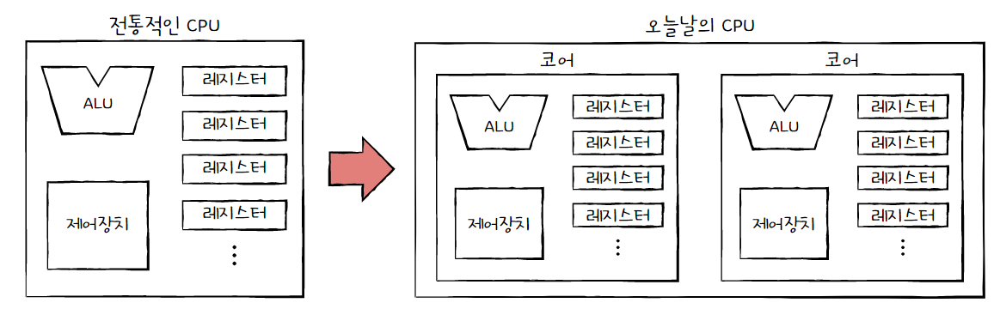

코어를 여러 개 포함하는 CPU를 **멀티코어 CPU** 또는 **멀티코어 프로세서**라고 부른다. 명령어를 처리하는 코어의 개수가 많은 멀티코어 CPU는 단일코어 CPU보다 빠르게 명령을 처리할 수 있다.

하지만 코어의 수에 따라 연산 처리 속도가 비례해서 증가하지는 않는다. 코어마다 처리할 연산이 적절히 분배되지 않는다면 코어의 수가 많아도 연산 처리 속도는 크게 증가하지 않는다. 또한 처리하고자 하는 작업량보다 코어 수가 지나치게 많아도 성능에는 크게 영향이 없다. 중요한 것은 **코어마다 처리할 명령어들을 얼마나 적절하게 분배하느냐**이다.

- 코어에 따른 프로세서 명칭
  
  | 코어 수 | 프로세서 명칭 |
  | ---- | ------- |
  | 1    | 싱글코어    |
  | 2    | 듀얼코어    |
  | 3    | 트리플코어   |
  | 4    | 쿼드코어    |
  | 6    | 헥사코어    |
  | 8    | 옥타코어    |
  | 10   | 데카코어    |
  | 12   | 도데카코어   |

### 스레드와 멀티스레드

**스레드**의 사전적 의미는 '실행 흐름의 단위'이지만, 어디서 사용되는지에 따라 의미하는 바가 다르다.

스레드는 CPU에서 사용되는 **하드웨어적 스레드**와 프로그램에서 사용되는 **소프트웨어적 스레드로** 나눌 수 있다.

- **하드웨어적 스레드**
  
  하드웨어적 스레드는 '하나의 코어가 동시에 처리하는 명령어 단위'를 의미한다.
  
  여러 스레드를 지원하는 CPU는 하나의 코어가 여러 스레드를 가질 수 있으며, 하나의 코어로도 여러 개의 명령어를 동시에 실행할 수 있다.
  
  이처럼 하나의 코어로 여러 명령어를 동시에 처리하는 CPU를 **멀티스레드 프로세서** 또는 **멀티스레드 CPU**라고 한다. (8코어 16스레드 CPU는 한 번에 16개의 명령어를 처리 가능)
  
  참고로 인텔의 멀티스레드 기술은 **하이퍼스레딩**이라는 용어로 불린다.

- **소프트웨어적 스레드**
  
  소프트웨어적 스레드는 '하나의 프로그램에서 독립적으로 실행되는 단위'를 의미한다.
  
  하나의 프로그램은 실행되는 과정에서 한 부분만 실행될 수도 있지만, 프로그램의 여러 부분이 동시에 실행될 수도 있다.
  
  따라서 프로그램을 개발할 때 여러 기능을 각각의 스레드로 만들면 동시에 실행할 수 있다.
  
  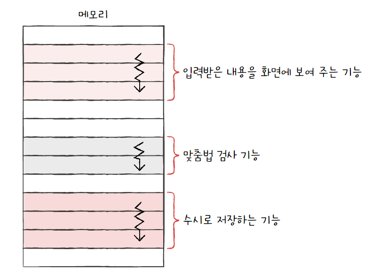
  
  즉, 한 번에 하나씩 명령어를 처리하는 1코어 1스레드 CPU도 소프트웨어적 스레드를 수십 개 실행할 수 있어, 프로그램의 여러 부분을 동시에 실행할 수 있다.

### 멀티스레드 프로세서

**멀티스레드 프로세서**는 하나의 코어로 여러 명령어를 동시에 처리하는 CPU이다.

이것이 가능한 이유는 하나의 명령어를 처리하기 위해 필요한 레지스터를 여러 개 가지고 있기 때문이다. 예를 들어 하나의 코어에 프로그램 카운터가 두 개 있다면 '메모리에서 가져올 명령어 주소'를 두 개 지정할 수 있을 것이다.

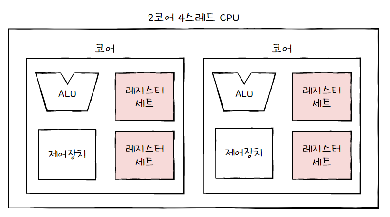

이처럼 하드웨어 스레드는 프로그램 입장에서 봤을 때 한 번에 하나의 명령어를 처리하는 CPU가 여러 개 있는 것처럼 보일 수 있다. 그래서 하드웨어 스레드를 **논리 프로세서**라고 부르기도 한다.

> **참고: 내 논리 프로세서 확인하기**
> 
> 작업 관리자 -> [성능] -> [CPU] 항목 -> 논리 프로세서

## 2. 명령어 병렬 처리 기법

빠른 CPU를 만들려면 높은 클럭 속도, 멀티스레드의 영향도 있지만, CPU가 놀지 않고 효율적으로 작동하게 하는 것도 중요하다.

명령어를 동시에 처리하여 CPU를 쉬지 않고 작동시키는 기법을 **명령어 병렬 처리 기법**(ILP, Instruction-Level Parallelism)이라고 한다.

대표적인 명령어 병렬 처리 기법에는 **명령어 파이프라이닝**, **슈퍼 스칼라**, **비순차적 명령어 처리**가 있다.

> **파이프라인이란?**
> 
> 프로세서 성능을 높이기 위해서 명령어 처리를 여러 단계로 나누어 단계별로 동시에 수행하여 병렬화를 시키는 것을 의미한다.

### 명령어 파이프라인

명령어 처리 과정을 클럭 단위로 나누어 보면 일반적으로 다음과 같이 나눌 수 있다.

- 명령어 인출(Instruction Fetch)

- 명령어 해석(Instruction Decode)

- 명령어 실행(Execute Instruction)

- 결과 저장(Write Back)

이때 같은 단계가 겹치지만 않는다면 CPU는 **각 단계를 동시에 실행**할 수 있다. 이처럼 명령어들을 **명령어 파이프라인**에 넣고 동시에 처리하는 기법을 **명령어 파이프라이닝**이라고 한다.

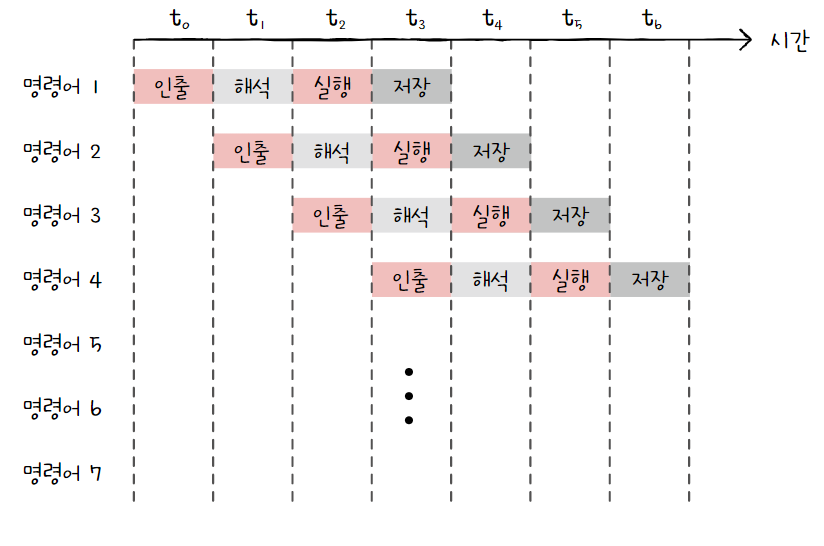

파이프라이닝이 높은 성능을 가져오기는 하지만, 특정 상황에서는 성능 향상에 실패하는 경우도 있다. 이러한 상황을 **파이프라인 위험**이라고 한다. 파이프라인 위험에는 크게 **데이터 위험**, **제어 위험**, **구조 위험**이 있다.

- 데이터 위험
  
  데이터 위험은 명령어 간 '데이터 의존성'에 의해 발생한다.
  
  ```
  명령어 1: R1 <- R2 + R3
  명령어 2: R4 <- R1 + R5
  ```
  
  위의 경우 명령어 1을 수행해야만 명령어 2를 수행할 수 있다. 이처럼 명령어끼리 데이터 의존성이 생기는 경우 파이프라인이 제대로 작동하지 않을 수 있는데, 이를 데이터 위험이라고 한다.

- 제어 위험
  
  제어 위험은 주로 분기 등으로 인한 '프로그램 카운터의 갑작스러운 변화'에 의해 발생한다.
  
  기본적으로 프로그램 카운터는 '현재 실행 중인 명령어의 다음 주소'로 갱신된다. 이때 프로그램 실행 흐름이 바뀌어 프로그램 카운터에 갑작스러운 변화가 생기면, 명령어 파이프라인에 미리 가지고 와서 처리 중이었던 명령어들은 아무 쓸모가 없어진다. 이를 제어 위험이라고 한다.
  
  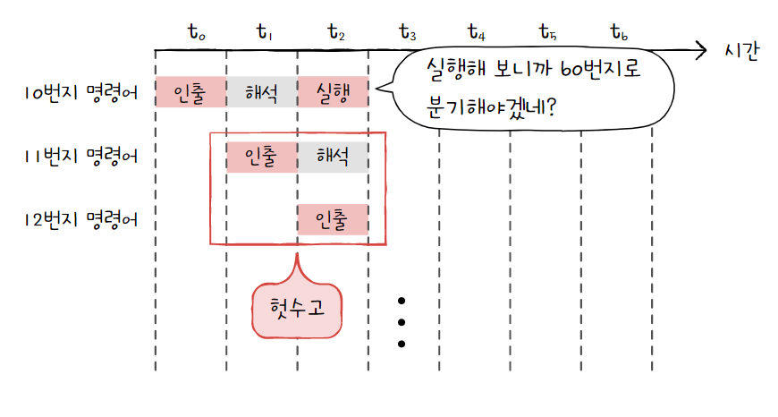
  
  이를 위해 사용하는 기술 중 하나가 **분기 예측**으로, 프로그램이 어디로 분기할지 미리 예측한 후 그 주소를 인출하는 기술이다.

- 구조적 위험
  
  구조적 위험은 명령어들을 겹쳐 실행하는 과정에서 서로 다른 명령어가 동시에 ALU, 레지스터 등과 같은 CPU 부품을 사용하려고 할 때 발생한다. 구조적 위험은 **자원 위험**이라고도 부른다.

### 슈퍼 스칼라

오늘날 대부분의 CPU는 단일 파이프라인보다 여러 개의 파이프라인을 이용한다. 이처럼 CPU 내부에 여러 개의 명령어 파이프라인을 포함한 구조를 **슈퍼 스칼라**라고 한다. 또한, 슈퍼 스칼라 구조로 명령어 처리가 가능한 CPU를 **슈퍼스칼라 프로세서** 또는 **슈퍼스칼라 CPU**라고 한다.

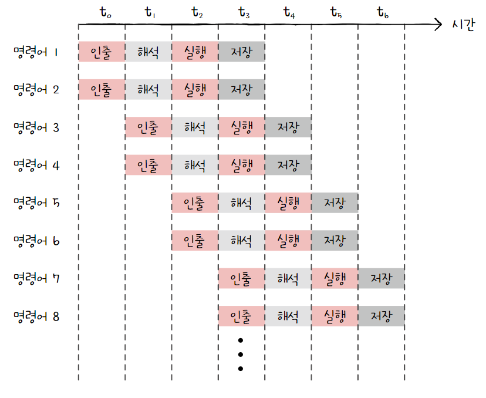

슈퍼스칼라 프로세서는 이론적으로 파이프라인 개수에 비례하여 프로그램 처리 속도가 빨라진다. 하지만 파이프라인 위험 등의 예상치 못한 문제 때문에 실제로는 파이프라인 개수에 비례하여 빨라지지는 않는다. 또한 슈퍼스칼라 방식을 차용한 CPU는 파이프라인 위험을 방지하기 위해 고도로 설계되어야 한다.

### 비순차적 명령어 처리

비순차적 명령어 처리(OoOE: Out-of-Order Execution)는 오늘날 CPU 성능 향상에 크게 기여한 기법이자 대부분의 CPU가 차용하는 기법이다.

비순차적 명령어 처리 기법은 파이프라인의 중단을 방지하기 위해 **명령어들을 순차적으로 처리하지 않는 명령어 병렬 처리 기법**이다.

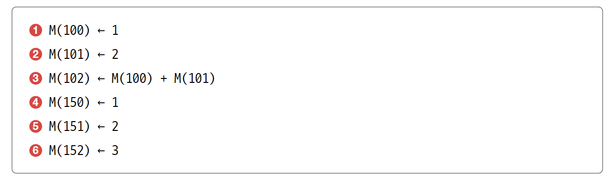

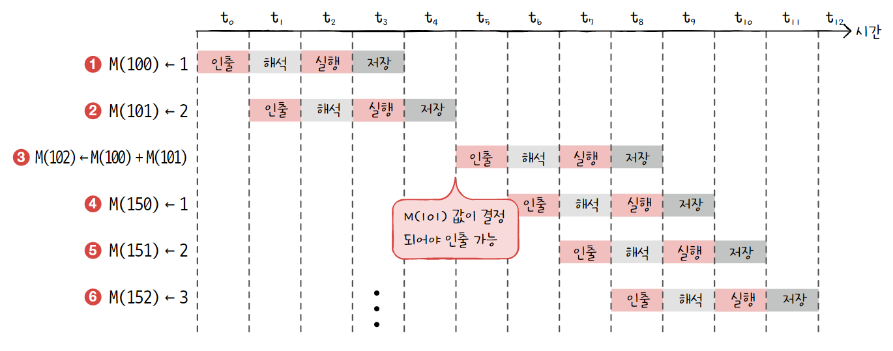

위 상황에서 명령어를 순차적으로 처리할 경우, 3~6번 명령어들은 2번 명령어 실행이 끝날 때까지 기다려야 한다.

하지만 3번 명령어를 맨 뒤로 보내게 되면 더 효율적으로 작업을 처리할 수 있다.

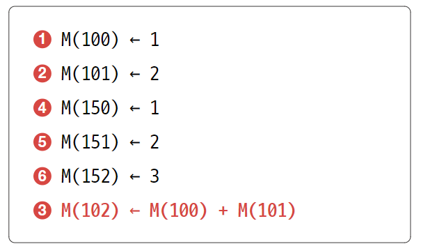

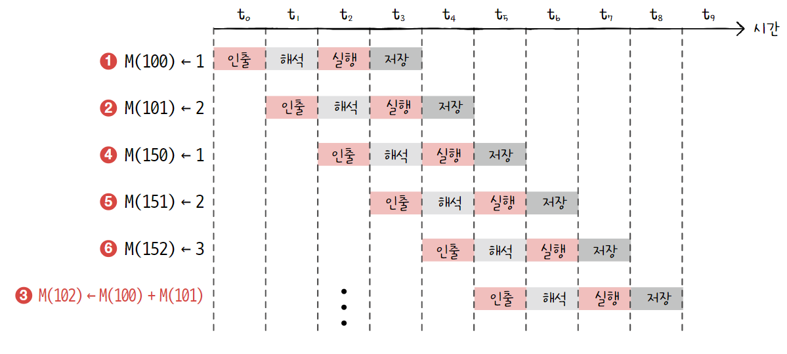

이처럼 비순차적 명령어 처리 기법을 사요하면 파이프라인이 멈추는 것을 방지하여 효율적으로 작업을 처리할 수 있다.

하지만 때에 따라 아무 명령이나 순서를 바꿔서 수행할 수는 없다. 따라서 비순차적 명령어 처리가 가능한 CPU는 명령어들이 어떤 명령어와 데이터 의존성을 가지고 있는지, 순서를 바꿔 실행할 수 있는 명령어에는 어떤 것들이 있는지를 판단할 수 있어야 한다.

## 3. CISC와 RISC

### 명령어 집합

명령어의 생김새, 명령어로 할 수 있는 연산, 주소 지정 방식 등은 CPU마다 조금씩 차이가 있다. CPU가 이해할 수 있는 명령어들의 모음을 **명령어 집합** 또는 **명령어 집합 구조**(**ISA**, Instruction Set Architecture)라고 한다. 즉, CPU마다 ISA가 다를 수 있다.

CPU마다 이해할 수 있는 명령어가 다르기 때문에 이해할 수 있는 어셈블리어도 달라진다. 이렇게 CPU마다 명령어가 달라지면 단지 명령어의 생김새 뿐만 아니라 제어장치가 명령어를 해석하는 방식, 사용되는 레지스터의 종류와 개수 등 많은 것이 달라진다.

이 중에서 현재 대표적으로 사용되는 ISA 중, 명령어 병렬 처리 기법을 적용하기에 용이한 ISA(RISC)와 적용하기 어려운 ISA(CISC)가 있다.

### CISC

CISC(Complex Instruction Set Computer)는 '복잡한 명령어 집합을 활용하는 컴퓨터'를 의미한다. x86, x86-64는 대표적인 CISC 기반의 ISA이다.

CISC는 다양하고 강력한 기능의 명령어 집합을 활용하기 때문에 명령어의 형태와 크기가 다양한 **가변 길이 명령어**를 활용한다. 메모리에 접근하는 주소 지정 방식도 다양해서 특별한 상황에서만 사용되는 독특한 주소 지정 방식들도 있다.

다양하고 강력한 명령어를 활용하기 때문에 상대적으로 적은 수의 명령어로도 프로그램을 실행할 수 있다. 즉, 같은 소스 코드를 컴파일해도 컴파일된 프로그램의 크기가 상대적으로 작다. 이는 곧 **메모리 공간을 절약**할 수 있다는 장점으로 이어질 수 있다.

하지만 명령어의 크기와 실행되기까지의 시간이 일정하지 않으며, 복잡한 명령어 때문에 명령어 하나를 실행하는 데에 여러 클럭 주기를 필요로 한다는 단점이 있다. '규격화되지 않은 명령어'라는 CISC의 특징은 **명령어 파이프라인을 구현하는 데에 큰 걸림돌**이 되기 때문에, 현대 CPU에서 치명적인 약점으로 작용할 수 있다. 심지어 대다수의 복잡한 명령어는 그 사용 빈도가 낮고 실제로는 자주 사용되는 명령어만 쓰이게 된다.

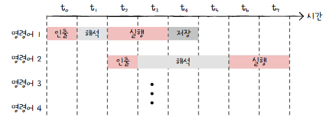

### RISC

RISC(Reduced Instruction Set Computer)는 CISC와는 달리 짧고 규격화된 명령어, 되도록 1클럭 내외로 실행되는 명령어를 지향하는 ISA이다. 즉, RISC는 **고정 길이 명령어**를 활용한다. ARM이 대표적인 RISC 기반의 ISA이다.

이러한 RISC의 특성은 **명령어 파이프라이닝에 최적화**되어 있다. 그리고 RISC는 메모리 접근을 단순화하고 최소화를 추구하기 때문에, CISC보다 주소 지정 방식의 종류가 적은 경우가 많다.

RISC는 메모리 접근을 단순화, 최소화하는 대신 레지스터를 적극적으로 활용한다. 따라서 CISC보다 레지스터를 이용하는 연산이 많고, 일반적인 경우보다 범용 레지스터 개수도 더 많다. 다만 사용 가능한 명령어 개수가 CISC보다 적기 때문에 RISC는 CISC보다 많은 명령으로 프로그램을 작동시킨다.

### CISC vs RISC

| CISC                 | RISC                 |
| -------------------- | -------------------- |
| 복잡하고 다양한 명령어         | 단순하고 적은 명령어          |
| 가변 길이 명령어            | 고정 길이 명령어            |
| 다양한 주소 지정 방식         | 적은 주소 지정 방식          |
| 프로그램을 이루는 명령어의 수가 적음 | 프로그램을 이루는 명령어의 수가 많음 |
| 여러 클럭에 걸쳐 명령어 수행     | 1클럭 내외로 명령어 수행       |
| 파이프라이닝하기 어려움         | 파이프라이닝하기 쉬움          |

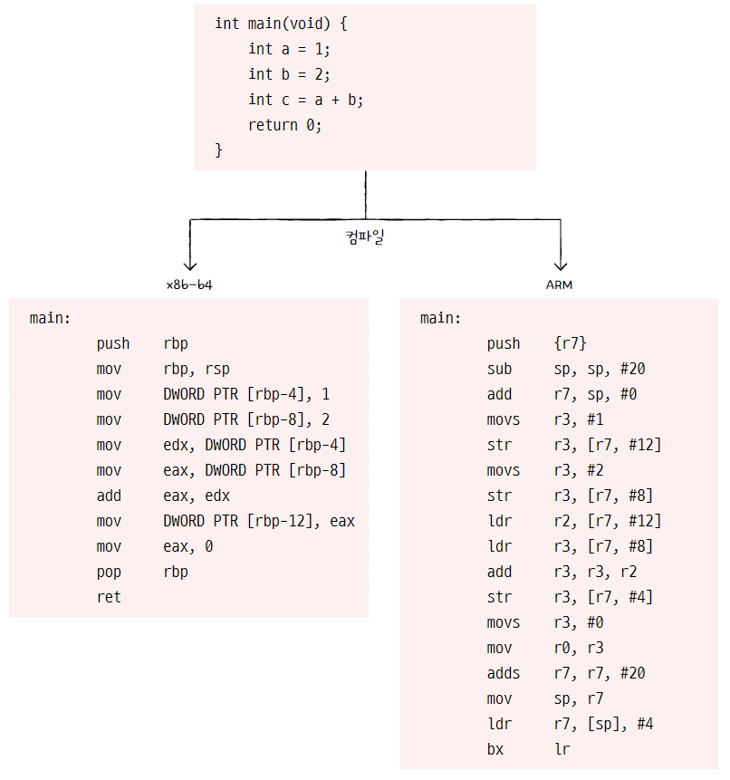


