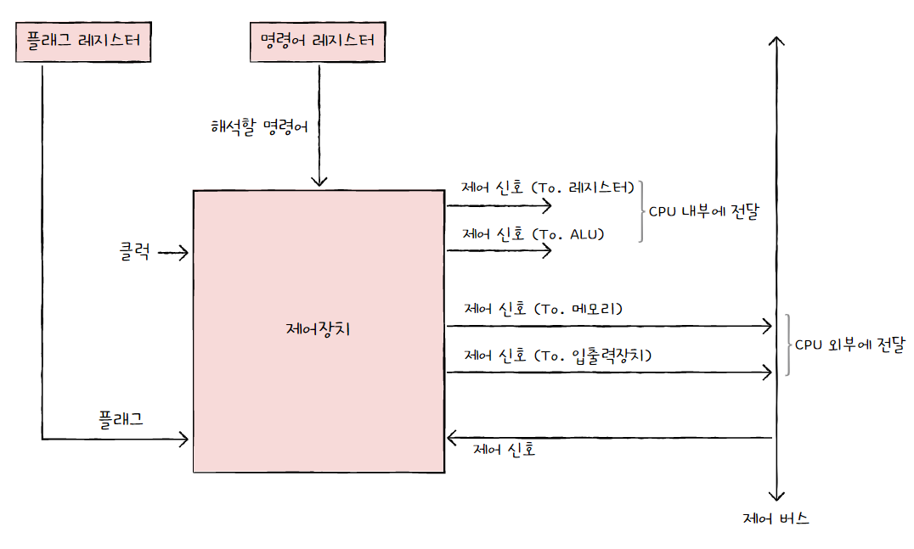
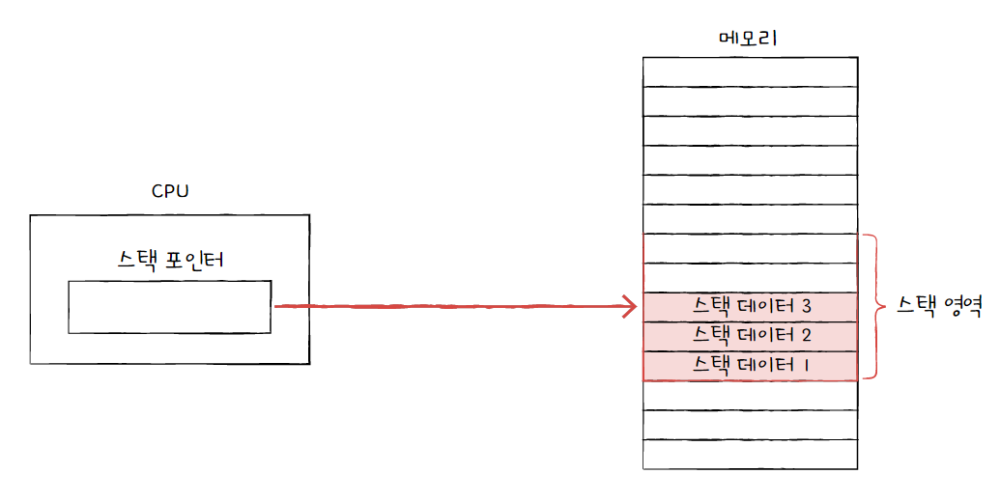
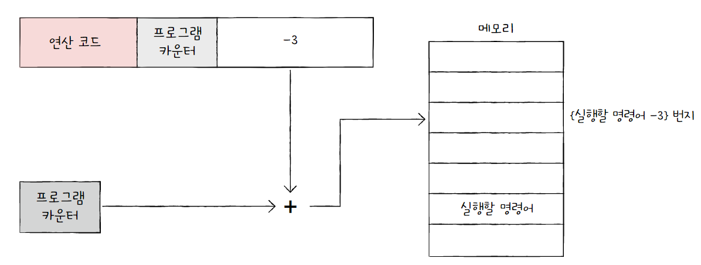
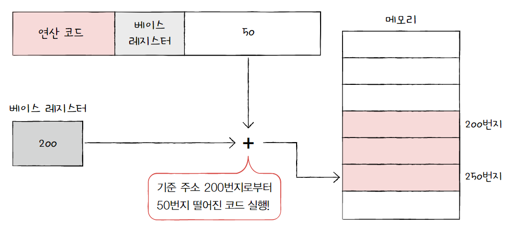
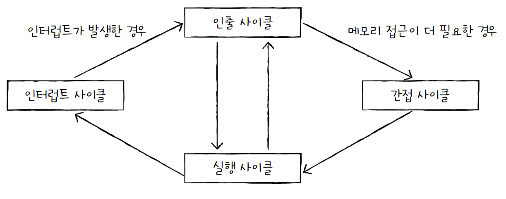
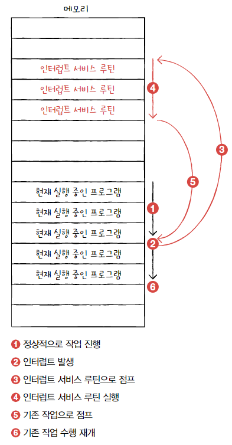

# CPU의 작동 원리

## 1. ALU와 제어장치

### ALU

ALU는 CPU내부에서 계산을 담당하는 디지털 회로이다.

- **ALU가 받아들이는 정보**
  
  - 레지스터로부터 피연산자를 받아들인다.
  
  - 제어창지로부터 수행할 연산을 알려주는 제어 신호를 받아들인다.

- **ALU가 내보내는 정보**
  
  - 연산 결과를 바로 메모리에 저장하지 않고 임시적으로 레지스터에 저장한다.
    
    (CPU가 메모리에 접근하는 횟수가 늘어나면 프로그램 실행 속도가 늦어진다.)
  
  - 플래그 레지스터에 플래그를 내보낸다.

> **플래그란?**
> 
> 연산 결과에 대한 추가적인 상태 정보를 뜻한다.
> 
> 플래그들은 **플래그 레지스터**라는 레지스터에 저장된다.
> 
> 대표적인 플래그
> 
> | 플래그 종류    | 의미                                   | 사용 예시                                  |
> | --------- | ------------------------------------ | -------------------------------------- |
> | 부호 플래그    | 연산한 결과의 부호를 나타낸다.                    | 1: 음수 0: 양수                        |
> | 제로 플래그    | 연산 결과가 0인지 여부를 나타낸다.                 | 1: 연산 결과가 0임 0: 연산 결과가 0이 아님       |
> | 캐리 플래그    | 연산 결과 올림수나 빌림수가 발생했는지를 나타낸다.         | 1: 올림수나 빌림수 발생 0: 올림수나 빌림수 발생하지 않음 |
> | 오버플로우 플래그 | 오버플로우가 발생했는지 나타낸다.                   | 1: 오버플로우 발생 0: 오버플로우 발생하지 않음       |
> | 인터럽트 플래그  | 인터럽트가 가능한지를 나타낸다.                    | 1: 인터럽트 가능 0: 인터럽트 불가능             |
> | 슈퍼바이저 플래그 | 커널 모드로 실행 중인지, 사용자 모드로 실행 중인지를 나타낸다. | 1: 커널 모드 0: 사용자 모드                 |

### 제어장치

**제어장치**는 제어 신호를 내보내고 명령어를 해석하는 부품이다.

여기서 **제어 신호**는 컴퓨터 부품들을 관리하고 작동시키기 위한 전기 신호를 말한다.

- **제어장치가 받아들이는 정보**
  
  - 클럭 신호
    
    **클럭**이란 컴퓨터의 모든 부품을 일사분란하게 움직일 수 있게 하는 시간 단위이다.
    
    클럭의 주기에 맞춰 레지스터간에 데이터가 이동하고 ALU에서 연산이 수행되거나, CPU가 메모리에 저장된 명령어를 읽어 들인다.
    
    컴퓨터의 모든 부품은 클럭 신호에 맞춰 작동하지만 컴퓨터의 모든 부품이 한 클럭마다 작동하는 것은 아니고, 여러 클럭에 걸쳐 수행될 수도 있다.
  
  - 해석해야 할 명령어
    
    **명령어 레지스터**로부터 해석할 명령어를 받아들이고 해석한 뒤, 제어 신호를 발생시켜 컴퓨터 부품들에 수행해야 할 내용들을 알려준다.
  
  - 플래그 값
    
    플래그 레지스터로부터 플래그 값을 받아들여, 이 값을 참고해 제어 신호를 발생시킨다.
  
  - 시스템 버스(제어 버스)로 전달된 제어 신호
    
    제어 버스를 통해 입출력장치를 비롯한 CPU 외부 장치로부터 전달된 제어 신호를 받아들인다.

- **제어장치가 내보내는 정보**
  
  - CPU 외부에 전달하는 제어 신호
    
    크게 메모리에 전달하는 제어 신호와 입출력장치 및 보조기억장치에 전달하는 제어 신호가 있다.
    
    두 가지 경우 모두 제어 버스로 제어 신호를 내보낸다.
  
  - CPU 내부에 전달하는 제어 신호
    
    크게 ALU에 전달하는 제어 신호와 레지스터에 전달하는 제어 신호가 있다.
    
    ALU에는 수행할 연산을 지시하기 위해, 레지스터에는 레지스터 간에 데이터를 이동시키거나 레지스터에 저장된 명령어를 해석하기 위해 제어 신호를 내보낸다.

## 2. 레지스터

### 반드시 알아야 할 레지스터

상용화된 CPU 속 레지스터들은 CPU마다 이름, 크기, 종류가 매우 다양하다.

이 중 많은 CPU가 공통으로 포함하는 여덟 개의 레지스터가 있다.

- **프로그램 카운터**
  
  프로그램 카운터(Program Counter)는 메모리에서 가져올 명령어의 주소, 즉 메모리에서 읽어 들일 명령어의 주소를 저장한다. **명령어 포인터**(IP, Instruction Pointer)라고 부르는 CPU도 있다.

- **명령어 레지스터**
  
  명령어 레지스터(IR, Instruction Register)는 해석할 명령어, 즉 방금 메모리에서 읽어 들인 명령어를 저장하는 레지스터이다. 제어장치는 명령어 레지스터 속 명령어를 받아들이고 해석한다.

- **메모리 주소 레지스터**
  
  메모리 주소 레지스터(MAR, Memory Address Register)는 메모리 주소를 저장하는 레지스터이다. CPU가 읽어 들이고자 하는 주소 값을 주소 버스로 보낼 때 메모리 주소 레지스터를 거치게 된다.

- **메모리 버퍼 레지스터**
  
  메모리 버퍼 레지스터(MBR, Memory Buffer Register)는 메모리와 주고받을 값(데이터와 명령어)을 저장하는 레지스터이다. 즉, 메모리에 쓰고 싶은 값이나 메모리로부터 전달받은 값은 메모리 버퍼 레지스터를 거친다. **메모리 데이터 레지스터**(MDR, Memory Data Register)라고도 부른다.

- **플래그 레지스터**
  
  플래그 레지스터(Flag Register)는 ALU 연산 결과 또는 CPU 상태에 대한 부가적인 정보를 저장하는 레지스터이다.

- **범용 레지스터**
  
  범용 레지스터(General Purpose Register)는 이름 그대로 다양하고 일반적인 상황에서 자유롭게 사용할 수 있는 레지스터이다. 데이터와 주소를 모두 저장할 수 있으며 CPU 내부에는 여러 개의 범용 레지스터들이 있다.

- **스택 포인터**
  
  스택 포인터(Stack Pointer)는 **스택 주소 지정 방식**이라는 주소 지정 방식에 사용된다.

- **베이스 레지스터**
  
  베이스 레지스터(Base Register)는 프로그램 카운터와 함께 **변위 주소 지정 방식**이라는 주소 지정 방식에 사용된다.

### 특정 레지스터를 이용한 주소 지정 방식

- **스택 주소 지정 방식**
  
  스택 주소 지정 방식은 스택의 꼭대기를 가리키는 레지스터인 스택 포인터를 이용해 스택 내 데이터에 접근하는 방식이다.
  
  스택은 메모리 안에 다른 주소 공간과는 다르게 스택처럼 사용하기로 약속된 영역을 차지하는데, 이를 **스택 영역**이라고 한다.

- **변위 주소 지정 방식**
  
  변위 주소 지정 방식은 명령어의 오퍼랜드 필드 값(변위)과 특정 레지스터의 값을 더하여 유효 주소를 얻어내는 주소 지정 방식이다.
  
  따라서 변위 주소 지정 방식을 사용하는 명령어는 연산 코드 필드, 오퍼랜드 필드와 더불어 어떤 레지스터를 사용할지 나타내는 레지스터 필드를 갖고 있다.
  
  어떤 레지스터를 사용할지에 따라 여러 방식이 있지만, 대표적으로 **상대 주소 지정 방식**과 **베이스 레지스터 주소 지정 방식**이 있다.
  
  - **상대 주소 지정 방식**
    
    오퍼랜드와 프로그램 카운터의 값을 더하여 유효 주소를 얻는다.
    
    
  
  - **베이스 레지스터 주소 지정 방식**
    
    오퍼랜드와 베이스 레지스터의 값을 더하여 유효 주소를 얻는다.
    
    여기서 베이스 레지스터는 '기준 주소', 오퍼랜드는 '기준 주소로부터 떨어진 거리'로서의 역할을 한다.
    
    

## 3. 명령어 사이클과 인터럽트

### 명령어 사이클

프로그램 속 각각의 명령어들은 CPU에 의해 일정한 주기가 반복되며 실행되는데, 이 주기를 **명령어 사이클**이라고 한다.

프로그램을 이루는 수많은 명령어는 일반적으로 인출 사이클과 실행 사이클을 반복하며 실행되며, 여기에 추가적으로 간접 사이클과 인터럽트 사이클이 있다.

- **인출 사이클**
  
  메모리에 있는 명령어를 CPU로 가지고 오는 단계

- **실행 사이클**
  
  CPU로 가져온 명령어를 실행하는 단계

- **간접 사이클**
  
  만약 간접 주소 지정 방식인 경우 오퍼랜드 필드에 유효 주소의 주소가 명시되어 있다. 따라서 명령어를 CPU로 가져왔다 하더라도 한 번 더 메모리에 접근을 해야한다. 이 단계를 간접 사이클이라고 한다.

- **인터럽트 사이클**
  
  CPU의 현재 처리 순서를 중단하고 다른 동작을 수행하도록 하는 사이클이다.

### 인터럽트

인터럽트란 CPU가 수행 중인 작업을 방해하는 신호를 뜻한다.

인터럽트의 종류에는 크게 동기 인터럽트와 비동기 인터럽트가 있다.

- **동기 인터럽트**
  
  CPU가 명령어들을 수행하다가 프로그래밍상의 오류와 같은 예외적인 상황에 마주쳤을 때 발생하는 인터럽트이다. 이런 점에서 동기 인터럽트는 **예외**라고도 부른다.

- **비동기 인터럽트**
  
  주로 입출력장치에 의해 발생하는 인터럽트이다. 키보드, 마우스, 프린터와 같은 입출력장치가 어떤한 입력을 받아들였거나 하던 작업을 끝내면 CPU에 인터럽트를 보낸다. 일반적으로 비동기 인터럽트를 인터럽트라 칭하기도 하지만, 혼동을 방지하기 위해 **하드웨어 인터럽트**라는 용어로 사용하기도 한다.

### 하드웨어 인터럽트

CPU는 입출력 작업 도중에도 효율적으로 명령어를 처리하기 위해 하드웨어 인터럽트를 사용한다.

예를 들어 CPU가 프린터에 출력을 명령했을 때 프린터의 작업 종료를 기다릴 경우 CPU 사이클이 낭비되게 된다. 따라서 하드웨어 인터럽트를 이용해 프린터의 작업 종료를 기다리지 않고 다른 작업을 처리하다가, 프린터 작업 종료와 동시에 인터럽트를 받아들여 이를 처리할 수 있다.

**하드웨어 인터럽트 처리 순서는 다음과 같다.**

1. 입출력장치는 CPU에 **인터럽트 요청 신호**를 보낸다.

2. CPU는 실행 사이클이 끝나고 명령어를 인출하기 전 항상 인터럽트 여부를 확인한다.

3. CPU는 인터럽트 요청을 확인하고 **인터럽트 플래그**를 통해 현재 인터럽트를 받아들일 수 있는지 여부를 확인한다.

4. 인터럽트를 받아들일 수 있다면 CPU는 지금까지의 작업을 백업한다.
   
   (프로그램 카운터 값 등 기존 작업을 재개하기 위해 필요한 모든 내용을 **스택**에 백업한다.)

5. CPU는 **인터럽트 벡터**를 참조하여 **인터럽트 서비스 루틴**을 실행한다.
   
   (프로그램 카운터 값은 인터럽트 서비스 루틴의 시작 주소가 위치한 곳으로 갱신된다.)

6. 인터럽트 서비스 루틴 실행이 끝나면 백업해 둔 작업을 복구하여 실행을 재개한다.
   
   (스택에 저장해두었던 값을 다시 불러온다.)
- **인터럽트 요청 신호**
  
  인터럽트 요청 신호는 입출력장치가 CPU의 정상적인 실행 흐름을 방해하는 인터럽트에 대한 요청이다.
  
  이때 CPU가 인터럽트 요청을 수용하기 위해서는 플래그 레지스터의 인터럽트 플래그가 활성화되어 있어야 한다.

- **인터럽트 플래그**
  
  인터럽트 플래그는 하드웨어 인터럽트를 받아들일지 무시할지를 결정하는 플래그이다.
  
  CPU가 중요한 작업을 처리해야 하는 경우 인터럽트 플래그를 불가능으로 설정해 인터럽트 요청을 무시한다.
  
  하지만 인터럽트 플래그가 불가능으로 설정되어 있어도 무시할 수 없는, 우선순위가 높은 인터럽트 요청도 있다. 정전이나 하드웨어 고장으로 인한 인터럽트가 이에 해당한다.

- **인터럽트 서비스 루틴(=인터럽트 핸들러)**
  
  CPU가 인터럽트 요청을 받아들이기로 했다면 CPU는 인터럽트 서비스 루틴이라는 프로그램을 실행한다.
  
  인터럽트 서비스 루틴은 인터럽트를 처리하기 위한 프로그램으로, **어떤 인터럽트가 발생했을 때 어떻게 처리하고 작동해야 할지**에 대한 정보로 이루어져있다.
  
  따라서 CPU는 인터럽트에 따라 각기 다른 인터럽트 서비스 루틴을 구분해야 하는데, 이는 인터럽트 벡터를 이용한다.

- **인터럽트 벡터**
  
  인터럽트 벡터는 서비스 루틴을 식별하기 위한 정보이다.
  
  인터럽트 벡터를 알면 인터럽트 서비스 루틴의 시작 주소를 알 수 있기 때문에 CPU는 인터럽트 벡터를 통해 특정 인터럽트 서비스 루틴을 처음부터 실행할 수 있다.
  
  인터럽트 벡터는 하드웨어 인터럽트 요청을 보낸 대상으로부터 데이터 버스를 통해 전달받는다.

> **참고: 예외(동기 인터럽트)**
> 
> 예외가 발생하면 CPU는 하던 일을 중단하고 해당 예외를 처리한다.
> 
> 예외의 종류는 다음과 같다.
> 
> - **폴트(fault)**
>   
>   예외를 처리한 직후 **예외가 발생한 명령어부터 실행을 재개**하는 예외이다.
>   
>   예를 들어 명령어를 실행하기 위해 꼭 필요한 데이터가 메모리에 없고 보조기억장치에 있다면, 이를 반드시 메모리에 저장해야한다. 따라서 CPU는 폴트를 발생시키고 보조기억장치로부터 필요한 데이터를 메모리로 가져와 저장한다. 이때 CPU는 폴트가 발생한 그 명령어부터 실행하게 된다.
> 
> - **트랩(trap)**
>   
>   예외를 처리한 직후 **예외가 발생한 명령어의 다음 명령어부터 실행을 재개**하는 예외이다. 주로 디버깅할 때 사용된다.
> 
> - **중단(abort)**
>   
>   CPU가 실행 중인 프로그램을 강제로 중단시킬 수밖에 없는 심각한 오류를 발견했을 때 발생하는 예외이다.
> 
> - **소프트웨어 인터럽트**
>   
>   시스템 호출이 발생했을 때 나타난다.

