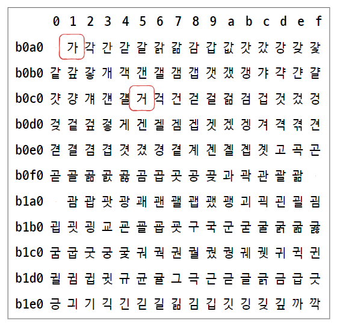

# 데이터

## 1. 0과 1로 숫자를 표현하는 방법

### 정보 단위

0과 1을 나타내는 가장 작은 정보 단위를 비트(Bit)라고 한다.

따라서 n비트는 2n가지 정보를 표현할 수 있다.

| 1바이트(byte)  | 8비트(8bit)           |
| ----------- | ------------------- |
| 1킬로바이트(kB)  | 1,000바이트(1,000byte) |
| 1메가바이트(MB)  | 1,000킬로바이트(1,000KB) |
| 1기가바이트(1GB) | 1,000메가바이트(1,000MB) |
| 1테라바이트(1TB) | 1,000기가바이트(1,000GB) |

> 참고: 워드(word)
> 
> CPU가 한 번에 처리할 수 있는 데이터 크기를 의미한다.
> 
> 즉, 워드 크기가 큰 CPU는 한 번에 처리할 수 있는 데이터가 많다.
> 
> 워드 크기는 CPU마다 다르지만 현대 컴퓨터의 워드 크기는 대부분 32비트 또는 64비트이다.
> 
> 인텔의 x86 CPU는 32비트 워드 CPU, x64 CPU는 64비트 워드 CPU이다.

### 이진법

0과 1만으로 모든 숫자를 표현하는 방법이다.

이진수를 십진수와 구분하기 위해 이진수 끝에 아래첨자 (2)를 붙이거나 이진수 앞에 0b를 붙인다.

- 이진수의 음수 표현
  
  음수를 표현하는 방법 중 하나는  2의 보수를 구해 이 값을 음수로 간주하는 것이다.
  
  2의 보수의 사전적 의미는 '어떤 수를 그보다 큰 2n에서 뺀 값'이다.
  
  ex) 11(2)-> 1002 - 112 -> 012
  
  더 쉽게는 '모든 0과 1을 뒤집고 거기에 1을 더한 값'으로도 표현할 수 있다.
  
  ex) 112 -> 00 -> 012
  
  하지만 여기서 012은 십진수 1의 이진수 표현과 같으므로 구분을 할 수 없다.
  
  따라서 컴퓨터는 이 수가 양수인지 음수인지를 구분하기 위해 **플래그**를 사용한다.

### 십육진법

이진수를 사용하면 숫자의 길이가 너무 길어진다는 문제가 있는데, 이를 해결하기 위한 방법 중 하나가 십육진법을 사용하는 것이다.

0부터 9, 그리고 A부터 F를 이용해 한 자릿수를 표현한다.

아래첨자 16를 붙이거나 숫자 앞에 0x를 붙여 구분한다.

- 이진수와 십육진수의 변환
  
  십육진수의 한 자릿수는 이진수 4비트를 이용해 표현할 수 있다.
  
  따라서 십육진수 n자리는 4n자리의 이진수로 표현가능하다.
  
  ex) 1A16 -> 000110102

## 2. 0과 1로 문자를 표현하는 방법

### 문자 집합과 인코딩

컴퓨터가 인식하고 표현할 수 있는 문자의 모음을 문자 집합이라고 한다.

여기서 문자 집합에 속한 문자라고 해서 컴퓨터가 바로 이해할 수 있는 것은 아니고, 문자를 0과 1로 변화하는 과정이 필요하다. 이 변환 과정을 **문자 인코딩**이라고 하고, 그 반대 과정을 **문자 디코딩**이라고 한다.

### 아스키코드

아스키는 초창기 문자 집합 중 하나로, 영어 알파벳과 아라비아 숫자, 일부 특수 문자를 포함한다.

아스키 문자들은 각각 8비트로 표현되는데, 이 중 1비트는 패리티 비트(parity bit)라고 불리는 오류 검출을 위해 사용되는 비트이다. 따라서 총 27 = 128개의 문자를 표현할 수 있다.

아스키 문자는 0부터 127까지의 숫자 중 고유한 하나의 숫자에 일대일로 대응되는데, 아스키 문자에 대응된 고유한 수를 **아스키 코드**라고 한다.

아스키 문자 집합에 속한 문자들은 128개밖에 되지 못하므로 다양한 문자 표현이 불가능하다.

### EUC-KR

한글을 0과 1로 표현하기 위해 고안한 인코딩 방식이다.

한글 인코딩에는 다음과 같은 방식이 존재한다.

- 완성형 인코딩
  
  초성, 중성, 종성의 조합으로 이루어진 완성된 하나의 글자에 고유한 코드를 부여하는 인코딩 방식

- 조합형 인코딩
  
  초성, 중성, 종성을 위한 각각의 비트열을 할당해 그 조합으로 하나의 글자 코드를 완성하는 방식

EUC-KR은 대표적인 완성형 인코딩 방식이다. 초성, 중성, 종성이 모두 결합된 한글 단어에 2바이트(네 자리 십육진수) 크기의 코드를 부여한다.

이 방식은 문자 집합에 정의되지 않은 '쀍'과 같은 문자를 표현할 수 없다.

따라서 이를 조금이나마 해결하기 위해 등장한 것이 마이크로소프트의 CP949인데, 이마저도 한글 전체를 표현할 수는 없다.

### 유니코드와 UTF-8

유니코드(unicode)는 모든 나라 언어의 문자 집합과 인코딩 방식을 통일해 다양한 문자를 표현할 수 있는 문자 집합이다.

대부분 나라의 문자, 특수문자, 화살표나 이모티콘까지도 코드로 표현할 수 있다.

아스키 코드나 EUC-KR과 같이 각 문자마다 고유한 값을 부여하지만, 인코딩할 때는 그 글자에 부여된 값을 그대로 인코딩 값으로 삼지 않는다. 이러한 인코딩 방식에는 크게 UTF-8, UTF-1, UTF-32 등이 있고, UTF-8이 가장 대중적으로 사용된다.

