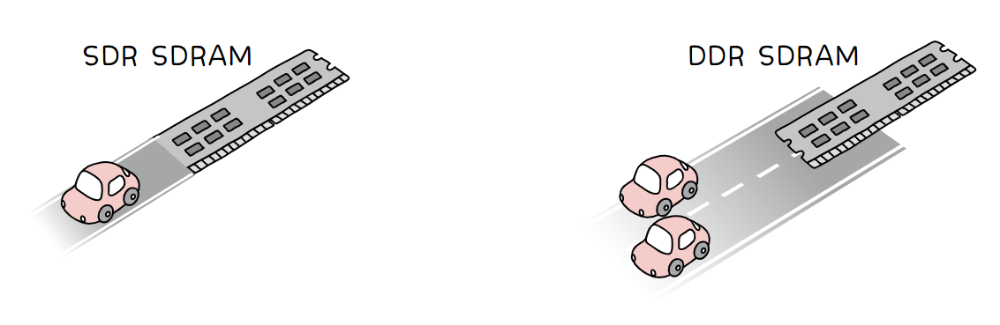
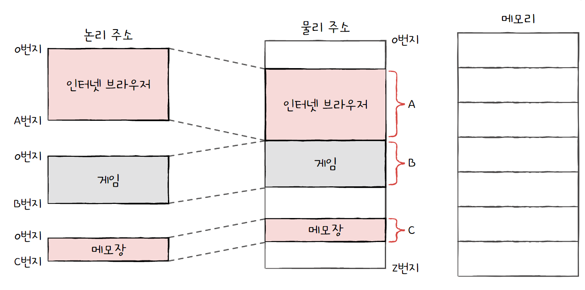
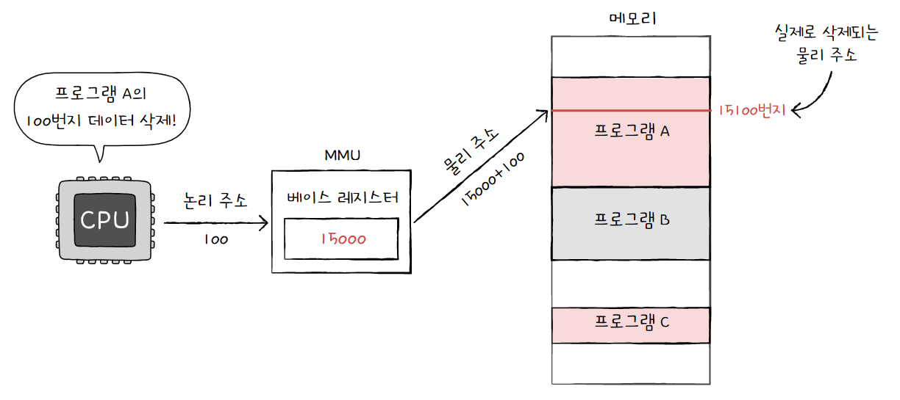
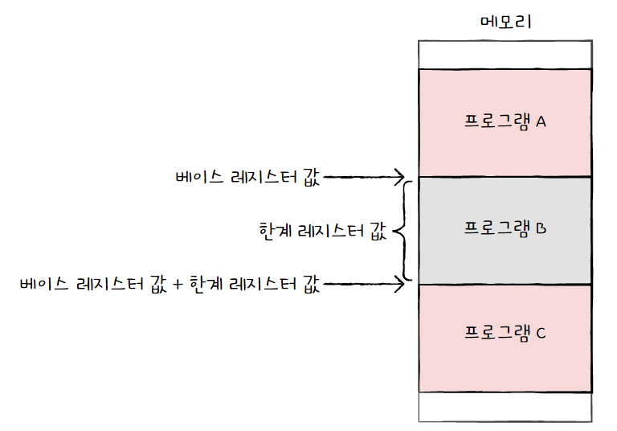
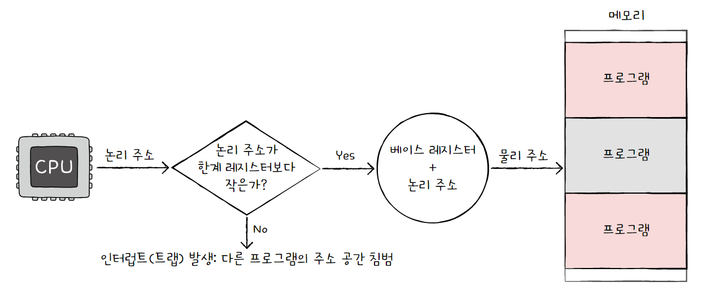
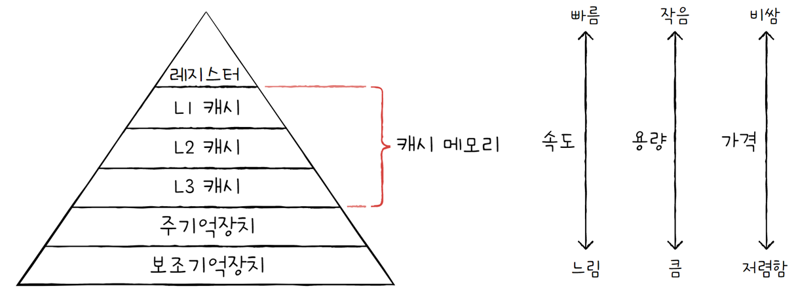
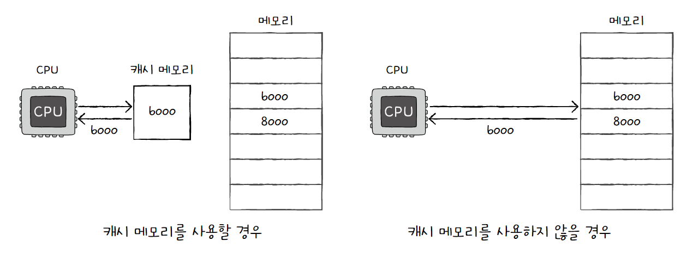
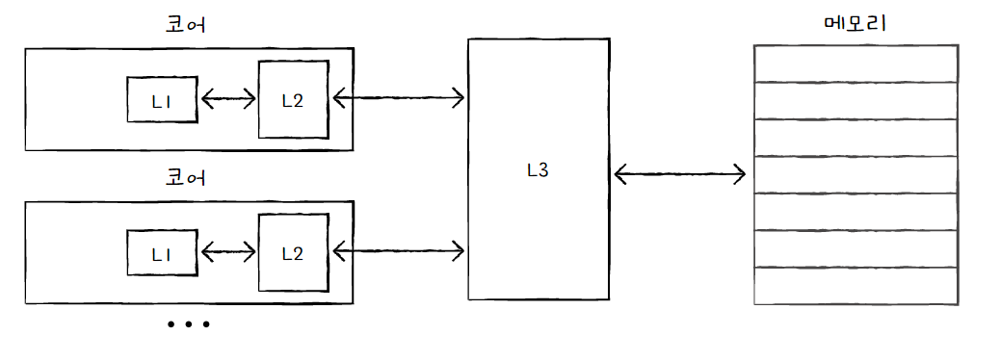

# 메모리와 캐시 메모리

## 1. RAM의 특징과 종류

주기억장치에는 크게 RAM과 ROM, 두 가지가 있고, '메모리'라는 용어는 주로 RAM을 지칭하는 경우가 많다.

### RAM의 특징

RAM에는 실행할 프로그램의 명령어와 데이터가 저장된다.

RAM은 **휘발성 저장 장치**로, 전원을 끄면 저장된 내용이 사라진다.

이에 반대로 **비휘발성 저장 장치**는 전원이 꺼져도 저장된 내용이 유지되며, 그 예로는 SSD, CD-ROM, USB 등이 있다.

CPU는 실행하고 싶은 프로그램이 보조기억장치에 있다면 이를 RAM으로 복사하여 저장한 뒤 실행한다.


### RAM의 용량과 성능

RAM의 용량이 적다면 CPU가 보조기억장치에 접근해야 하는 일이 잦아 실행 시간이 길어진다.

반대로 RAM 용량이 크면 보조기억장치에서 많은 데이터를 가져와 미리 RAM에 저장할 수 있기 때문에, 많은 프로그램을 동시에 빠르게 실행하는 데 유리하다.

단, RAM의 용량에 비례하게 프로그램 실행 속도가 빨라지는 것은 아니다.


### RAM의 종류

- **DRAM(Dynamic RAM)**
  
  저장된 데이터가 동적으로 변하는(사라지는) RAM을 의미한다.
  
  즉, 시간이 지나면 저장된 데이터가 점차 사라지는 RAM이다.
  
  따라서 DRAM은 데이터의 소멸을 막기 위해 일정 주기로 데이터를 재활성화(다시 저장)해야 한다.
  
  소비 전력이 비교적 낮고, 저렴하고, 집적도가 높기 때문에 대용량으로 설계하기가 용이해 일반적인 메모리로 주로 사용된다.

- **SRAM(Static RAM)**
  
  저장된 데이터가 변하지(사라지지) 않는 RAM을 의미한다.
  
  따라서 주기적으로 데이터를 재활성화할 필요가 없다.
  
  DRAM보다 일반적으로 속도가 더 빠르며, 캐시 메모리에서 사용된다.
  
  > DRAM vs SRAM
  > 
  > |       | DRAM       | SRAM   |
  > | ----- | ---------- | ------ |
  > | 재충전   | 필요함        | 필요 없음  |
  > | 속도    | 느림         | 빠름     |
  > | 가격    | 저렴함        | 비쌈     |
  > | 집적도   | 높음         | 낮음     |
  > | 소비 전력 | 적음         | 높음     |
  > | 사용 용도 | 주기억장치(RAM) | 캐시 메모리 |

- **SDRAM(Synchronous DRAM)**
  
  클럭 신호와 동기화된, 발전된 형태의 DRAM이다.
  
  클럭에 맞춰 동작하며 클럭마다 CPU와 정보를 주고받을 수 있다.

- **DDRSDRAM(Double Data Rate SDRAM)**
  
  최근 가장 흔히 사용되는 RAM으로, 대역폭을 넓혀 속도를 빠르게 만든 SDRAM이다. 여기서 대역폭이란 '데이터를 주고받는 길의 너비'를 의미한다. 즉, 대역폭이 넓을수록 한 번에 많은 데이터를 주고받을 수 있다.
  
  한 클럭에 한 번씩 CPU와 데이터를 주고받을 수 있는 SDRAM에 비해 DDR SDRAM은 두 배의 대역폭으로 한 클럭당 두 번씩 CPU와 데이터를 주고받을 수 있다. 따라서 전송 속도가 두 배가량 빠르다.
  
  
  
  - SDR SDRAM(Single Data Rate SDRAM): 한 클럭당 1번씩 데이터를 주고받음
  
  - DDR SDRAM(Double Data Rate SDRAM): 한 클럭당 2번씩 데이터를 주고받음
  
  - DDR2 SDRAM: DDR SDRAM보다 대역폭이 두 배 넓은 SDRAM
  
  - DDR3 SDRAM: DDR2 SDRAM보다 대역폭이 두 배 넓은 SDRAM
  
  - DDR4 SDRAM: DDR3 SDRAM보다 대역폭이 두 배 넓은 SDRAM


## 2. 메모리의 주소 공간

### 물리 주소와 논리 주소

**물리 주소**: 정보가 실제로 저장된 메모리 하드웨어상의 주소

**논리 주소**: CPU와 실행 중인 프로그램이 사용하는 주소로, 실행 중인 프로그램 각각에게 부여되며 0번지부터 시작한다.



CPU와 메모리가 각각 인지하는 주소가 다르므로, 둘이 상호작용하려면 논리 주소와 물리 주소 간의 변환이 이루어져야 한다.

논리 주소와 물리 주소 간의 변환은 CPU와 주소 버스 사이에 위치한 **메모리 관리 장치**(**MMU**: Memory Management Unit)라는 하드웨어에 의해 수행된다.

MMU는 CPU가 발생시킨 논리 주소에 **베이스 레지스터** 값을 더하여 논리 주소를 물리 주소로 변환한다.

즉 **베이스 레지스터는 프로그램의 첫 물리 주소**를 저장하고 **논리 주소는 프로그램의 첫 주소로부터 떨어진 거리**를 의미하게 된다.




### 메모리 보호 기법

만약 프로그램의 물리 주소 범위를 벗어나는 명령어가 실행된다면, 다른 프로그램의 영역을 침범하게 될 것이다. 따라서 이 명령어 실행을 방지하고 다른 프로그램에 영향을 주지 않도록 보호해야 하는데, 이는 **한계 레지스터**라는 레지스터가 담당한다.

한계 레지스터는 논리 주소의 최대 크기를 저장한다. 즉, 프로그램의 물리 주소 범위는 `베이스 레지스터 값` 이상, `베이스 레지스터 + 한계 레지스터 값` 미만이 된다.



CPU는 메모리에 접근하기 전에 접근하고자 하는 논리 주소가 한계 레지스터보다 작은지를 항상 검사한다. 만약 한계 레지스터보다 높은 논리 주소에 접근하려고 하면 인터럽트(트랩)을 발생시켜 실행을 중단한다.




## 3. 캐시 메모리

### 저장 장치 계층 구조

저장 장치는 빠르고 용량이 클수록 좋은 저장 장치라고 할 수 있다.

하지만 두 특성은 양립하기 어렵기 때문에, 컴퓨터는 다양한 저장장치를 모두 사용하게 된다.

저장 장치들은 **CPU에 얼마나 가까운가**(**속도가 빠른가**)를 기준으로 계층적으로 나타낼 수 있는데, 이를 **저장 장치 계층 구조**(memory hierarchy)라고 한다.



### 캐시 메모리

CPU가 메모리에 접근하는 시간은 CPU의 연산 속도보다 느리기 때문에, 메모리에 접근하는 시간을 줄여야 효율적으로 작동할 수 있다.

그래서 등장한 저장 장치가 **캐시 메모리**이다. 캐시 메모리는 CPU와 메모리 사이에 위치하며 레지스터보다 용량이 크고 메모리보다 빠른 SRAM 기반의 저장 장치이다.



캐시 메모리들은 CPU(코어)와 가까운 순서대로 계층을 구성한다. 코어와 가장 가까운 캐시 메모리를 **L1(Level 1) 캐시**, 그다음 가까운 캐시 메모리를 **L2(Level 2) 캐시**, 그다음 가까운 캐시 메모리를 **L3(Level 3) 캐시**라고 부른다. 일반적으로 L1 캐시와 L2 캐시는 코어 내부에, L3 캐시는 코어 외부에 위치해 있다.

CPU는 L1, L2, L3 캐시 순으로 데이터를 검색하며, 각 특성은 다음과 같다.

- 용량: L1 < L2 < L3

- 속도: L1 > L2 > L3

- 가격: L1 > L2 > L3

멀티 코어 프로세서에서 L1 캐시와 L2 캐시는 코어마다 고유한 캐시 메모리로 할당되고, L3 캐시는 여러 코어가 공유하는 형태로 사용된다.



> 참고: 분리형 캐시
> 
> 코어와 가장 가까운 L1 캐시는 조금이라도 접근 속도를 빠르게 만들기 위해 명령어만을 저장하는 L1I 캐시와 데이터만을 저장하는 L1D 캐시로 분리하는 경우도 있다. 이를 **분리형 캐시**라고 한다.


### 참조 지역성 원리

메모리가 보조기억장치의 일부를 복사하여 저장하는 것처럼, 캐시 메모리도 메모리의 일부를 복사하여 저장한다.

이때 캐시 메모리는 CPU가 사용할 법한 대상을 예측하여 저장하는데, 예측한 데이터가 실제로 들어맞아 캐시 메모리 내 데이터가 CPU에서 활용될 경우를 **캐시 히트**라고 한다. 반대로 예측이 틀려 메모리에서 필요한 데이터를 직접 가져와야 하는 경우는 **캐시 미스**라고 한다.

캐시 히트와 캐시 미스를 이용해 캐시가 히트되는 비율을 구할 수 있는데, 이는 **캐시 적중률**이라고 한다.

```
캐시 적중률 = 캐시 히트 횟수 / (캐시 히트 횟수 + 캐시 미스 횟수)
```

따라서 캐시 히트 횟수를 높이는 것이 중요한데, 캐시 메모리는 **참조 지역성의 원리**에 따라 메모리로부터 가져올 데이터를 결정한다. 참조 지역성의 원리는 CPU가 메모리에 접근할 때의 주된 경향을 바탕으로 만들어진 원리이다.

- **CPU는 최근에 접근했던 메모리 공간에 다시 접근하려는 경향이 있다.**
  
  프로그래밍 언어에서 **변수**에 값을 저장하고 나면 해당 변수를 프로그램이 실행되는 동안 여러 번 사용된다. 즉, CPU는 최근에 접근했던 (변수가 저장된) 메모리 공간을 여러 번 다시 접근할 수 있다.
  
  이렇게 '최근에 접근했던 메모리 공간에 다시 접근하려는 경향'을 **시간 지역성**이라고 한다.

- **CPU는 접근한 메모리 공간 근처를 접근하려는 경향이 있다.**
  
  CPU가 실행하려는 프로그램은 보통 관련 데이터들끼리 한데 모여 있다. 또한 하나의 프로그램 내에서도 기능 별로 관련 있는 데이터들은 모여서 저장된다. 따라서 만약 현재 실행중인 프로그램이 있다면 해당 프로그램 데이터가 모여 있는 공간 근처를 접중적으로 접근할 것이다.
  
  이렇게 '접근한 메모리 공간 근처를 접근하려는 경향'을 **공간 지역성**이라고 한다.
  
  


