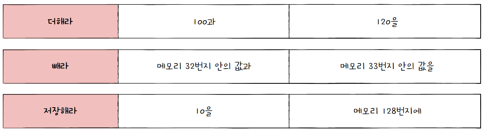
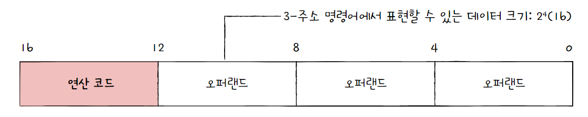
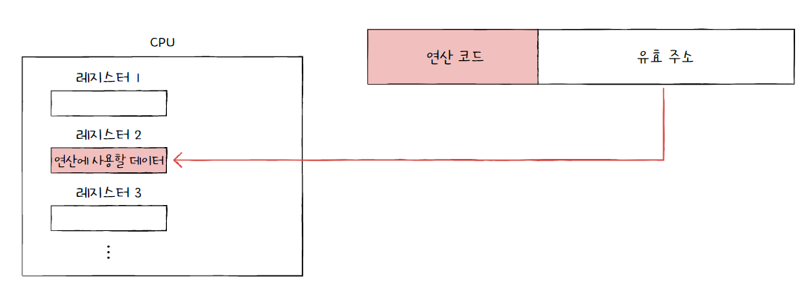
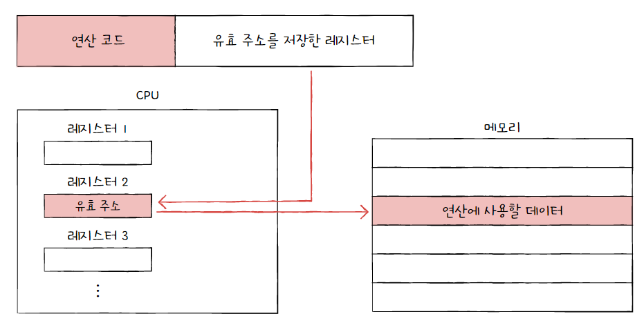

# 명령어

## 1. 소스 코드와 명령어

프로그래밍 언어로 소스 코드를 만들면 이 소스 코드는 컴퓨터 내부에서 명령어로 변환된다.


### 고급 언어와 저급 언어

- **고급 언어**
  
  - 컴퓨터가 이해하는 언어가 아닌 사람이 이해하고 작성하기 쉽게 만들어진 언어
  
  - ex) C, C++, Java, Python

- **저급 언어**
  
  - 컴퓨터가 직접 이해하고 실행할 수 있는 언어
  
  - ex) 기계어, 어셈블리어

**고급 언어로 작성된 소스 코드가 실행되려면 반드시 저급 언어, 즉 명령어로 변환되어야 한다.**

저급 언어 중 **기계어**는 이진수 혹은 십육진수로 표형된 언어이다. 이는 오직 컴퓨터만을 위해 만들어진 언어로, 사람이 이해하기 어렵다. 그래서 등장한 저급 언어가 **어셈블리어**이다.

```
# 어셈블리어 예
push rbp
mov rbp, rsp
ret
```

기계어를 읽기 편하게 만든 어셈블리어조차도 이를 이용해 복잡한 프로그램을 만들기는 쉽지 않다. 따라서 개발자는 사람이 읽고 쓰기 편하며 편리한 문법을 제공하는 **고급 언어**를 이용해 프로그램을 개발한다. (개발 종류에 따라 어셈블리어를 많이 이용하기도 한다.)


### 컴파일 언어와 인터프리터 언어

고급 언어로 작성한 소스 코드는 결국 저급 언어로 변환되어 실행되어야 한다. 고급 언어가 저급 언어로 변환되는 방식은 **컴파일 방식**과 **인터프리터 방식**이 있다.


**컴파일 언어**

컴파일 언어는 컴파일러에 의해 소스 코드 전체가 저급 언어로 변환되어 실행되는 고급 언어이다. 이렇게 저급 언어로 변환되는 과정을 **컴파일**이라고 하며 컴파일을 수행해 주는 도구를 **컴파일러**라고 한다.

컴파일러는 소스 코드를 한번에 처음부터 끝까지 컴파일 하는데, 오류를 하나라도 발견하면 해당 소스 코드는 컴파일에 실패하게 된다. 성공적으로 컴파일이 수행되면 소스 코드는 저급 언어로 변환되며, 이렇게 저급 언어로 변환된 코드를 **목적 코드**라고 한다.


**인터프리터 언어**

인터프리터 언어는 소스 코드를 한 줄씩 실행하는 고급 언어이며, 소스 코드를 한 줄씩 저급 언어로 변환해 실행해 주는 도구를 **인터프리터**라고 한다.

인터프리터 언어는 소스 코드를 한 줄씩 실행하기 때문에 소스 코드 전체를 저급 언어로 변환하는 시간을 기다릴 필요가 없다. 또한 N번째 줄에 오류가 있더라도 N-1번째 줄까지는 정상적으로 수행한다.


**컴파일 언어 vs 인터프리터 언어**

컴파일 언어는 컴파일 과정만 거치면 컴퓨터가 해석 가능한 저급 언어로 변환되기 때문에, 실행 속도는 인터프리터 언어에 비해 빠르다.

하지만 컴파일 언어는 소스코드 전체를 저급 언어로 컴파일하는 과정이 필수적이기 때문에, 코드를 변경할 때마다 컴파일을 기다리는 과정이 필요하다. 이에 반해 인터프리터 언어는 수정 후 별도의 컴파일 과정이 필요없기 때문에 수정이 간편하다는 장점이 있다.

> 참고: 목적 파일 vs 실행 파일
> 
> 목적 코드로 이루어진 파일을 목적 파일, 실행 코드로 이루어진 파일을 실행 파일이라고 한다. 윈도우의 .exe 확장자를 가진 파일이 대표적인 실행 파일이다. 컴퓨터가 이해할 수 있는 저급 언어인 목적 코드가 실행 파일이 되기 위해서는 **링킹**이라는 과정을 거쳐야 한다.
> 
> 하나의 프로젝트에 여러 소스 파일이 있으면 각 소스 코드마다 목적 파일이 생성된다. 이때 **링커**는 모든 목적 파일과 라이브러리를 종합해 하나의 실행 파일을 만드는데, 이 과정을 링킹이라고 한다.


## 2. 명령어의 구조


### 연산 코드와 오퍼랜드

명령어는 **연산 코드**와 **오퍼랜드**로 구성되어 있다. 




**오퍼랜드(=피연산자)**

오퍼랜드는 '연산에 사용할 데이터' 또는 '연산에 사용할 데이터의 주소'를 뜻한다.

즉, 숫자와 문자 등을 나타내는 데이터 또는 데이터의 위치(메모리나 레지스터 주소)가 올 수 있다.

오퍼랜드가 담기는 영역을 **오퍼랜드 필드**라고 하는데, 대부분의 경우 연산에 사용할 데이터를 직접 명시하기보다 데이터의 위치를 저장하므로 **주소 필드**라고도 한다.

오퍼랜드가 하나도 없는 명령어를 **0-주소 명령어**라고 하고, 오퍼랜드가 하나인 명령어를 **1-주소 명령어**, 두 개인 명령어를 **2-주소 명령어**, 세 개인 명령어를 **3-주소 명령어**라고 한다.


**연산 코드(=연산자)**

연산 코드는 '명령어가 수행할 연산'을 의미한다.

연산 코드가 담기는 영역을 **연산 코드 필드**라고 한다.

가장 기본적인 연산 코드 유형은 크게 네 가지로 나눌 수 있다.

- 데이터 전송

- 산술/논리 연산

- 제어 흐름 변경

- 입출력 제어


### 주소 지정 방식

오퍼랜드 필드에 메모리나 레지스터의 주소를 담는 이유는 **데이터의 크기를 고려하기 때문**이다.

만약 만약 명령어의 크기가 16비트, 연산 코드 필드가 4비트인 3-주소 명령어에서는 오퍼랜드 필드당 4비트 정도밖에 남지 않는다. 이 경우 하나의 오퍼랜드 필드로 표현할 수 있는 정보의 가짓수는 2<sup>4</sup>개밖에 없다.



하지만 만약 오퍼랜드 필드 안에 메모리 주소가 담긴다면 표현할 수 있는 데이터의 크기는 하나의 메모리 주소에 저장할 수 있는 공간만큼 커지게 된다.

이렇게 연산 코드에 사용할 데이터가 저장된 위치, 즉 연산의 대상이 되는 데이터가 저장된 위치를 **유효 주소**라고 한다.

그리고 오퍼랜드 필드에 값을 저장할 때 유효 주소를 찾는 방법을 **주소 지정 방식**이라고 한다. 대표적인 주소 지정 방식은 다음과 같다.

- 즉시 주소 지정 방식
  
  
  
  연산에 사용할 데이터를 오퍼랜드 필드에 직접 명시하는 방식이다.
  
  데이터의 크기가 작아지는 단점이 있지만 연산에 사용할 데이터를 메모리나 레지스터로부터 찾는 과정이 없기 때문에 빠르게 데이터를 찾을 수 있다.

- 직접 주소 지정 방식
  
  
  
  오퍼랜드 필드에 유효 주소(메모리 주소)를 직접적으로 명시하는 방식이다.
  
  즉시 주소 지정 방식보다 표현할 수 있는 데이터의 크기는 커졌지만, 여전히 유효 주소를 표현할 수 있는 범위가 연산 코드의 비트 수만큼 줄어들어 제한이 생긴다.

- 간접 주소 지정 방식
  
  
  
  유효 주소(메모리 주소)의 주소를 오퍼랜드 필드에 명시하는 방식이다.
  
  직접 주소 지정 방식보다 표현할 수 있는 유효 주소의 범위가 더 넓어졌지만, 두 번의 메모리 접근이 필요하기 때문에 상대적으로 더 느리다.

- 레지스터 주소 지정 방식
  
  
  
  직접 주소 지정 방식과 비슷하게 레지스터에 저장된 데이터의 유효 주소를 오퍼랜드 필드에 직접 명시하는 방식이다.
  
  일반적으로 CPU 외부에 있는 메모리에 접근하는 것보다 CPU 내부에 있는 레지스터에 접근하는 것이 더 빠르기 때문에, 직접 주소 지정 방식보다 빠르게 접근할 수 있다.

- 레지스터 간접 주소 지정 방식
  
  
  
  연산에 사용할 데이터를 메모리에 저장하고, 그 유효 주소를 저장한 레지스터를 오퍼랜드 필드에 명시하는 방법이다.
  
  간접 주소 지정 방식과 비슷하지만 메모리에 접근하는 횟수가 한 번으로 줄어든다는 장점이 있다. 즉, 간접 주소 지정 방식보다 빠르게 접근할 수 있다.