# 보조기억장치

## 1. 다양한 보조기억장치

### 하드 디스크

하드 디스크는 자기적인 방식으로 데이터를 저장하는 보조기억장치이다.

하드 디스크에서 실질적으로 데이터가 저장되는 곳은 동그란 원판 형태의 **플래터**이다. 플래터는 자기 물질로 덮여 있어 수많은 N극과 S극을 저장하는데, 이는 곧 0과 1의 역할을 수행한다.

그 플래터를 회전시키는 구성 요소를 **스핀들**이라고 하며, 스핀들이 플래터를 돌리는 속도는 RPM 단위로 표현한다.

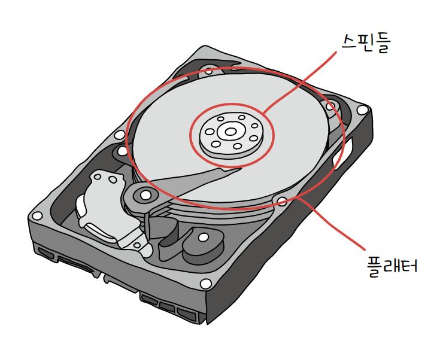

플래터를 대상으로 데이터를 읽고 쓰는 구성 요소는 **헤드**이다. 헤드는 플래터 위에서 미세하게 떠 있는 채로 데이터를 읽고 쓸 수 있다. 이 헤드는 원하는 위치로 헤드를 이동시키는 **디스크 암**에 부착되어 있다.

하드 디스크는 여러 겹의 플래터로 이루어져 있고 플래터 양면을 모두 이용할 수 있다. 양면 플래터를 사용하면 위아래로 플래터당 두 개의 헤드가 사용된다.

플래터는 **트랙**과 **섹터**라는 단위로 데이터를 저장한다. 플래터를 여러 동심원으로 나누었을 때 그중 하나의 원을 트랙이라고 부르고, 트랙을 여러 조각으로 나누었을 때 한 조각을 섹터라고 부른다. 하나의 섹터는 일반적으로 512바이트 정도의 크기를 갖는다.

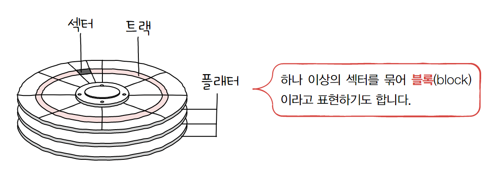

여러 겹의 플래터 상에서 같은 트랙이 위치한 곳을 모아 연결한 원통 모양의 논리적 단위를 **실린더**라고 한다. 하드 디스크는 디스크 암을 움직이지 않고 여러 데이터에 접근하는 것이 유리하기 때문에, 한 실린더에 연속된 정보를 기록한다.

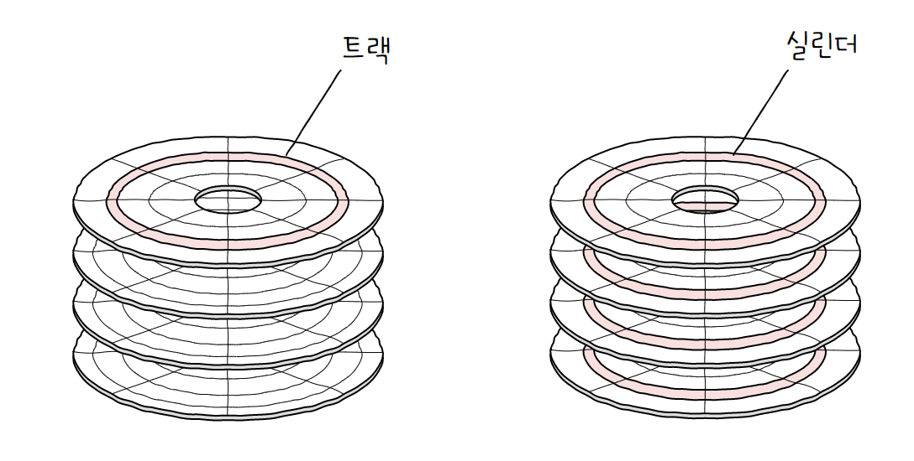

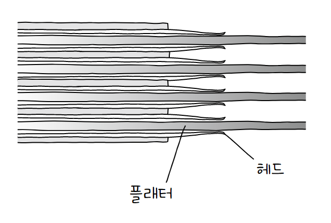

하드 디스크가 저장된 데이터에 접근하는 시간은 크게 세 가지로 나눌 수 있다.

- **탐색 시간**
  
  접근하려는 데이터가 저장된 트랙까지 헤드를 이동시키는 시간을 의미한다.
  
  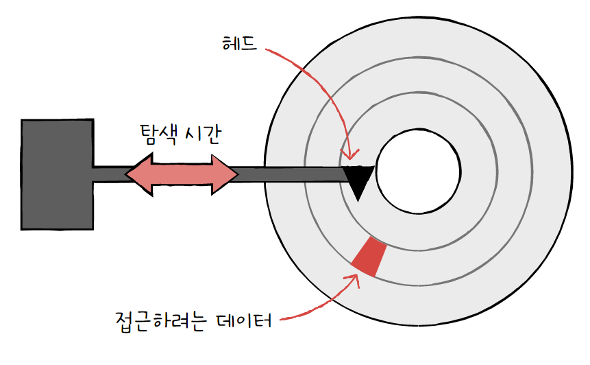

- **회전 지연**
  
  헤드가 있는 곳으로 플래터를 회전시키는 시간을 의미한다.
  
  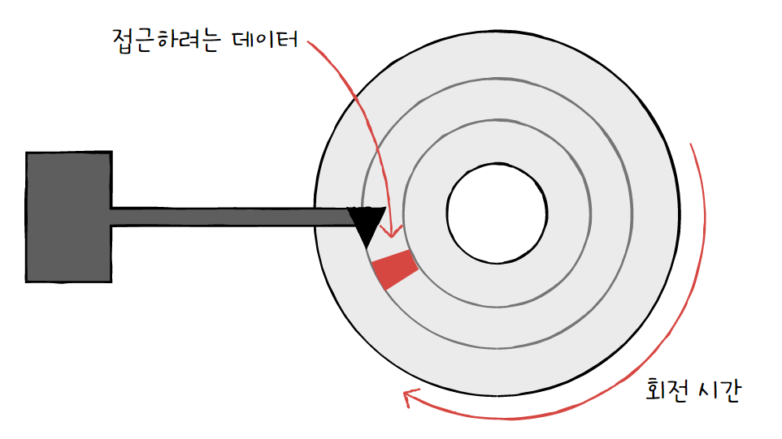

- **전송 시간**
  
  하드 디스크와 컴퓨터 간에 데이터를 전송하는 시간을 의미한다.
  
  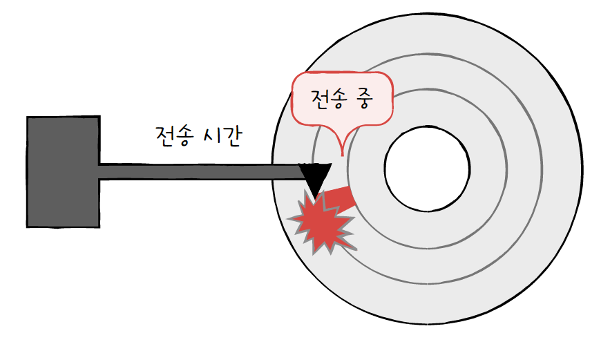

탐색 시간과 회전 지연을 단축시키기 위해서는 **참조 지역성**, 즉 접근하려는 데이터가 플래터 혹은 헤드를 조금만 옮겨도 접근할 수 있는 곳에 위치해 있는 것이 중요하다.

> **참고: 다중 헤드 디스크와 고정 헤드 디스크**
> 
> - 단일 헤드 디스크(=고정 헤드 디스크): 플래터의 한 명당 헤드가 하나씩 달려 있는 하드 디스크
> 
> - 다중 헤드 디스크(=이동 헤드 디스크): 트랙별로 헤드가 여러 개 달려 있는 하드 디스크
> 
> 다중 헤드 디스크는 트랙마다 헤드가 있기 때문에 헤드를 움직일 필요가 없어, 탐색 시간이 들지 않는다.

> **참고: 컴퓨터 시간들**
> 
> | 동작                          | 소요 시간        |
> | --------------------------- | ------------ |
> | L1 캐시 참조 시간                 | 0.5ns        |
> | L2 캐시 참조 시간                 | 5ns          |
> | 메모리 참조 시간                   | 7ns          |
> | 메모리에서 1MB를 순차적으로 읽는 시간      | 250,000ns    |
> | (하드) 디스크 탐색 시간              | 10,000,000ns |
> | (하드) 디스크에서 1MB를 순차적으로 읽는 시간 | 30,000,000ns |

### 플래시 메모리

플래시 메모리는 전기적으로 데이터를 읽고 쓸 수 있는 반도체 기반의 저장 장치이다. 대표적으로는 USB 메모리, SD 카드, SSD 등이 있으며, 주기억장치 중 하나인 ROM에도 사용된다.

> ** 참고: 두 종류의 플래시 메모리**
> 
> 플래시 메모리에는 크게 **NAND 플래시 메모리**와 **NOR 플래시 메모리**가 있다.
> 
> 이 둘 중 대용량 저장 장치로 많이 사용되는 플래시 메모리는 NAND 플래시 메모리이다.

플래시 메모리에는 데이터를 저장하는 가장 작은 단위인 **셀**이라는 단위가 있다.

하나의 셀에 몇 비트를 저장할 수 있느냐에 따라 플래시 메모리 종류를 나눌 수 있다.

- **SLC**(Single Level Cell)
  
  한 셀에 1비트 저장이 가능하다.
  
  다른 타입에 비해 비트의 빠른 입출력이 가능하며 수명도 길다.
  
  하지만 용량 대비 가격이 높아, 보통 기업에서 고성능의 빠른 저장 장치가 필요한 경우 사용한다.

- **MLC**(Multiple Level Cell)
  
  한 셀에 2비트 저장이 가능해, 한 셀로 네 개의 정보를 표현할 수 있다.
  
  SLC 타입보다 속도와 수명은 떨어지지만 대용량화에 유리하며 용량 대비 가격이 저렴하다.
  
  시중에서 사용되는 많은 플래시 메모리 저장 장치들이 MLC 타입으로 만들어진다.

- **TLC**(Triple Level Cell)
  
  한 셀에 3비트 저장이 가능해, 한 셀로 여덟 개의 정보를 표현할 수 있다.
  
  수명과 속도는 가장 떨어지지만 대용량화에 가장 유리하며 용량 대비 가격이 제일 저렴하다.

이렇게 셀이 모여 만들어진 단위를 **페이지**, 페이지가 모여 만들어진 단위를 **블록**이라 하고, 블록이 모이면 **플레인**, 플레인이 모여 **다이**가 된다.

**플래시 메모리에서 읽기와 쓰기는 페이지 단위로 이루어지지만, 삭제는 페이지보다 큰 블록 단위로 이루어진다.**

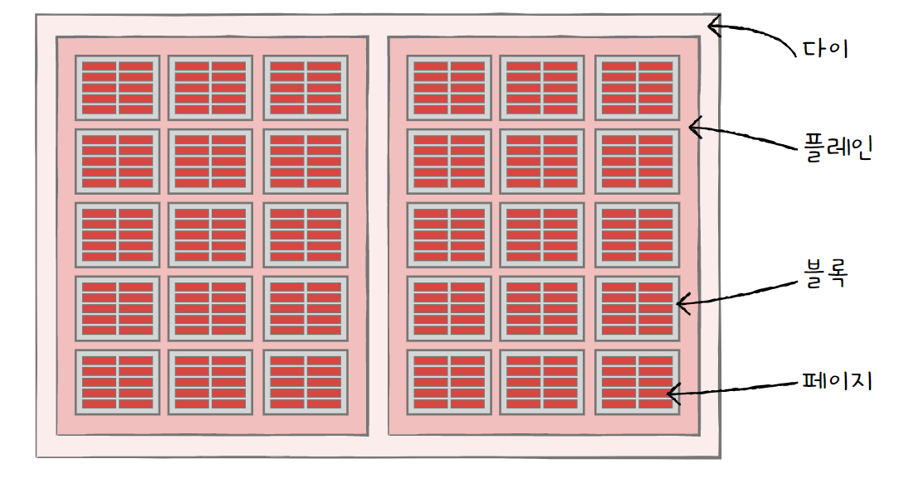

페이지는 세 개의 상태를 갖는다.

- **Free 상태**
  
  어떠한 데이터도 저장하고 있지 않아 새로운 데이터를 저장할 수 있는 상태

- **Valid 상태**
  
  이미 유효한 데이터를 저장하고 있는 상태
  
  플래시 메모리는 하드 디스크와 달리 덮어쓰기가 불가능해, Valid 상태인 페이지에 새 데이터를 저장할 수 없다.

- **Invalid 상태**
  
  유효하지 않은 데이터를 저장하고 있는 상태

**플래시 메모리의 동작**

- 블록 내 빈 페이지가 있는 경우 해당 페이지에 데이터를 저장한다.
  
  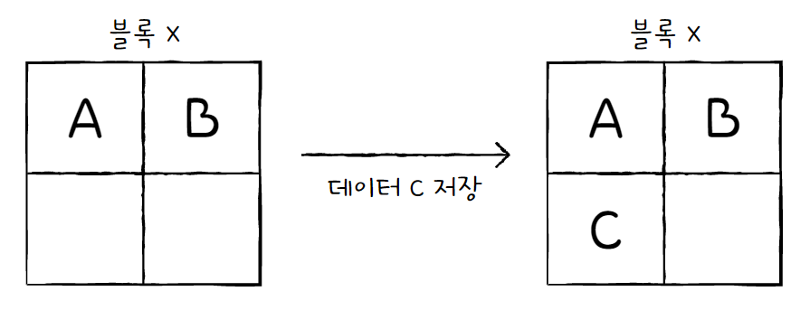

- 기존 데이터를 수정하는 경우, 덮어쓰기가 불가능하기 때문에 새로운 페이지에 저장한다. 이때 기존 데이터를 저장한 페이지는 Invalid 상태가 된다.
  
  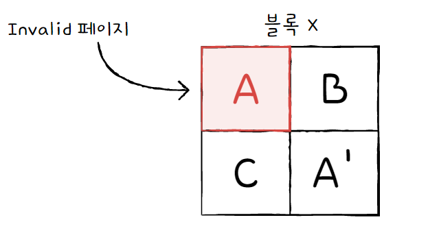

- Invalid 페이지를 갖고 있는 블록은 공간이 낭비되므로, **가비지 컬렉션** 기능을 이용해 유효한 페이지만을 새로운 블록으로 복사하고 기존 블록을 삭제한다.
  
  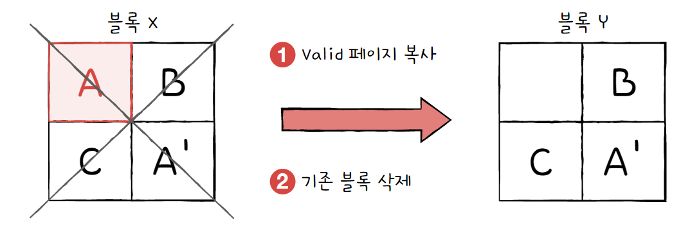

## 2. RAID의 정의와 종류

### RAID의 정의

**RAID**(Redundant Array of Independent Disks)는 주로 하드 디스크와 SSD를 사용하는 기술로, 데이터의 안정성 혹은 높은 성능을 위해 여러 개의 물리적 보조기억장치를 마치 하나의 논리적 보조기억장치처럼 사용하는 기술을 의미한다.

즉, RAID를 이용해 수명이 있는 보조기억장치 내 데이터를 안전하게 관리할 수 있다.

### RAID의 종류

RAID 구성 방법을 **RAID 레벨**이라 표현하며, RAID 레벨에는 다음과 같은 종류가 있다.

- **RAID 0**
  
  RAID 0은 **여러 개의 보조기억장치에 데이터를 단순히 나누어 저장**하는 구성 방식이다.
  
  어떤 데이터를 저장할 때 각 하드 디스크를 번갈아가며 저장하고, 저장되는 데이터는 하드 디스크 개수만큼 나뉘어 저장된다.
  
  이때 마치 줄무늬처럼 분산되어 저장된 데이터를 **스트라입**이라고 하고, 분산하여 저장하는 것을 **스트라이핑**이라고 한다.
  
  이렇게 데이터가 분산되어 저장되면 **여러 개의 저장 장치에서 한 번에 데이터를 가져올 수 있으므로, 저장된 데이터를 읽고 쓰는 속도가 빨라진다.**
  
  하지만 RAID 0은 저장 장치 중 하나에 문제가 생기면 다른 모든 하드 디스크의 정보를 읽는 데 문제가 생길 수 있으므로, **저장된 정보가 안전하지 않다**는 단점이 있다.
  
  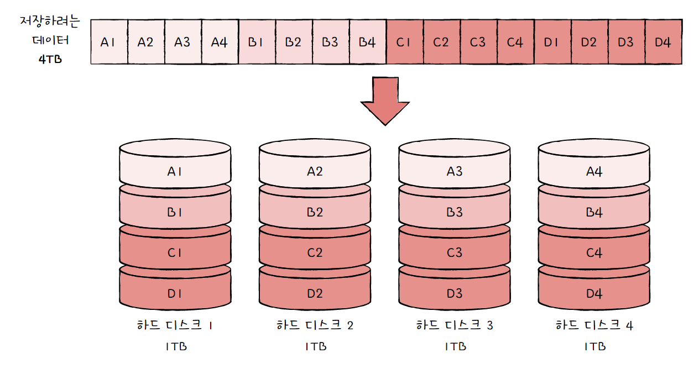

- **RAID 1**
  
  RAID 1은 **복사본을 만드는 방식**으로, **미러링**이라고도 부른다.
  
  저장 장치의 반은 RAID 0과 동일하게 데이터 스트라이핑을 사용하고, 나머지 반은 백업용으로 사용한다. 따라서 **복구가 매우 간단하다는 장점**이 있다.
  
  하지만 RAID 1에 어떠한 데이터를 쓸 때는 원본과 복사본 두 군데에 써야 하므로, **쓰기 속도는 RAID 0보다 느리다**는 단점이 있다. 또한 저장 장치의 개수가 한정되었을 때 **사용 가능한 용량이 적어지는 단점**이 있다.
  
  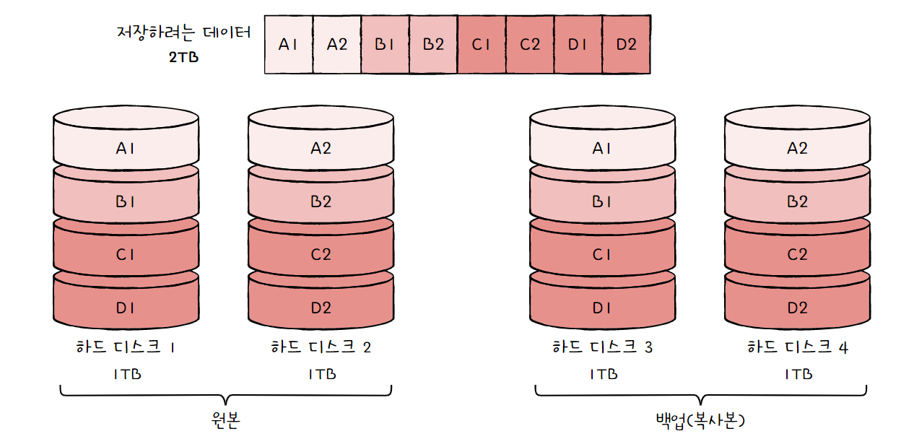

- **RAID 4**
  
  RAID 4는 RAID 1처럼 완전한 복사본을 만드는 대신 오류를 검출하고 복수하기 위한 정보를 저장한 장치를 두는 구성 방식이다. 이때 '오류를 검출하고 복구하기 위한 정보'를 **패리티 비트**라고 한다. 패리티를 저장한 장치를 이용해 다른 장치들의 오류를 검출하고 복구할 수 있다. 따라서, **RAID 1보다 적은 저장 장치로도 데이터를 안전하게 보관**할 수 있다.
  
  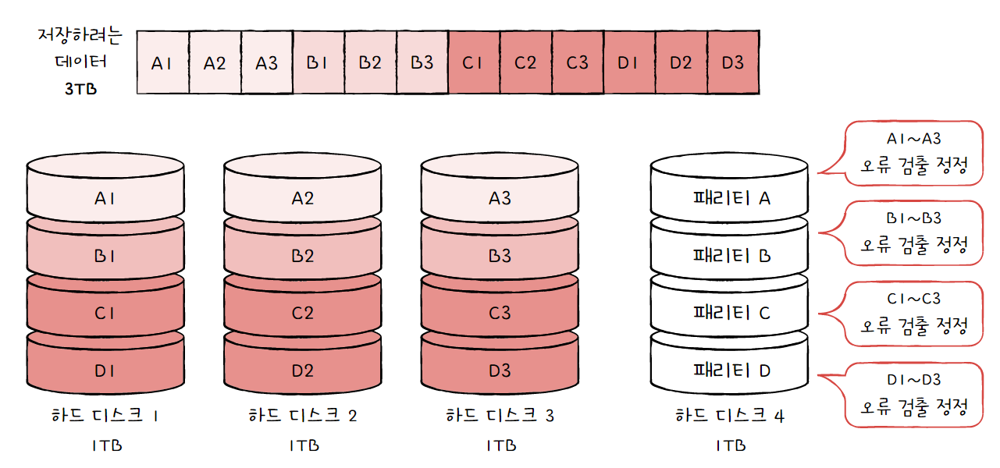
  
  > **참고: 패리티 비트**
  > 
  > 원래 패리티 비트는 오류 검출만 가능할 뿐 오류 복구는 불가능하다.
  > 
  > 하지만 RAID에서는 패리티 값으로 오류 수정도 가능하다.

- **RAID 5**
  
  RAID 4에서는 새로운 데이터가 저장될 때마다 패리티를 저장하는 디스크에도 데이터를 써야 하므로, 패리티를 저장하는 장치에 병목 현상이 발생한다는 문제가 있다.
  
  RAID 5는 **패리티 정보를 분산하여 저장**하는 방식으로, 이 병목 현상을 해소한다.
  
  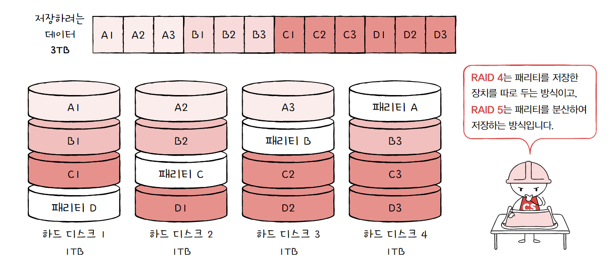

- **RAID 6**
  
  RAID 6의 구성은 기본적으로 RAID 5와 같지만 **서로 다른 두 개의 패리티를 두는 방식**이다.
  
  새로운 정보를 저장할 때마다 함께 저장할 패리티가 두 개이므로 **쓰기 속도는 RAID 5보다 느리지만, 데이터를 더욱 안전하게 저장**할 수 있다는 장점이 있다.
  
  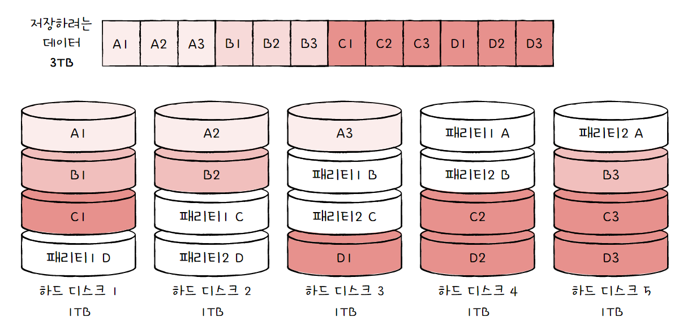

다양한 RAID 레벨이 있는데, 이 외에도 RAID 10(RAID 0과 RAID 1을 혼합) 방식이나 RAID 50(RAID 0과 RAID 5를 혼합)도 있다. 이렇게 여러 RAID 레벨을 혼합한 방식을 **Nested RAID**라고 한다.

