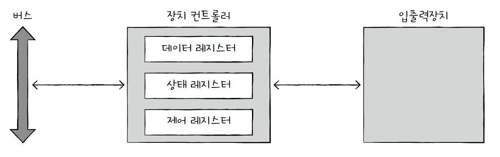
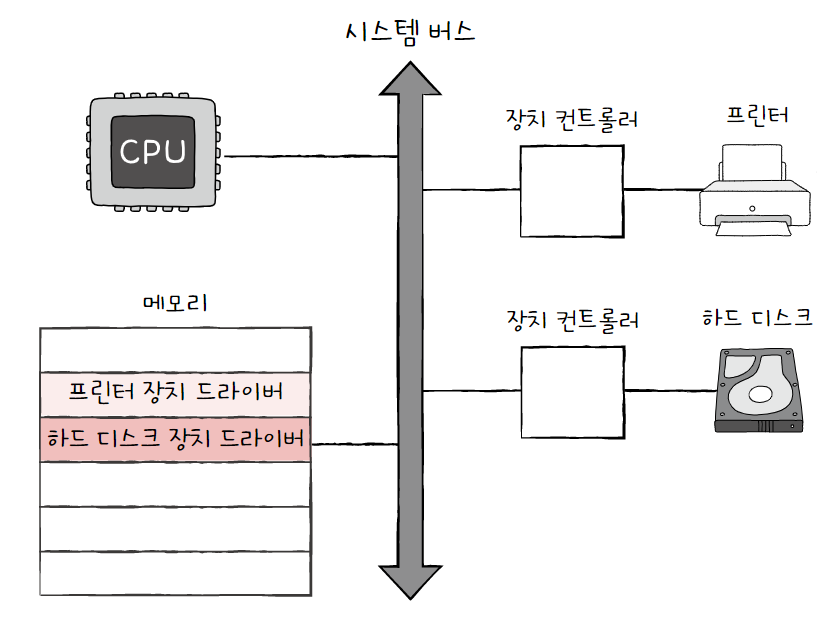
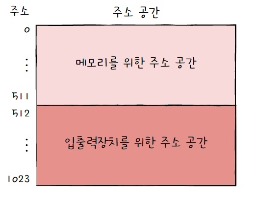
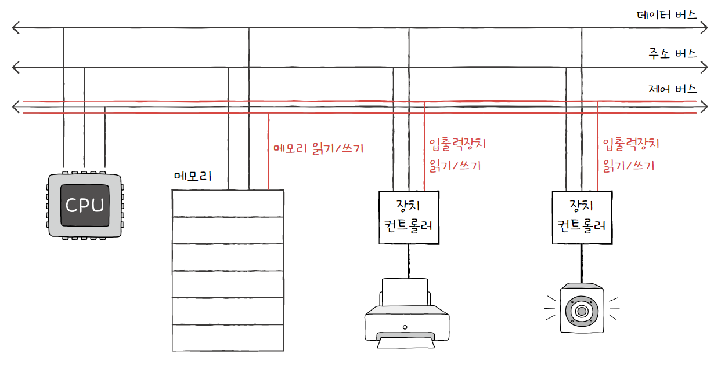
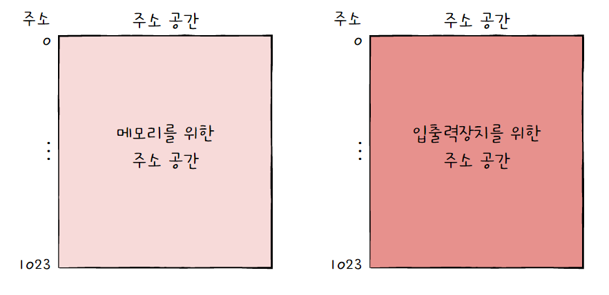
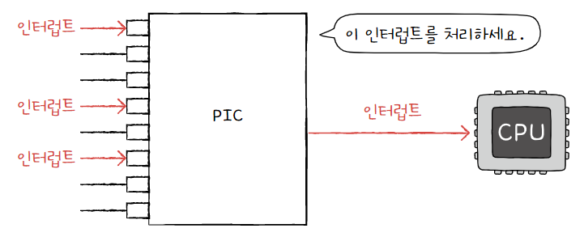
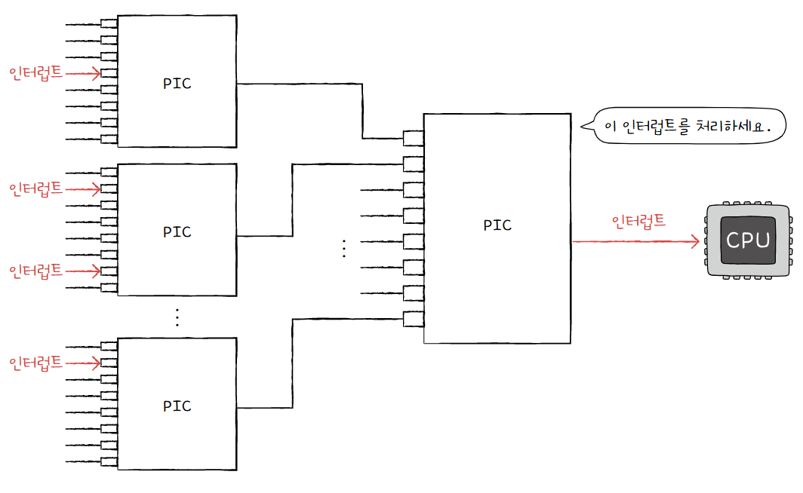
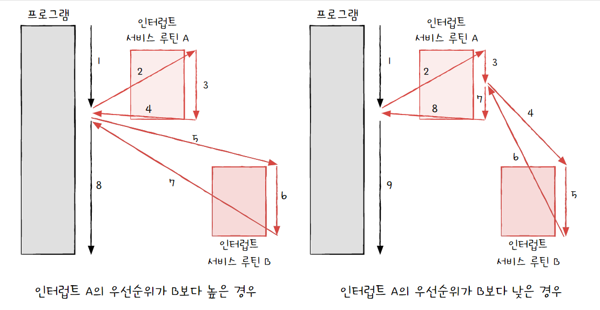
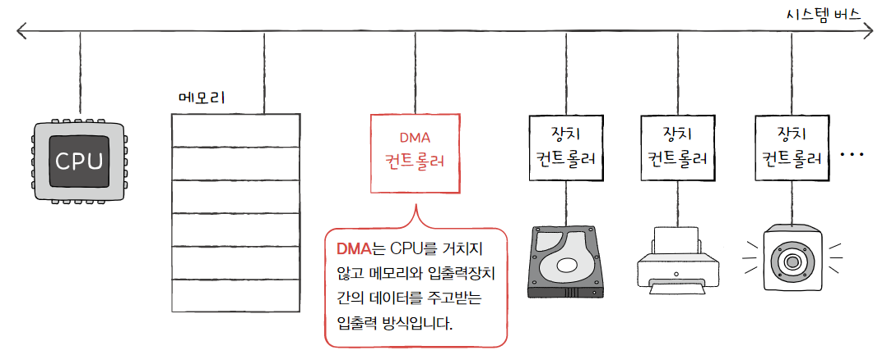
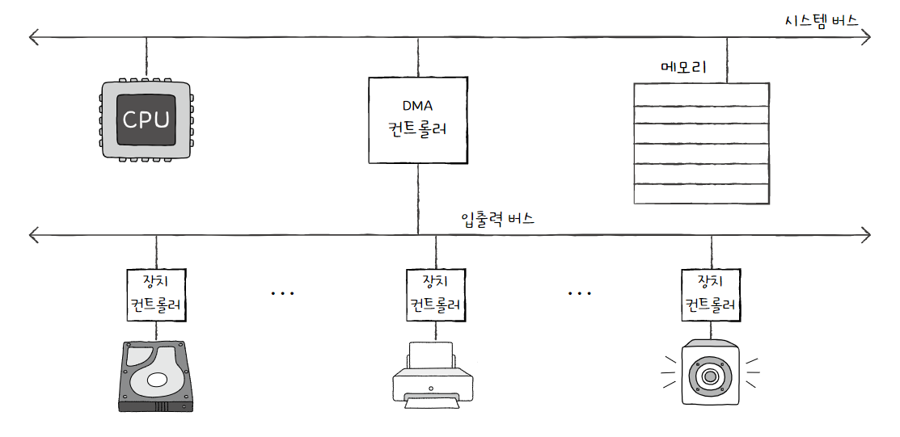

# 입출력장치

# 1. 장치 컨트롤러와 장치 드라이버

### 장치 컨트롤러

입출력장치는 다음과 같은 이유로 컴퓨터 내부와 직접 통신하기가 어렵다.

- 종류가 너무 다양해 정보를 주고받는 방식을 규격화하기가 어렵다.

- CPU와 메모리의 데이터 전송률은 높지만 입출력장치의 데이터 전송률은 낮다.
  
  - 전송률: 데이터를 얼마나 빨리 교환할 수 있는지를 나타내는 지표

따라서 입출력장치는 각각의 **장치 컨트롤러**를 통해 컴퓨터 내부와 정보를 주고받는다.

장치 컨트롤러는 **입출력 제어기** 또는 **입출력 모듈** 등으로 다양하게 불린다.

장치 컨트롤러의 주요 역할은 다음과 같다.

- CPU와 입출력장치 간의 통신 중개

- 오류 검출

- 데이터 버퍼링
  
  - **버퍼링**이란 전송률이 높은 장치와 낮은 장치 사이에 주고받는 데이털르 **버퍼**라는 임시 저장 공간에 저장하여 전송률을 비슷하게 맞추는 방법을 뜻한다.
    
    버퍼에 데이터를 조금씩 모았다가 한번에 내보내거나, 데이터를 한 번에 많이 받아 조금씩 내보내는 것을 버퍼링이라고 할 수 있다.

장치 컨트롤러의 내부 구조는 여러가지가 있지만, 대표적으로 **데이터 레지스터**, **상태 레지스터**, **제어 레지스터**가 있다. 이 레지스터들에 담긴 값들은 버스를 타고 CPU 혹은 다른 입출력장치와 통신한다.

- 데이터 레지스터
  
  CPU와 입출력장치 사이에 주고받을 데이터가 담기는 레지스터이다.
  
  전송률 차이를 완화하는 **버퍼 역할**을 한다.
  
  주고받는 데이터가 많은 입출력장치는 레지스터 대신 RAM을 사용하기도 한다.

- 상태 레지스터
  
  입출력장치가 작업을 할 준비가 되었는지, 작업이 완료되었는지, 오류는 없는지 등의 상태 정보가 저장된다.

- 제어 레지스터
  
  입출력장치가 수행할 내용에 대한 제어 정보와 명령을 저장한다.

### 장치 드라이버

**장치 드라이버**란 장치 컨트롤러의 동작을 감시하고 제어함으로써 장치 컨트롤러가 컴퓨터 내부와 정보를 주고받을 수 있게 하는 프로그램이다.

장치 드라이버도 프로그램이기 때문에 실행 과정에서 메모리에 저장된다.

입출력장치를 연결하기 위해 장치 컨트롤러가 **하드웨어적인 통로** 역할을 한다면, 장치 드라이버는 **소프트웨어적인 통로** 역할을 한다.

컴퓨터가 장치 드라이버를 인식하고 실행할 수 있다면 어떠한 장치라도 컴퓨터 내부와 정보를 주고받을 수 있다.

반대로 장치 드라이버를 인식하거나 실행할 수 없다면 그 장치는 컴퓨터 내부와 정보를 주고받을 수 없다.

## 2. 다양한 입출력 방법

### 프로그램 입출력

프로그램 속 명령어로 입출력장치를 제어하는 방법이다.

CPU가 장치 컨트롤러와 상호작용하며 입출력 작업을 수행한다.

이때 CPU가 장치 컨트롤러와 상호작용하려면 장치 컨트롤러의 레지스터들이 메모리에 저장되어 있어야 한다. 장치 컨트롤러의 주소를 저장하는 방법에는 크게 두 가지 방식이 있다.

- **메모리 맵 입출력**
  
  메모리에 접근하기 위한 주소 공간과 입출력장치에 접근하기 위한 주소 공간을 하나의 주소 공간으로 간주하는 방법이다.
  
  CPU는 메모리 주소나 장치 컨트롤러의 레지스터나 명령어를 구분하지 않고, 같은 메모리 주소를 대하듯 한다.
  
  

- **고립형 입출력**
  
  메모리를 위한 주소 공간과 입출력장치를 위한 주소 공간을 분리하는 방법이다.
  
  제어 버스에 '메모리 읽기/쓰기' 선과 '입출력장치 읽기/쓰기' 선을 분리한 뒤, 입출력장치에 접근할 때는 입출력 읽기/쓰기 선을 활성화시키는 입출력 명령어를 사용한다.
  
  두 메모리 공간이 분리되어 있기 때문에, 두 가지 모두 모든 메모리 공간을 사용할 수 있다.
  
  
  
  
  
  > **메모리 맵 입출력 vs 고립형 입출력**
  > 
  > | 메모리 맵 입출력                | 고립형 입출력                  |
  > | ------------------------ | ------------------------ |
  > | 메모리와 입출력장치는 같은 주소 공간 사용  | 메모리와 입출력장치는 분리된 주소 공간 사용 |
  > | 메모리 주소 공간이 축소됨           | 메모리 주소 공간이 축소되지 않음       |
  > | 메모리와 입출력장치에 같은 명령어 사용 가능 | 입출력 전용 명령어 사용            |
  > 
  > 

### 인터럽트 기반 입출력

장치 컨트롤러가 CPU에 하드웨어 인터럽트 요청 신호를 보내면 CPU가 인터럽트 서비스 루틴을 실행하는 방식이다.

> **참고: 폴링(polling)**
> 
> 폴링이란 CPU가 입출력장치의 상태 및 처리할 데이터가 있는지 등을 주기적으로 확인하는 방식이다.
> 
> 인터럽트 요청을 받을 때까지 온전히 다른 일에 집중할 수 있는 인터럽트 방식에 비해 폴링 방식이 CPU의 부담이 더 크다.

다양한 입출력장치가 인터럽트 요청을 보낼 경우 CPU는 우선순위가 높은 인터럽트부터 처리하는데, 많은 컴퓨터에서는 **프로그래머블 인터럽트 컨트롤러**(**PIC**)라는 하드웨어를 사용한다.

PIC는 여러 장치 컨트롤러에 연결되어 우선 순위를 판별한 뒤 CPU에 가장 먼저 처리할 하드웨어 인터럽트를 알려준다.

(참고로 PIC는 무시할 수 없는 인터럽트인 **NMI**(Non-Maskable Interrupt)까지 우선순위를 판별하지는 않는다.)

- PIC의 다중 인터럽트 처리 과정
  
  1. PIC가 장치 컨트롤러에서 인터럽트 요청 신호(들)를 받아들인다.
  
  2. 우선순위를 판단한 뒤 CPU에 처리해야 할 인터럽트 요청 신호를 보낸다.
  
  3. CPU는 PIC에 인터럽트 확인 신호를 보낸다.
  
  4. PIC는 데이터 버스를 통해 CPU에 인터럽트 벡터를 보낸다.
  
  5. CPU는 인터럽트 벡터를 통해 인터럽트 요청의 주체를 알게 되고, 해당 장치의 인터럽트 서비스 루틴을 실행한다.

일반적으로 더 많고 복잡한 장치들의 인터럽트를 관리하기 위해 PIC를 다음과 같이 두 개 이상 계층적으로 구성한다.

> **참고: 우선순위가 더 높은 인터럽트**
> 
> 인터럽트 서비스 루틴을 실행하는 중에도 우선순위가 더 높은 인터럽트 요청이 오면, 기존의 서비스 루틴을 잠시 중지하고 우선순위가 더 높은 인터럽트 서비스 루틴을 실행한다.
> 
> 

### DMA 입출력

프로그램 기반 입출력과 인터럽트 기반 입출력은 전송되는 데이터가 반드시 CPU를 거쳐야 한다는 단점이 있다.

이를 해결하기 위해 입출력장치와 메모리가 CPU를 거치지 않고도 메모리와 입출력장치가 상호작용할 수 있는 **DMA**(Direct Memory Access)가 등장했다.

DMA 입출력을 하기 위해서는 시스템 버스에 연결된 DMA 컨트롤러라는 하드웨어가 필요하다.

- DMA 입출력 과정
  
  1. CPU가 DMA 컨트롤러에 입출력 작업을 명령한다.
  
  2. DMA 컨트롤러는 CPU 대신 장치 컨트롤러와 상호작용하며 입출력 작업을 수행한다. 이때 DMA 컨트롤러는 필요한 경우 메모리에 직접 접근하여 정보를 읽거나 쓸 수 있다.
  
  3. 입출력 작업이 끝나면 DMA 컨트롤러는 CPU에 인터럽트 요청 신호를 보낸다.

CPU는 오로지 입출력의 시작과 끝에만 관여하면 되기 때문에 작업 부담이 훨씬 줄어든다.

하지만 DMA 컨트롤러는 시스템 버스로 메모리 혹은 장치 컨트롤러와 상호작용하는데, 시스템 버스는 공용 자원이기 때문에 CPU와 동시 작업이 불가능하다. 따라서 DMA 컨트롤러는 CPU가 시스템 버스를 이용하지 않을 때 사용하거나, 일시적으로 CPU의 이용을 중단하고 시스템 버스를 집중적으로 사용한다. 이러한 DMA의 시스템 버스 이용을 **사이클 스틸링**이라고 한다.

DMA 컨트롤러가 시스템 버스를 사용하는 동안 CPU가 사용하지 못하는 문제를 해결하기 위해, 장치 컨트롤러들과 DMA 컨트롤러는 **입출력 버스**라는 별도의 버스에 연결해 상호작용한다.

입출력 버스에는 **PCI(Peripheral Component Interconnect) 버스**, **PCI Express(PCIe) 버스** 등 여러 종류가 있다.

> **참고: 입출력 채널**
> 
> DMA 등장 이후에도 여전히 입출력 명령어를 인출하고, 해석하고, 실행하는 역할은 상당 부분 CPU의 몫이었다.
> 
> 그래서 최근에는 메모리 직접 접근 뿐 아니라 입출력 명령어를 직접 인출하고, 해석하고, 실행까지 하는 입출력 전용 CPU가 만들어졌는데, 이를 **입출력 프로세서**(IOP: Input/Output Processor) 혹은 **입출력 채널**(Input/Output Channel)이라고 부른다.
> 
> CPU가 입출력 채널에게 메모리에 저장된 특정 입출력 명령어를 수행하라고 지시하면, 입출력 채널이 해당 입출력 명령어를 인출하고, 해석하고, 실행한 뒤, CPU에게 인터럽트 요청 신호를 보낸다.