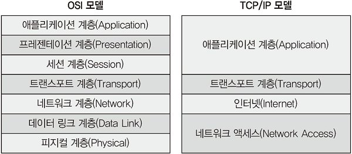
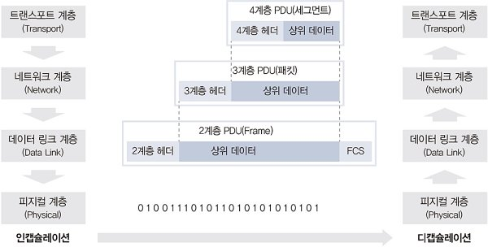

# 네트워크 시작하기

## 1. 네트워크 구성도 살펴보기

네트워크는 크게 서비스를 받는 입장과 서비스를 제공하는 입장으로 나뉜다.

서비스를 받는 입장: 집에서 인터넷에 접속하는 경우, 회사에서 인터넷에 접속해 업무하는 경우 등

서비스를 제공하는 입장: 클라우드나 데이터 센터, 회사 기계실에 서버를 놓고 고객 혹은 내부 직원을 위한 서비스를 제공하는 경우 등

## 2. 프로토콜

기존 프로토콜은 어디서 만들었는지 또는 어떤 회사에서 사용하는지에 따라 다양했다. 하지만 최근에는 여러 프로토콜 기술이 이더넷-TCP/IP 기반 프로토콜로 변경되고 있다.

- 물리적 측면: 데이터 전송 매체, 신호 규약, 회선 규격 등에서 이더넷이 많이 쓰인다.

- 논리적 측면: 장치들끼리 통신하기 위한 프로토콜 규격으로 TCP/IP가 많이 쓰인다.

프로토콜은 2진수 비트 기반으로 만들어졌지만, 애플리케이션 레벨에서는 문자 기반 프로토콜이 사용된다. 따라서 HTTP와 SMTP와 같은 프로토콜을 통해 사람이 읽을 수 있는 형태로 쓰인다. 이는 효율성은 떨어지지만 다양한 확장이 가능하다는 장점이 있다.

## 3. OSI 7계층과 TCP/IP

### OSI 7 계층

과거에는 통신용 규약이 표준화되지 않았기 때문에 시스템이나 애플리케이션이 서로 호환되지 않는 문제가 있었다. 이를 하나의 규약으로 통합하려는 노력이 현재 OSI 7계층으로 남아있다.

따라서 현재는 대부분의 프로토콜이 TCP/IP 프로토콜 스택 기반으로 되어있지만, OSI 7계층은 네트워크 동작을 나누어 이해하는 데 많은 도움이 된다.

OSI 7계층은 두 가지 계층으로 묶어서 나눌 수 있다.

1~4계층: 데이터 플로 계층(Data Flow Layer) / 하위 계층(Lower Layer)

5~7계층: 애플리케이션 계층(Application Layer) / 상위 계층(Upper Layer)

- 데이터 플로 계층: 애플리케이션 개발자가 해당 계층 프로토콜을 개발할 때 하위 계층을 고려하지 않고 데이터를 표현하는 데 초점을 맞춘다.

- 애플리케이션 계층: 데이터를 상대방에게 잘 전달하는 역할을 가지며 네트워크 엔지니어는 애플리케이션의 데이터 표현을 고려하기보다 데이터를 전송하는데만 집중한다.
  
  

### TCP/IP 프로토콜 스택

TCP/IP 모델은 실용성에 중점을 둔 프로토콜로, 4계층으로 구분한다.

OSI 7계층에서 서버 엔지니어와 네트워크 엔지니어의 업무에 따라 데이터 플로 계층과 애플리케이션 계층을 나눈 것처럼, TCP/IP 모델은 그 구분이 더 확연히 드러난다. 

또한 상위 3계의 계층을 하나의 애플리케이션 계층으로 묶고, 1, 2 계층을 하나의 네트워크 계층으로 구분한다. 이는 현실에 더 쉽게 반영할 수 있도록 하고자 하는 의도를 볼 수 있다.

## 4. OSI 7계층 이해하기

### 1계층(피지컬 계층)

**물리적 연결과 관련된 정보를 정의하는 계층**

주로 전기 신호를 전달하는 데 초점이 맞추어져 있다.

주요 장비로는 허브, 리피터, 케이블, 커넥터, 트랜시버, 탭 등이 있다.

1계층에서는 들어온 전기 신호를 그대로 잘 전달하는 것이 목적이다.

주소의 개념이 없기 때문에, 전기 신호가 들어온 포트를 제외하고 모든 포트에 같은 전기 신호를 전송한다.

### 2계층(데이터 링크 계층)

**전기 신호를 우리가 알 수 있는 데이터 형태로 처리하는 계층**

주소 정보를 정의하고 정확한 주소로 통신이 되도록 하는 데 초점이 맞추어져 있다.

출발지와 도착지 주소를 확인하고 내게 보낸게 맞는지 내가 처리해야하는지를 검사한 뒤 데이터 처리를 수행한다.

데이터에 대한 에러를 탐지하거나 고치는 역할을 수행할 수 있는데, 이더넷 기반 네트워크의 2계층에서는 에러를 탐지하는 역할만 수행한다.

무작정 데이터를 던지지 않고 받는 사람이 현재 데이터를 받을 수 있는지 확인하는 작업부터 수행하는데, 이를 플로 컨트롤(Flow Control)이라고 한다.

2계층에서 동작하는 네트워크 구성 요소는 네트워크 인터페이스 카드와 스위치이다.

**가장 중요한 특징은 MAC 주소라는 주소 체계가 있다는 것이다.**

네트워크 인터페이스 카드와 스위치 모두 MAC 주소를 이해할 수 있다.

네트워크 인터페이스 카드에는 고유 MAC 주소가 있으며, 입력되는 전기 신호를 데이터 형태로 만들고 데이터에서 도착지 MAC 주소를 확인한 후 자신에게 들어오는 전기신호가 맞는지 확인한다. 자신에게 들어오는 전기신호가 맞으면 이 데이터를 상위 계층에서 처리할 수 있도록 메모리에 적재한다.

스위치는 MAC 주소를 보고 통신해야 할 포트를 지정해 내보내는 능력이 있다. 따라서 모든 포트로 전기신호를 보내는 허브와 달리, MAC 주소의 위치를 파악해 해당 목적지까지 연결된 포트로만 전기신호를 보내는 스위치 덕에 이더넷 기반 네트워크가 급증하는 계기가 되었다.

(MAC 주소가 아직 MAC 주소 테이블에 등록되지 않은 경우에는 출발지를 제외한 나머지 포트에 모두 데이터를 전송하는데, 이를 플러딩이라고 한다.)

> 참고: 네트워크 인터페이스 카드는 다음과 같이 불리기도 한다.
> 
> NIC(Network Interface Controller), 네트워크 카드, 랜 카드, 물리 네트워크 인터페이스, 이더넷 카드, 네트워크 어댑터

데이터를 보낼 때는 이더넷 헤더(목적지 MAC 주소, 출발지 MAC 주소, 프로토콜 유형)와 FCS(Frame Check Sequence)를 붙여 **프레임**단위로 전송한다. FCS는 데이터 전송 중 오류가 발생하는지 확인하는 용도이다.

### 3계층(네트워크 계층)

**논리적 주소(IP)가 정의되며 라우터로 최적 경로를 찾아 패킷을 전송하는 역할을 한다.**

IP주소는 네트워크 주소 부분과 호스트 주소 부분으로 나뉘며 변경이 가능하다.

라우터를 이용해 IP주소를 이해할 수 있으며, 최적의 경로를 찾아 해당 경로로 패킷을 전송하는 역할을 한다.

> 패킷: 네트워크 계층에서 데이터를 전송하는 단위
> 
> 상위 계층에서 전달받은 데이터에 IP헤더를 붙인 것을 의미한다.

### 4계층(트랜스포트 계층)

**해당 데이터들이 잘 보내지도록 확인하는 역할을 하는 계층**

패킷이 유실되거나 순서가 바뀌는 것을 바로잡아줄 수 있다.

통신 방법은 크게 연결형 통신과 비연결형 통신으로 나뉜다.

- 연결형 통신: 데이터를 신뢰성 있게 전달   ex) TCP

- 비연결형 통신: 데이터를 효율적으로 전달   ex) UDP

TCP의 경우 세그먼트 단위로 데이터를 전달하며 패킷에 보내는 순서를 명시한 것을 `시퀀스 번호`, 패킷에 받는 순서를 명시한 것을 `ACK 번호`라고 한다.

사용되는 장비로는 로드밸런서와 방화벽이 있다.

### 5계층(세션 계층)

**양 끝단의 프로세스를 안정적으로 연결하거나 끊어주는 역할을 한다.**

흔히 부르는 `세션`을 관리하는 것이 주요 역할이며, TCP/IP 세션을 만들고 없애는 책임을 진다. 또한 에러로 중단된 통신에 대한 에러 복구와 재전송도 수행한다.

### 6계층(프레젠테이션 계층)

**표현 방식이 다른 애플리케이션이나 시스템 간의 통신을 돕는 번역 역할을 한다.**

사용자 시스템의 응용 계층에서 데이터의 형식상 차이를 다루는 부담을 줄여준다. MIME인코딩이나 암호화, 압축, 코드 변환과 같은 동작이 이뤄진다.

### 7계층(애플리케이션 계층)

**애플리케이션 프로세스를 정의하고 애플리케이션 서비스를 수행한다.**

네트워크 소프트웨어의 UI부분이나 사용자 IO부분을 정의한다.

대표적인 프로토콜로는 FTP, HTTP, SMTP 등이 있다.

## 5. 인캡슐레이션과 디캡슐레이션

- 인캡슐레이션: 상위 계층에서 하위 계층으로 데이터를 보내면서 물리 계층에서 전기 신호 형태로 네트워크를 통해 신호를 보내는 과정

- 디캡슐레이션: 전기 신호를 받아 데이터화하여 하위계층에서 상위계층으로 전달하는 과정

인캡슐레이션 과정에서는 각 계층별로 자신이 필요한 정보를 비트 단위로 헤더에 저장한다. 디캡슐레이션 과정에서는 해당 계층에서 붙힌 헤더를 이해하며 상위 계층으로 데이터를 올려보낸다.

헤더에는 반드시 다음과 같은 정보가 포함되어야 한다.

- 현재 계층에서 정의하는 정보

- 상위 프로토콜 지시자(한 계층에 다양한 프로토콜이 존재하기 때문에, 어떤 프로토콜로 보내야 할지 구분해야 한다.)

PDU는 Protocol Data Unit의 약자로, 상위 계층이 전달한 데이터에 붙이는 제어 정보를 의미한다.