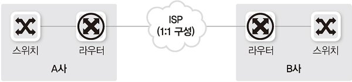
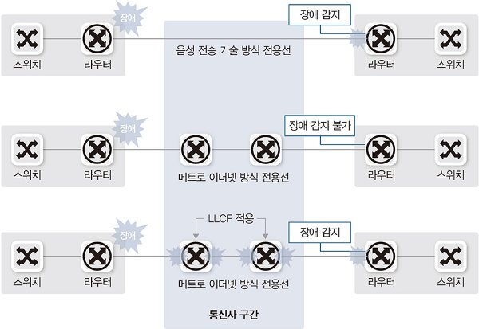
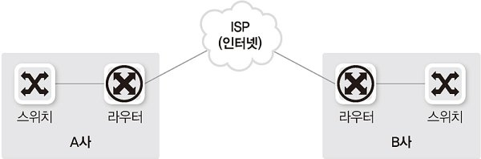
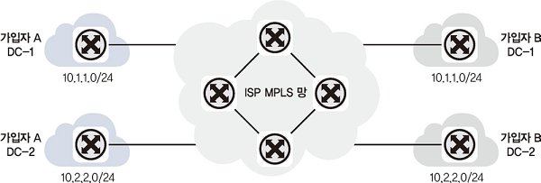
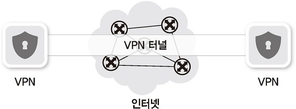
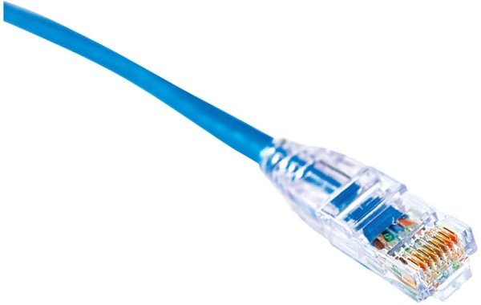
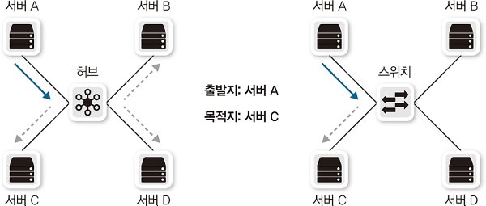

# 네트워크 연결과 구성요소

현재 기술은 이더넷-TCP/IP 기반으로 단순화되고 있지만 아직도 용도와 필요한 네트워크 속도에 따라 다양한 기술 요소들이 사용되고 있다.

## 1. 네트워크 연결 구분

현재 대부분의 기술이 이더넷으로 통합되면서 전송 기술 구분은 의미가 없어졌기에 관리 범위 기준으로 구분을 하면 다음과 같다. 관리 범위 기준으로 나누는 것은 **트래픽 최소화** 관점에서 의미가 있다.

- LAN(Local Area Network): 사용자 내부 네트워크

- MAN(Metro Area Network): 한 도시 정도를 연결하고 관리하는 네트워크

- WAN(Wide Area Network): 멀리 떨어진 LAN을 연결해주는 네트워크

> 참고: MAN의 범위
> 
> MAN은 사람, 서적마다 다양한 개념으로 불린다.
> 
> 1. 한 도시의 범위(수십 km)를 연결하는 개념으로 보통 도시 단위 네트워크를 구성할 때 통신사가 이미 가지고 있는 인프라를 기반으로 구축하는 경우 WAN, 자체 인프라로 구축하면 MAN으로 구분하기도 한다.
> 
> 2. 근거리 네트워크를 벗어나 라우터간의 통신이 되면 모두 WAN의 영역으로 본다.
> 
> 3. MAN은 LAN이 모여서 만들어진 것이고, WAN은 MAN이 모여서 만들어진 것이다.

### LAN(Local Area Network)

사무실 혹은 가정집과 같이 비교적 소규모 네트워크를 말한다.

근거리 통신만으로 충분하기에 스위치와 같이 간단한 장비로 연결된다.

현재는 대부분 이더넷 기반 전송 기술을 사용한다.

또한 무선 랜도 보급되면서 무선 방식이 굉장히 활성화되고 있다.

### WAN(Wide Area Network)

먼 거리에 있는 네트워크를 연결하기 위해 사용한다.

멀리 떨어진 LAN을 서로 연결하거나 인터넷에 접속하기 위한 네트워크이다.

직접 구현하기가 힘들기 때문에 대부분 통신사업자(KT, LGU+, SKB)로부터 회선을 임대해 사용한다.

원격으로 자신의 대지및 건물이 아닌 곳을 통신해야 할 때 사용하며 비용이 발생한다.

## 2. 네트워크 회선

### 인터넷 회선

인터넷 접속을 위해 통신사업자와 연결하는 회선을 말한다.

일반 가정에서 인터넷에 연결하기 위해 사용하는 기술은 가입자와 통신사업자 간에 직접 연결되는 구조가 아니라, **전송 선로 공유 기술**을 사용한다.

예를 들어 통신사업자와 아파트 간에 연결한 회선을 아파트 가입자가 공유하게 되면, 주변 사용량에 따라 속도가 느려질 수 있다. 즉, **속도가 보장되지 않는다.**

### 전용 회선

가입자와 통신사업자 간에 **대역폭을 보장**해주는 서비스를 대부분 전용 회선이라고 부른다.

가입자와 통신사업자 간에는 전용 케이블로 연결되어 있고 통신사업자 내부에서 TDM(시분할 다중화, Time Division Multiplexing) 같은 기술로 마치 직접 연결한 것처럼 통신 품질을 보장한다.

(ISP: 인터넷 제공자, Internet Service Provider)

전용 회선 전송 기술

- 저속: 음성 전송 기술 기반(64kbps 단위로 구분되어 사용)

- 고속: 메트로 이더넷(광케이블 기반)

> 참고: LLCF(Link Loss Carry Forward)
> 
> 한쪽 링크가 다운되면 이를 감지해 반대쪽 링크도 다운시키는 기술
> 
> LLCF가 설정되지 않으면 반대쪽 링크가 장애를 감지하지 못하는 문제가 발생할 수 있다.
> 
> 저속 회선은 2계층 프로토콜 통신 상태를 확인하는 기능이 있으므로(라우터에서 감지), LLCF 설정이 별도로 필요없다.
> 
> 

### 인터넷 전용 회선

인터넷 연결 회선에 대한 통신 대역폭을 보장해주는 상품을 말한다.

일반가정에서 사용하는 기술과 달리 다른 가입자와 경쟁하지 않고 연결 품질을 보장해준다.

### VPN(Virtual Private Network)

물리적으로는 전용선이 아니지만 가상으로 직접 연결한 것 같은 효과가 나도록 만들어주는 네트워크 기술이다.

만약 A 컴퓨터가 B 네트워크의 VPN에 접속했다면, 둘은 물리적으로 연결되지 않았지만 A 컴퓨터의 모든 통신은 B 네트워크를 거치게 된다. 따라서 A 컴퓨터는 마치 B 네트워크에 포함된 장비처럼 통신할 수 있다.

보안 등의 이유로 내부 네트워크를 이용해야 하지만 부득이하게 외부와의 통신이 필요한 경우, VPN을 통해 보안을 해치지 않고 통신할 수 있다. 하지만 VPN에 접속한 장비는 VPN 서버와 암호화 통신을 해야하기 때문에 네트워크 속도가 매우 느려진다.

- 통신사업자 VPN
  
  전용선은 연결 거리가 늘어날수록 비용이 증가하고, 또 가입자가 계약된 대역폭을 항상 100% 사용하는 것이 아니어서 낭비되는 비용이 클 수 있다. 이런 비용 낭비를 줄이기 위해 통신 사업자가 직접 가입자를 구분할 수 있는 VPN 기술을 사용해 비용을 낮추고 있다. 가장 대표적인 기술이 MPLS VPN이다.
  
  
  
  이 기술은 여러 가입자가 하나의 망에 접속해 통신하므로 공용 회선을 함께 이용하게 되어 비용이 낮아지고, 가입자 입장에서 기술적으로 특별히 고려할 점이 없다는 장점이 있다. 따라서 본사-지사 또는 지사-지사 간의 연결은 대부분 MPLS VPN 기술을 사용한다.

- 가입자 VPN
  
  대부분의 일반 사용자가 사용하는 VPN 기술이다.
  
  일반 인터넷망을 이용해 사용자가 직접 가상 전용 네트워크를 낮은 비용으로도 구성할 수 있다.
  
  

### DWDM(Dense Wavelength Division Multiplex)

장거리 통신시 케이블 포설 비용 및 관리의 어려움 문제를 극복하기 위해 개발되었다.

하나의 광케이블에 하나의 통신만 가능했던 과거와 달리, 하나의 광 케이블에 다른 파장의 빛을 통해 여러 채널을 만드는 동시에 많은 데이터를 전송할 수 있다.

## 

## 3. 네트워크 구성 요소

### 네트워크 인터페이스 카드(NIC)

역할 세 가지

- 전기적 신호를 데이터 신호 형태로 또는 그 반대로 변환해준다. 이런 상호 변환작업을 **직렬화**라고 한다.

- MAC 주소를 가지고 있으며, 받은 패킷의 도착지 주소가 자신의 MAC 주소가 아니면 폐기하고 맞으면 시스템 내부에서 처리할 수 있도록 전달한다.

- 패킷 기반 네트워크는 다양한 통신이 하나의 채널을 이용하므로 이미 통신 중인 데이터가 있다면 데이터의 유실 위험이 있다. 이를 방지하기위해 상대방에게 통신 중지를 요청할 수 있는데, 이를 **흐름 제어**라고 한다.

### 케이블과 커넥터

- 이더넷 표준
  
  현재 대중화되어 있는 이더네 표준은 기가비트 이더넷과 10기가비트 이더넷이다. 그중에서도 케이블의 종류, 인코더의 종류 등으로 세분화해 여러가지 표준으로 나뉘지만 대중적으로 많이 사용하는 표준은 3가지이다.
  
  - 1,000BASE-T(1G)
  
  - 1,000BASE-SX(1G)
  
  - 1,000BASE-LX(1G)
    
    참고
    
    

- 케이블, 커넥터 구조
  
  케이블은 물리적으로 케이블 본체, 커넥터, 트랜시버와 같은 여러 요소로 나뉜다. 케이블 본체는 트위스티드 페어, 동축, 광케이블로 나뉘고 케이블 본체의 종류에 따라 커넥터와 트랜시버의 종류도 함께 달라진다.
  
  - 트위스티드 페어 케이블: 가장 흔히 사용되는 케이블이다.
    
    
  
  - 동축 케이블: 과거에는 LAN구간에도 사용되었지만, 다루기 힘들고 고가이기에 케이블 TV혹은 인터넷 연결목적으로만 사용되어 왔다.
  
  - 광 케이블: 높은 대역폭, 장거리 통신이 필요한 네트워크 장비 통신에 주로 사용되며 신뢰도가 높다.
  
  - 커넥터: 케이블의 끝부분으로 네트워크 장비나 네트워크 카드에 연결되는 부분이다.
  
  - 트랜시버: 다양한 외부 신호를 컴퓨터 내부의 전기 신호로 바꾸어준다. 서로 다양한 네트워크 표준을 혼용해 사용할 수 있도록 트랜시버가 사용된다.

### 허브

1계층에서 동작하는 장비로, 여러 대의 장비를 연결하는 목적으로 사용한다. 

단순히 들어온 신호를 모든 포트로 내보내 네트워크에 접속된 모든 단말이 경쟁하게 되므로 전체 네트워크 성능이 줄어들며 패킷이 무한 순환하는 문제가 발생해 현재는 거의 사용되지 않는다.

### 스위치

허브와 동일하게 여러 장비를 연결하고 통신을 중재하는 2계층 장비이다.

허브와 내부 동작 방식은 다르지만 여러 장비를 연결하고 케이블을 한 곳으로 모아주는 역할은 같으므로 '허브'라는 용어를 공통적으로 사용하며, '스위칭 허브'라고도 불린다.

허브와의 가장 큰 차이는 **MAC 주소를 이해**할 수 있어, 목적지 MAC 주소의 위치를 파악해 해당 포트로만 전기 신호를 보낸다는 것이다. 또한 허브는 한쪽 방향으로만 동작하지만 스위치는 송수신을 동시에 할 수 있다.

### 라우터

3계층에서 동작하는 장비로, 패킷을 목적지까지 전달하기 위해 다음 네트워크 지점을 결정하는 장치나 컴퓨터 내의 소프트웨어를 뜻한다.

서로 다른 네트워크 간의 최적의 경로를 설정하고 가장 빠른 길로 트래픽을 이끌어주는 네트워크 장비이다.

### 로드 밸런서

4계층에서 동작하는 장비로, 서버에 가해지는 트래픽을 여러 대의 서버에게 균등하게 분산시켜주는 역할을 한다.

4계층 포트 주소를 확인하는 동시에 IP 주소를 변경할 수 있다.

ex) 웹 서버 증설시 로드밸런서를 웹 서버 앞에 두고 웹 서버를 여러 대로 증설한다. 그리고 대표 IP를 로드밸런서가 갖고 로드밸런서는 각 웹 서버로 패킷의 목적지 IP 주소를 변경해 보내준다.

IP 변환 외에도 서비스 헬스 체크, 대용량 세션 처리 기능도 제공한다.

### 보안 장비(방화벽/IPS)

정보를 잘 제어하고 공격을 방어하는데 초점이 맞춰져있다.

방어 목적 및 장비가 설치되는 위치에 맞춰 다양한 보안 장비가 사용된다.

그 중 방화벽은 4계층에서 동작하며 방화벽을 통과하는 패킷의 3,4 계층 정보를 확인 후 패킷을 정책과 비교해 버리거나 포워딩한다.

### 기타(모뎀/공유기 등)

일반 가정집이나 작은 회사에서 사용하는 공유기를 의미한다.

2계층 스위치, 3계층 라우터, 4계층 NAT와 간단한 방화벽 기능을 한 곳에 모아놓은 장비이다.
