# 네트워크 통신하기

## 1. 유니캐스트, 멀티캐스트, 브로드캐스트, 애니캐스트

네트워크에서 출발지에서 목적지로 데이터를 전송할 때의 통신 방법은 **목적지를 기준**으로 네 가지로 나눌 수 있다.

### 유니캐스트

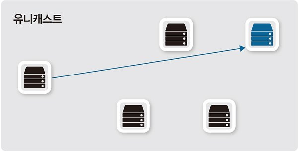

출발지와 목적지가 1:1로 통신한다.

실제로 사용하는 대부분의 통신이 유니캐스트 방식이다.

### 멀티캐스트

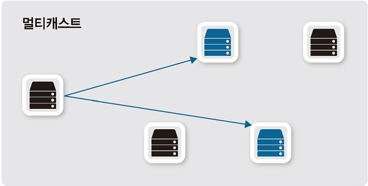

하나의 출발지에서 다수의 특정 목적지로 데이터를 전송한다.

멀티캐스트 그룹 주소를 이용해 해당 그룹에 속한 다수의 호스트로 패킷을 전송한다.

사내 방송이나 IPTV와 같이 단방향으로 다수에게 동시에 같은 내용을 전달할 때 사용한다.

### 브로드캐스트

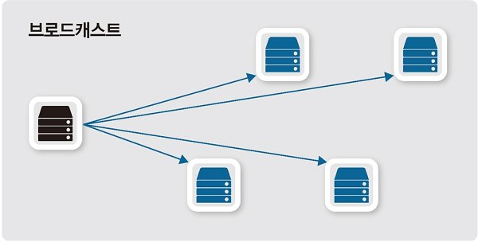

하나의 출발지에서 로컬 네트워크 내 모든 호스트에 패킷을 전달할 때 사용한다.

유니캐스트로 통신하기 전, 주로 상대방의 정확한 위치를 알기 위해 사용한다.

### 애니캐스트

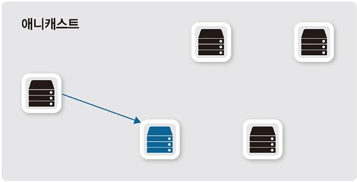

애니캐스트 주소가 같은 호스트들 중에서 가장 가깝거나 가장 효율적으로 서비스할 수 있는 호스트와 통신한다.

가장 가까운 DNS 서버나 게이트웨이를 찾을 때 사용한다.

> BUM 트래픽
> 
> B(Broadcast), U(Unknown Unicast), M(Multicast)를 지칭한다.
> 
> 세 트래픽은 서로 다른 종류지만, 동작은 서로 비슷하다.
> 
> Unknown Unicast
> 
> 유니캐스트이므로 목적지는 명확히 명시되어있지만, 스위치가 목적지에 대한 주소를 학습하지 못한 상황을 말한다.
> 
> 따라서 패킷을 모든 포트로 플러딩(전송)하는데, 이러한 동작은 브로드캐스트와 같다.

## 2. MAC 주소

MAC은 Media Access Control의 줄임말로 2계층에서 통신을 위해 네트워크 인터페이스에 할당된 고유 식별자이다.

네트워크에 접속하는 모든 장비는 MAC 주소라는 **물리적인 주소**가 있어야 하고, 이 주소를 통해 서로 통신한다.

### MAC 주소 체계

MAC 주소는 변경할 수 없도록 하드웨어에 고정되어 출하되므로, 네트워크 구성 요소마다 다른 주소를 가지고 있다.  48비트의 16진수 12자리로 표현되며 앞의 OUI값은 국제기구 IEEE가 할당한 제조사 코드로, 뒤의 UAA는 제조사에서 네트워크 구성 요소에 할당한 코드로 구성된다.

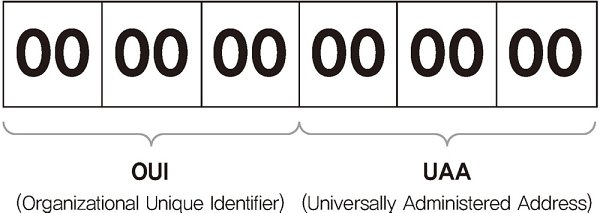

하지만 MAC 주소도 결국 메모리에 적재되어 구동되므로, 여러 가지 방법을 이용해 변경된 MAC 주소로 NIC를 동작시킬 수 있다.

### MAC 주소 동작

NIC는 전기 신호가 들어오면 데이터 형태(패킷)으로 변환하여 도착지 MAC 주소가 자신의 MAC 주소와 같은지 확인한다. 주소가 다르면 패킷을 폐기하고, 같으면 패킷 정보를 상위 계층으로 넘긴다.

라우터와 같은 장비는 NIC를 여러 개 가질 수 있으므로, MAC 주소 또한 여러 개가 할당된다.

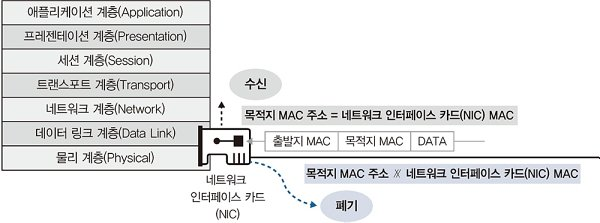

> 무차별 모드(Promiscuous Mode)
> 
> 다른 목적지를 가진 패킷을 분석하거나 수집해야 할 경우 무차별모드로 NIC를 구성하면, NIC는 다른 목적지 주소를 가진 패킷을 폐기하지 않고 메모리에 올린다.
> 
> 대표적인 애프리케이션으로 '와이어샤크'가 있다.

## 3. IP 주소

IP 주소는 **논리적 주소**이며 3계층에서 사용된다.

대부분의 네트워크가 TCP/IP로 동작하므로 IP 주소 체계를 이해하는 것이 중요하다.

### IP 주소 체계

우리가 흔히 사용하는 IP 주소는 32비트인 **IPv4** 주소이다.

IP는 v4, v6 두 체계가 사용되며 IPv6 주소는 128비트이다.

IPv4 주소를 표기할 때는 4개의 옥텟이라고 부르는 8비트 단위로 나누고 각 옥텟은 `.`으로 구분한다.

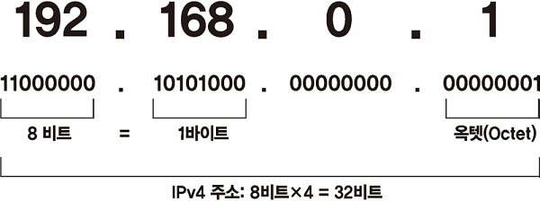

IP주소는 다음과 같이 나뉜다.

- 네트워크 주소: 호스트들을 모은 네트워크를 지칭하는 주소(네트워크 주소가 동일한 네트워크를 로컬 네트워크라고 함)

- 호스트 주소: 하나의 네트워크 내에 존재하는 호스트를 구분하기 위한 주소

### 클래스풀과 클래스리스

**클래스풀**

IP 주소 체계는 필요한 호스트 IP 개수에 따라 네트워크 크기를 다르게 할당할 수 있는 **클래스** 개념을 도입했다.

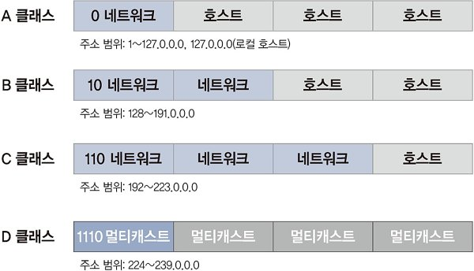

각 클래스 별로 몇 개의 네트워크가 각각 몇 개의 호스트 주소를 가질 수 있는지 알 수 있다.

하지만 인터넷이 상용화되면서 호스트 숫자가 폭발적으로 증가했고, 기존 클래스풀 기반의 주소 체계는 늘어나는 IP 주소를 감당하기에 부족했다.

**클래스리스**

클래스리스는 클래스 개념 자체를 버린 주소 체계이며, 현재 우리가 사용하는 방식이다.

네트워크와 호스트 주소를 나누는 구분자로 서브넷 마스크(Subnet Mast)를 사용한다.

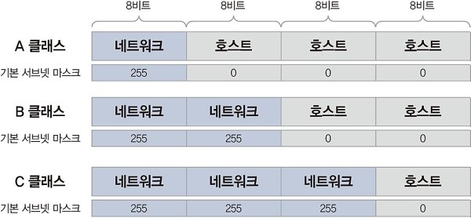

서브넷 마스크는 255는 네트워크 주소 부분, 0은 호스트 주소 부분으로 구분한다.

만약 `103.9.32.146` 주소에 `255.255.255.0 `서브넷 마스크가 있다면, 네트워크 주소는 `103.9.32.0`이고 호스트 주소는 `0.0.0.146`이 될 것이다.

따라서 클래스리스 기반의 IP 네트워크에서는 네트워크를 표현하는 데 반드시 서브넷 마스크가 필요하다.

### 서브네팅

기존의 클래스풀 단위의 네트워크보다 더 쪼개서 네트워크와 호스트 주소를 구분하는 것을 서브네팅이라고 한다.

옥텟 단위가 아닌 2진수 자리 단위로 서브네팅하므로, 처음 접할 시 어려움을 겪을 수 있다.

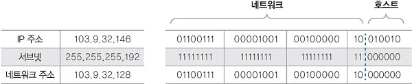

이는 네트워크 사용자 입장과 네트워크 설계자 입장에 따라 고려해야 할 요소와 범위가 달라진다.

**네트워크 사용자의 서브네팅**

이미 설계되어 있는 네트워크에서 사용할 수 있는 IP 주소 범위를 파악해야 한다. 일반적으로 자신이 속한 네트워크의 유효 범위를 파악하는 방법은 다음과 같다.

1. 내 IP를 2진수로 표현한다.

2. 서브넷 마스크를 2진수로 표현한다.

3. 2진수 AND 연산으로 서브네팅된 네트워크 주소를 알아낸다.

4. 호스트 주소 부분을 2진수 1로 모두 변경해 브로드캐스트 주소를 알아낸다.

5. 유효 IP 범위를 파악한다. `서브네팅된 네트워크 주소+1`은 유효 IP 중 가장 작은 IP이고, `브로드캐스트 주소-1`은 유효 IP 중 가장 큰 IP이다.

6. 2진수로 연산되어 있는 결괏값을 10진수로 변환한다.

**네트워크 설계자 입장**

네트워크를 새로 구축하는 경우, 서브넷 마스크가 지정되어 주어지지 않기 때문에 네트워크의 크기를 고민해 서브넷 마스크를 결정해야 한다. 네트워크 설계자가 고민해야 할 부분은 다음과 같다.

- 서브넷된 하나의 네트워크에 IP를 몇 개나 할당해야 하는가?

- 서브넷된 네트워크가 몇 개나 필요한가?

> **회사 네트워크 설계를 예시로 들어보자.** 
> 
> 회사에 총 12곳의 지사가 있다.  
> 이 지사들에는 최대 12대의 IP가 필요한 장비    가 운영될 예정이다. 
> 현재 가진 네트워크는 103.9.32.0/24 네트워크이다.
> 
> 1. 서브넷된 하나의 네트워크에 12개 IP를 할당해야 한다.
> 
> 2. 네트워크는 2진수의 배수로 커지므로 4, 8, 16, ..., 256개 단위로 네트워크를 할당할 수 있다. 
>    12개 IP주소를 수용할 수 있는 가장 작은 네트워크는 16개이므로, 16개짜리 네트워크를 할당한다. 
>    하지만 16개짜리 네트워크는 네트워크 주소와 브로드캐스트 주소로 사용할 2개 IP를 제외해야 한다. 
>    따라서 실제로 사용할 수 있는 IP는 14개이다.
> 
> 3. 다음과 같이 16개짜리 네트워크 12개를 확보한다. 
> 
>    네트워크 주소  /  브로드캐스트 주소  /  유효 IP 범위     /     할당 
> 
>    103.9.32.0   /   103.9.32.15     /  103.9.32.1~14    / 네트워크 장비 주소 
> 
>    103.9.32.16  /   103.9.32.31     /  103.9.32.17~30   / 시리얼 구간(라우터 중간 네트워크 할당용) 
> 
>    103.9.32.32  /   103.9.32.47     /  103.9.32.33~46   / 1번 지사
> 
>      ... 
>     
>     
>     103.9.32.208 /   103.9.32.223    /  103.9.32.209~222 / 12번 지사 
>     
>     
>     103.9.32.224 /   103.9.32.239    /  103.9.32.225~238 / 추후 할당 
>     
>     
>     103.9.32.240 /   103.9.32.254    /  103.9.32.241~253 / 추후 할당 

### 공인 IP와 사설 IP

공인 IP: 전 세계에서 유일해야 하는 식별자

사설 IP: 개인적으로 구성되어 IP주소를 할당받지 않고 구축되어 사용되는 식별자

인터넷에 접속하려면 공인 IP를 이용해야 하지만, 공인 IP는 통신사업자로부터 할당받거나 IP할당기관에서 인터넷 독립기관 주소를 할당받은 후 독립 IP를 할당받아야 하기에 그 과정이 쉽지 않다.

그래서 인터넷에 접속하지 않거나 NAT(Network Address Translation) 기술을 사용할 경우, 사설 IP 주소를 이용해도 무방하다. NAT 장비를 이용하면 IP를 공인 IP로 변경해주기 때문에 인터넷 접속이 가능해진다. 가정에서 많이 사용하는 공유기는 NAT 장비의 역할을 하는 대표적인 예이다.

## 4. TCP와 UDP

2계층과 3계층에서 사용된 MAC과 IP는 목적지를 정확히 찾아가기 위한 주소 제공이 목적이었지만, 4계층에서 동작하는 프로토콜은 목적이 조금 다르다. 목적지 단말 안에서 동작하는 여러 애플리케이션 프로세스 중 통신해야 할 **목적지 프로세스를 정확히 찾아가고 패킷 순서가 바뀌지 않도록 잘 조합해 원래 데이터를 잘 만들어내기 위한 역할**을 한다.

### 4계층 프로토콜(TCP, UDP)과 서비스 포트

인캡슐레이션, 디캡슐레이션 과정에서 추가되는 정보 중 가장 중요한 것은 **각 계층에서 정의하는 정보**와 **상위 프로토콜 지시자 정보**이다. 

각 계층 별 정의 정보는 수신 측의 동일 계층에서 사용하기 위한 정보이고, 상위 프로토콜 지시자는 디캡슐레이션 과정에서 상위 계층의 프로토콜이나 프로세스를 정확히 찾아가기 위한 목적으로 사용된다.

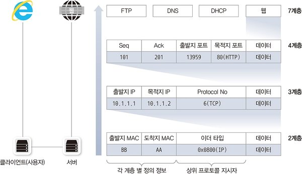

TCP/IP 프로토콜 스택에서 4계층은 TCP와 UDP가 담당한다. 4계층의 목적인 패킷 분할 및 조합을 위해 TCP 프로토콜에서는 **시퀀스 번호**와 **ACK 번호**를 사용한다.

4계층의 상위 프로토콜 지시자는 포트 번호인데, 2, 3계층과는 달리 출발지와 목적지 포트 번호를 구분해 처리해야 한다. 이는 TCP/IP에서는 일반적으로 클라이언트용 프로그램과 서버용 프로그램이 구분되어 개발되기 때문이다.

### TCP(Transmission Control Protocol)

**TCP는 연결형 통신 방법이다.**

TCP 프로토콜은 신뢰할 수 없는 공용망에서도 정보유실 없는 통신을 보장하기 위해 세션을 안전하게 연결하고 데이터를 분할하고 분할된 패킷이 잘 전송되었는지 확인하는 기능이 있다.

패킷에 번호를 부여(시퀀스 번호)하고 잘 전송되었는지에 대해 응답(ACP 번호)한다.

또한 한꺼번해 얼마나 보내야 수신자가 잘 처리할 수 있는지 전송 크기(Window Size)까지 고려해 통신한다.

이러한 역할 덕분에 네트워크 상태를 심각하게 고려하지 않고 특별한 개발 없이도 쉽고 안전하게 네트워크를 사용할 수 있다.

**패킷 순서, 응답 번호**

TCP에서는 패킷을 보낼 때 번호(시퀀스 번호)를 부여하고, 받는 쪽은 이 번호의 순서가 맞는지 확인한다. 받은 패킷 번호가 맞으면 응답(ACK 번호)을 주는데, 이때 다음 번호의 패킷을 요청한다. 즉 ACK 번호를 보내는 의미는 다음에 해당 시퀀스 번호에 맞는 패킷을 달라는 것이다.

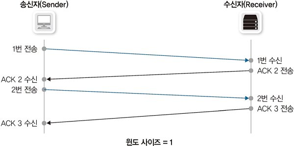

다음 그림과 같이 시퀀스 번호와 ACK 번호도 양방향으로 함께 동작한다.

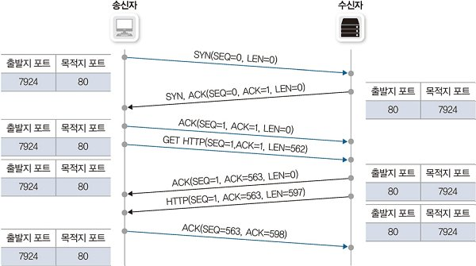

1. 출발지에서 시퀀스 번호를 0으로 보낸다.

2. 수신자는 0번 패킷의 응답(ACK)으로 1을 부여하고, 자신이 처음 보내는 패킷이므로 시퀀스 번호 0을 부여한다.

3. 이 패킷을 받은 송신자는 ACK 번호(1)를 인식해 시퀀스 번호를 1로 하고, 상대방의 0번 시퀀스에 대한 응답(ACK)으로 1을 부여해 다시 보낸다.

**윈도 사이즈와 슬라이딩 윈도**

TCP는 패킷을 보낸 뒤 그에 대한 응답으로 ACK 번호를 확인하고 그 다음 패킷을 전송한다. 이는 먼 거리에 떨어져 있으면 왕복 지연시간(Round Trip Time, RTT)이 늘어나므로 모든 데이터를 전송하는 데 긴 시간이 걸릴 수 있다.

그래서 데이터를 보낼 때 패킷을 하나만 보내지 않고, 여러 패킷을 한꺼번에 보내고 한 번의 응답을 받는다. 이러한 방법은 효율적이지만 패킷 유실 가능성이 커지므로 적절한 송신량을 결정해야 한다.

따라서 한 번에 데이터를 받을 수 있는 데이터 크기를 **윈도 사이즈**라 하고, 네트워크 상황에 따라 이 윈도 사이즈를 조절하는 것을 **슬라이딩 윈도**라 한다.

TCP 헤더에서 윈도사이즈로 표현할 수 있는 최대 크기는 216이다. 이는 64k만큼 윈도사이즈를 가질 수 있다는 의미지만 현대 네트워크에서는 너무 작은 숫자이다.

그래서 이를 해결하기 위해 TCP 헤더 사이즈를 늘리지 않고 뒤의 숫자를 무시하는 방법으로 윈도 사이즈를 증가시켜 통신한다. 이런 방식을 사용하면 기존 숫자의 10배, 100배로 윈도 사이즈가 커진다.

만약 TCP에서 데이터 유실이 발생하면 윈도 사이즈를 절반으로 떨어뜨린 뒤, 정상적인 통신이 되는 경우 서서히 하나씩 늘린다. 따라서 패킷 유실 이후에 작아진 윈도 사이즈로 인해 통신 속도가 느려지는 문제가 발생하는데, 이를 해결하기 위해 버퍼가 큰 네트워크 장비를 사용하거나 TCP 최적화 솔루션을 사용할 수 있다.

### **3방향 핸드셰이크**

TCP는 유실없는 안전한 통신을 위해, 통신 전 안전하게 데이터를 보내고 받을 수 있는지 확인하는 사전 연결작업을 진행한다.

TCP에서는 3번의 패킷을 주고받으면서 통신을 서로 준비하므로 '3방향 핸드셰이크'라고 부른다.

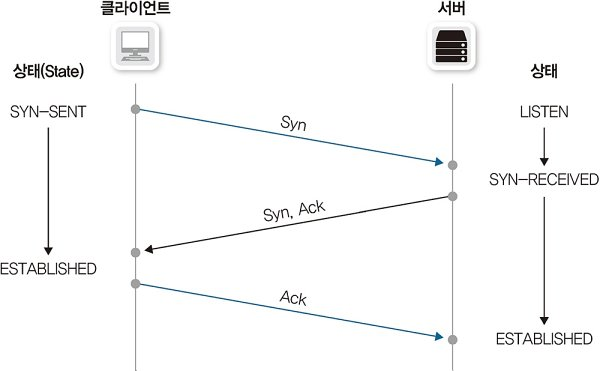

### UDP(User Datagram Protocol)

**UDP는 비연결형 통신 방법이다.**

TCP는 3방향 핸드셰이크, 시퀀스 번호, ACK 번호와 같이 **신뢰성 있는 통신**을 위한 요소가 있는 반면, UDP는 이러한 기능이 전혀 없다.

UDP는 음성 데이터나 실시간 스트리밍과 같이 **시간에 민감한 프로토콜이나 애플리케이션**을 사용하는 경우나, 사내 방송과 같은 **단방향으로 다수의 단말과 통신**하는 경우 주로 사용된다.

이러한 경우는 대부분 청각, 시각적으로 **응답 시간에 민감한 경우**이다. 실 세계 데이터를 디지털화할 때는 시간을 잘게 쪼개 데이터를 샘플링하는데, 이런 경우 시간 지연에 따른 어려움이 발생한다. 따라서 동영상이나 음성이 잠시 멈출 수 있는데, 이러한 문제는 사용자 입장에서 중간 데이터가 몇 개쯤 유실되는 것보다 민감하게 반응할 수 있다. 따라서 유실된 데이터라도 그대로 데이터를 처리해버리는 것이 UDP이다. 

UDP는 3방향 핸드셰이크와 같이 사전 연결을 확립하는 절차는 없지만, 첫 데이터는 리소스 확보를 위해 인터럽트를 거는 용도로 사용되고 유실된다. 

UDP 프로토콜을 사용하는 애플리케이션은 연결 확립은 TCP 프로토콜을 사용하고 실제 데이터만 UDP를 이용하는 경우가 대부분이다.

## 5. ARP(Address Resolution Protocol)

주소 결정 프로토콜로, IP에 맞는 MAC 주소를 가지고 오는 프로토콜이다. (**IP주소가 필요하므로 3계층 프로토콜이다.**)

인캡슐레이션 과정에서 출발지와 목적지 IP 주소는 알고 있지만 목적지 MAC 주소를 알지 못하는 경우, 2계층 캡슐화를 수행할 수 없다. 따라서 ARP 브로드캐스트를 이용해 네트워크 전체에 상대방의 MAC 주소를 질의해야 한다.

ARP 브로드캐스트를 받은 목적지는 ARP 프로토콜을 이용해 자신의 MAC 주소를 응답하고, 이 작업이 완료되면 둘 모두 상대방에 대한 MAC 주소를 학습할 수 있다.

패킷을 보낼 때마다 ARP 브로드캐스트를 수행하면 효율성이 크게 저하되므로, 학습한 MAC 주소를 저장해두기 위해 ARP 테이블을 사용한다. 논리 주소가 바뀌는 경우를 고려해, 일정 시간 통신이 없으면 이 테이블은 삭제된다.

> PC의 ARP 테이블 정보 확인하기
> 
> 명령 프롬프트 -> `arp -a` 입력

### ARP 동작 순서

1. 서버 A는 서버 B의 MAC 주소를 알아내기 위해 ARP 요청을 네트워크에 브로드캐스트한다.
   
   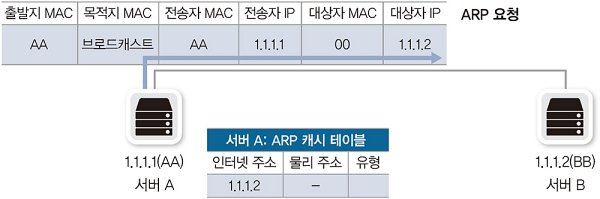

2. 네트워크 내 모든 단말은 ARP 프로토콜 내용을 확인해, ARP 프로토콜필드의 대상자 IP가 자신이 맞는지 확인한다. 이때 서버 B만이 ARP 요청을 처리하고 그에 대한 응답을 보낸다. 이 응답에는 자신의 MAC 주소를 포함하기 때문에 모든 ARP 필드가 채워져 있다.
   
   또한 이 응답은 상대방(서버 A)의 MAC 주소를 알기 때문에, 유니캐스트이다.
   
   

3. 서버 A는 ARP 응답을 받아 자신의 ARP 캐시 테이블을 갱신한다. 그 후 도착지 MAC 주소 필드를 완성해 패킷을 보낸다.
   
   

### GARP(Gratuitous ARP)

ARP가 상대방의 MAC 주소를 알아내기 위해 사용되는 반면, GARP는 **자신의 IP와 MAC 주소를 알릴 목적**으로 사용된다.

GARP는 대상자 IP 필드에 자신의 IP 주소를 채우고 목적지 MAC 주소는 브로드캐스트 MAC 주소를 사용해 ARP 요청을 보낸다.

GARP를 사용해 동일 네트워크에 자신의 IP 주소와 MAC 주소를 알려주는 이유는 다음 3가지이다.

- IP 주소 충돌 감지
  
  IP 주소는 유일하게 할당되어야 하는 값이지만 여러 가지 이유로 내가 할당받은 IP를 다른 사람이 사용하고 있을 수 있다. IP 충돌 때문에 통신이 안 되는 것을 예방하기 위해 자신에게 할당된 IP가 네트워크에서 이미 사용되고 있는지 GARP를 통해 확인할 수 있다.

- 상대방(동일 서브넷에 있는)의 ARP 테이블 갱신
  
  가상 MAC 주소를 사용하지 않는 데이터베이스 HA(High Avaliability) 솔루션에서 주로 사용한다. 
  
  데이터베이스 HA는 주로 두 데이터베이스 서버가 하나의 가상 IP 주소로 서비스하며, 두 대의 데이터베이스 중 한 대만 동작하고 나머지 한 대는 대기하는 액티브-스탠바이로 동작한다. 이 때 액티브 상태인 서버가 가상 IP 주소 요청에 응답하지만 MAC 주소는 가상이 아닌 실제 주소를 사용한다. 따라서 해당 장비가 동작하지 않을 경우 나머지 한 대를 이용해야하는데, 이 때 자신의 MAC 주소를 서버에 알려줘야 하기 때문에 GARP 요청을 보낸다.
  
  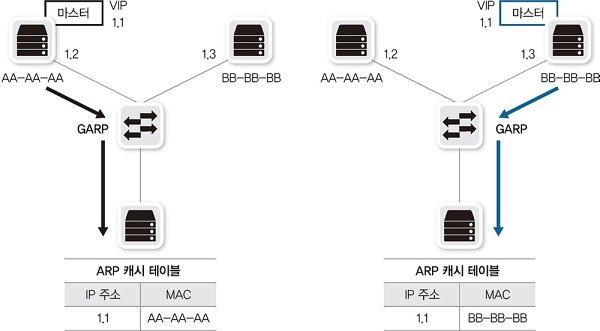

- 클러스터링, FHRP(VRRP, HSRP)
  
  실제 MAC 주소를 사용하지 않고 가상 MAC을 사용하는 클러스터링, FHRP(Frist Hop Redundancy Protocol)에서도 GARP가 사용된다. 이 때의 목적은 네트워크에 있는 스위치 장비의 MAC 테이블을 갱신하는 것이다.
  
  클러스터링 중간에 있는 스위치의 MAC 테이블은 마스터가 변경될 경우 가상 MAC 주소의 위치를 적절히 찾아가도록 업데이트해야한다. 따라서 슬레이브가 마스터로 역할이 변경되는 시점에 GARP를 전송하고 스위치에서는 MAC 주소에 대한 포트 정보를 새로 변경해 테이블을 갱신한다.
  
  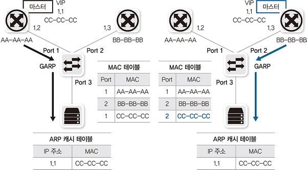
  
  > 참고
  > 
  > VRRP, HSRP는 FHRP의 일종이다. 디폴트 게이트웨이에 장애가 발생할 경우, 해당 네트워크에 속한 단말이 외부 네트워크로 통신할 수 없는 문제를 해결하기 위해 개발되었다.

### RARP(Reverse ARP)

RARP는 IP 주소가 정해져 있지 않은 단말이 IP 할당을 요청할 때 사용한다.

나 자신의 MAC 주소는 알지만 IP가 아직 할당되지 않아 IP를 할당해주는 서버에 어떤 IP 주소를 써야 하는지 물어볼 때 사용한다.

하지만 현재는 제한된 기능으로 인해 BOOTP와 DHCP로 대체되어 사용되지 않는다.

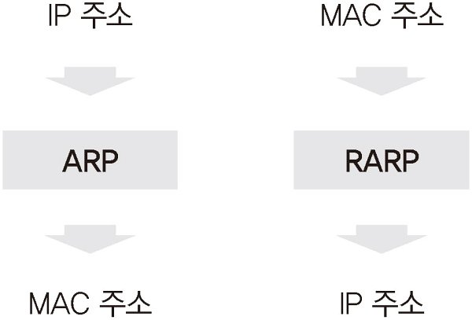

## 6. 서브넷과 게이트웨이

작은 LAN 네트워크들이 하나로 묶이면서 원격지 네트워크와의 통신을 하게 되는데, 이때 통신에 사용하는 장비를 게이트웨이라고 부른다. 3계층 장비(라우터, L3 스위치)가 이 역할을 수행할 수 있다.

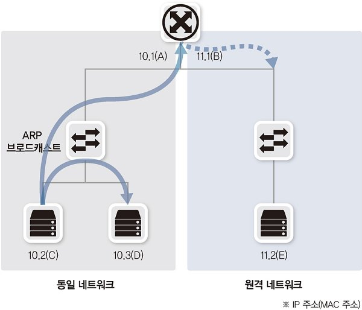

### 서브넷과 게이트웨이의 용도

로컬 네트워크에서는 ARP 브로드캐스트를 이용해 도착지 MAC 주소를 학습할 수 있지만, 원격 네트워크 통신은 네트워크 장비의 도움이 필요하다. 이 장비를 **게이트웨이**라고 하고, 게이트웨이에 대한 정보를 PC나 네트워크 장비에 설정하는 항목이 **기본 게이트웨이**이다.

이렇게 출발지와 목적지 네트워크가 동일한지 아닌지에 따라 통신 방식이 달라지므로, 출발지에서는 먼저 **목적지가 자신이 속한 네트워크의 범위인지 확인**하는 작업이 필요하다. 이때 사용되는 것이 **서브넷마스크**이다. 앞서 배웠던 **서브네팅**을 이용해 로컬 네트워크 주소를 알아내고, 이 주소가 목적지가 속해 있으면 로컬 통신, 아니면 원격지 통신이 된다.

즉, 서브넷 마스크는 **동일 네트워크 간의 통신과 서로 다른 네트워크 간의 통신을 구분**하기 위해 사용된다.

> 참고: Proxy ARP
> 
> ARP 브로드캐스트는 기본적으로 동일한 네트워크 대역에서만 영향이 미친다.
> 
> 하지만 라우터의 Proxy ARP 기능을 활성화시키면, 원격지 통신이더라도 라우터 테이블을 이용해 라우터가 알고 있는 주소에 대해 ARP 응답을 대행해서 해줄 수 있다.

### 2계층 통신 vs 3계층 통신

2계층 통신과 3계층 통신은 실무에서 많이 쓰이는 용어이고, 정확한 표현은 로컬 네트워크 통신, 원격지 네트워크 통신이다.

단말 간의 통신은 모든 계층을 거쳐 통신하는데, 로컬 네트워크에서 직접 통신할 경우 라우터와 같은 3계층 네트워크 장비의 도움 없이 통신이 가능하다. 즉, 2계층까지만 정보를 확인해 통신할 수 있기 때문에 이를 L2통신이라고 한다.

반면, 원격지 네트워크와 통신해야 할 경우 라우터와 같은 3계층 장비의 도움이 없으면 통신할 수 없다. 해당 패킷을 전송하는 네트워크 장비에서 3계층 정보까지 확인해야 하며, 이를 L3 통신이라고 한다.

따라서 로컬 통신은 도착지 IP 주소와 도착지 MAC 주소가 서로 같지만, 원격지 통신은 도착지 IP 주소와 도착지 MAC 주소가 서로 다르다. (IP주소: 통신의 실제 도착지, MAC 주소: 기본 게이트웨이의 MAC 주소)

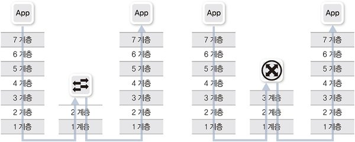

> 예시
> 
> PC1은 외부 원격지에 있는 PC2와 통신하고자 한다.
> 
> 하지만 PC1은 기본 게이트웨이의 MAC 주소를 모르고, 게이트웨이도 PC2의 MAC주소를 모른다.
> 
> PC1이 PC2와 통신하기까지의 단계는 다음과 같다.
> 
> 1. 게이트웨이의 MAC 주소를 알아내기 위해 ARP 요청을 브로드캐스팅한다.
>    
>    Source MAC : PC1 MAC 주소
>    
>    Source IP     : PC2 IP 주소
>    
>    Target MAC  : 0000.0000.0000 (아직 GW의 MAC 주소를 모름)
>    
>    Target IP      : PC1 쪽 GW IP 주소
> 
> 2. 해당 요청을 받은 게이트웨이는 본인의 MAC주소를 응답한다.
>    
>    Source MAC : PC1 쪽 GW MAC 주소
>    
>    Source IP     : PC1 쪽 GW IP 주소
>    
>    Target MAC  : PC1 MAC 주소
>    
>    Target IP      : PC1 IP 주소
> 
> 3. 게이트웨이의 MAC 주소를 알아낸 PC1은 PC2의 IP주소를 담아 게이트웨이에게 보낸다.
>    
>    Source MAC : PC1 MAC 주소
>    
>    Source IP     : PC1 IP 주소
>    
>    Target MAC  : PC1 쪽 GW MAC 주소 (PC2의 MAC 주소를 모르므로 GW MAC 주소를 사용한다.)
>    
>    Target IP      : PC2 IP 주소
> 
> 4. 게이트웨이는 PC2의 MAC 주소를 모르므로, ARP 요청을 먼저 보낸다.
>    
>    Source MAC : PC2 쪽 GW MAC 주소
>    
>    Source IP     : PC2 쪽 GW IP 주소
>    
>    Target MAC  : 0000.0000.0000 (아직 PC2의 MAC 주소를 모름)
>    
>    Target IP      : PC2 IP 주소
> 
> 5. 해당 요청을 받은 PC2는 본인의 MAC 주소를 응답한다.
>    
>    Source MAC : PC2 MAC 주소
>    
>    Source IP     : PC2 IP 주소
>    
>    Target MAC  : PC2 쪽 GW MAC 주소
>    
>    Target IP      : PC2 쪽 GW IP 주소
> 
> 6. PC2의 MAC 주소를 알아낸 게이트웨이는 다음과 같은 헤더로 응답한다.
>    
>    Source MAC : PC2 쪽 GW MAC 주소
>    
>    Source IP     : PC1 IP 주소
>    
>    Target MAC  : PC2 IP 주소
>    
>    Target IP      : PC2 MAC 주소
> 
> 7. PC2는 다음과 같은 헤더로 게이트웨이에 응답한다.
>    
>    Source MAC : PC2 MAC 주소
>    
>    Source IP     : PC2 IP 주소
>    
>    Target MAC  : PC2 쪽 GW MAC 주소
>    
>    Target IP      : PC1 IP 주소
> 
> 8. 마지막으로 PC2의 응답을 PC1에게 전달하며 통신이 마무리된다.
>    
>    Source MAC : PC1 쪽 GW MAC 주소
>    
>    Source IP     : PC2 IP 주소
>    
>    Target MAC  : PC1 MAC 주소
>    
>    Target IP      : PC1 IP 주소
