# 스위치: 2계층 장비

2계층에서 스위치는 아무런 설정 없이도 MAC 주소를 기반으로 패킷을 전달하는 기본 동작을 수행할 수 있다.

또한 스위치는 논리적으로 네트워크를 분리할 수 있는 VLAN 기능과 네트워크의 루프를 방지하는 스패닝 트리 프로토콜과 같은 기능을 갖고 있다.

> 참고: PDU(Protocol Data Unit)
> 
> 각 계층에서 헤더와 데이터를 합친 부분을 말한다.
> 
> 2계층 PDU 명칭은 '프레임'이고 3계층 PDU 명칭은 '패킷'인데 보통 데이터를 쪼개 전달하는 데이터 전체를 '패킷'이라고 통칭해서 사용한다.
> 
> 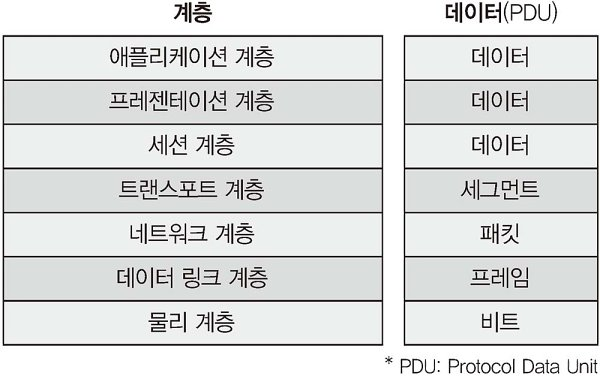

## 1. 스위치 장비 동작

스위치는 MAC 주수와 단말이 위치하는 인터페이스 정보를 매핑한 MAC 주소 테이블을 갖고 있다. 전송하려는 패킷의 헤더 안에 있는 2계층 목적지 주소를 확인하고 해당 포트로만 전송할 수 있다. 이러한 특징 덕에 여러 장비가 서로 간섭 없이 통신할 수 있게 되었다.

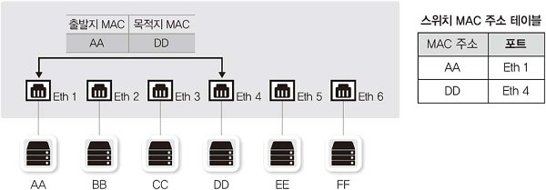

스위치의 동작 방식은 다음 세 가지로 정리할 수 있다.

### 플러딩(Flooding)

스위치는 부팅 시 네트워크 관련 정보가 아무것도 없기 때문에, 마치 허브처럼 동작한다.

패킷이 들어오면 도착지 MAC 주소를 확인하고 주소 테이블에 해당 주소가 없으면, 모든 포트에 같은 내용의 패킷을 전송한다.

이런 동작이 많아지면 스위치가 제 역할을 못하게 되므로, 스위치는 MAC 주소를 학습해 주소 테이블을 만든다.

> 참고: 비정상적인 플러딩
> 
> 이더넷-TCP/IP 네트워크에서는 ARP 브로드캐스트를 미리 주고받은 후 데이터가 전달되므로, 실제로 데이터를 보내고 받을 때는 스위치가 패킷을 플러딩하지 않는다.
> 
> 그래서 스위치는 필요한 곳에만 패킷을 포워딩하므로 허브에 비해 보안이 뛰어나다.
> 
> 이러한 스위치를 공격하기 위해 엉뚱한 MAC 주소를 습득시키거나 스위치 MAC 테이블을 꽉 차게 해 플러딩을 유도할 수 있는데, 이런 상황이 발생한다면 주변에서 공격이 수행되는 상황임을 인지해야 한다.

### 어드레스 러닝

MAC 주소 테이블을 만들고 유지하는 과정을 어드레스 러닝이라고 한다.

어드레스 러닝은 패킷의 출발지 MAC 주소 정보를 이용한다. 몇 번 포트에서 어떤 패킷의 출발지 MAC 주소가 들어왔는지 기록한다.

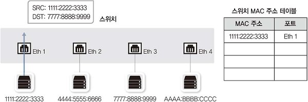

### 포워딩/필터링

포워딩: 패킷이 스위치에 들어왔을 때 도착지 MAC 주소가 자신의 MAC 테이블 내에 있다면, 해당 포트로 패킷을 보낸다.

필터링: 다른 포트로는 보내지 않고 해당 포트로만 패킷을 보낸다.

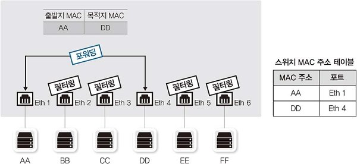

스위치는 일반적인 유니캐스트에 대해서만 포워딩/필터링 작업을 수행하고, BUM 트래픽(브로드캐스트, 언노운 유니캐스트, 멀티캐스트)에서는 조금 다르게 동작한다.

브로드캐스트, 멀티캐스트에서는 모두 출발지가 사용되지 않으므로 모두 플러딩한다. 언노운 유니캐스트도 MAC 주소 테이블에 없는 주소이므로 동일하게 플러딩 동작한다.

> **MAC 주소 테이블과 ARP 테이블 구분하기**
> 
> MAC 주소 테이블: 특정 단말이 연결된 물리적 포트에 대한 정보를 저장한다.(2계층주소를 1계층 인터페이스에 매핑)
> 
> ARP 테이블: 단말의 IP 및 MAC 주소로 구성된다.(3계층 주소를 2계층 주소에 매핑)
> 
> MAC 주소 테이블의 aging time은 ARP timeout보다 길게 설정되어야 한다.(플러딩없이 효율적으로 운영 가능)

## 2. VLAN

### VLAN이란?

VLAN(Virtual LAN)은 물리적 배치와 상관없이 LAN을 논리적으로 분할, 구성하는 기술이다.

예를 들어 기업에서 여러 부서가 함께 근무하면 과도한 브로드캐스트로 인한 단말들의 성능 저하 등의 이유로, 각 부서별로 네트워크를 분할해서 사용해야 한다. 이때 VLAN을 이용할 수 있다.

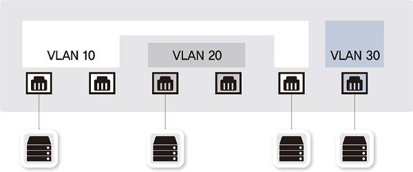

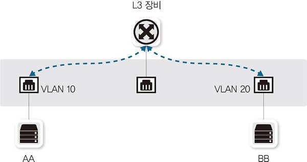

VLAN을 나누면 하나의 장비를 서로 다른 네트워크를 갖도록 논리적으로 분할한 것이므로, 유니캐스트나 브로드캐스트 모두 VLAN 간에 통신할 수 없다. 즉, 같은 스위치에 연결되어 있더라도 서로 다른 VLAN 간의 통신은 서로 다른 네트워크 간의 통신이므로 3계층 장비가 필요하다.

### VLAN 종류와 특징

VLAN 할당 방식에는 포트 기반의 VLAN과 MAC 주소 기반의 VLAN이 있다.

기존에 스위치가 고가였을 때는 스위치를 논리적으로 분할해 사용하는 목적을 달성하기 위해 포트 기반 VLAN을 도입했다. 어떤 단말에 접속하든지 스위치의 특정 포트에 VLAN을 할당하면 할당된 VLAN에 속하게 되며, 우리가 일반적으로 언급하는 대부분의 VLAN에 해당된다.

사용자들의 자리 이동이 많아지면서 MAC 기반 VLAN이 개발되었다. 스위치의 고정 포트에 VLAN을 할당하는 것이 아니라, 스위치에 연결되는 단말의 MAC 주소를 기반으로 해당 포트를 지정된 VLAN으로 할당하는 기술이다. 단말에 따라 VLAN 정보가 바뀔 수 있어 다이나믹 VLAN이라고도 부른다.

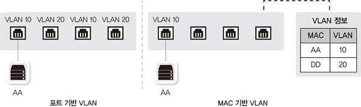

### VLAN 모드(Trunk/Access) 동작 방식

여러 개의 VLAN이 존재하는 상황에서 스위치를 서로 연결해야 하는 경우에는 각 VLAN끼리 통신하려면 VLAN 개수만큼 포트를 연결해야 한다.

하지만 VLAN을 많이 사용하는 네트워크에서 이렇게 포트를 연결하면 장비 간의 연결만으로도 많은 포트가 낭비된다. 이 문제를 해결하기 위한 것이 VLAN 태그 기능이다.

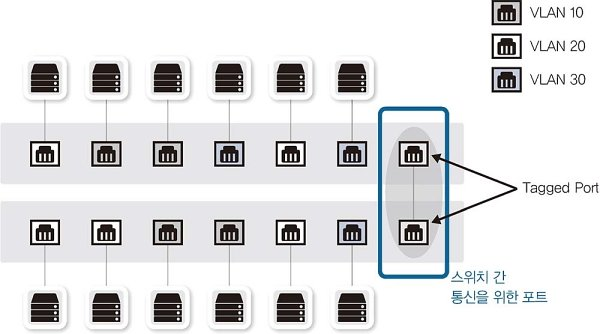

**태그 기능은 하나의 포트에 여러 개의 VLAN을 함께 전송**할 수 있게 해준다. 이 포트를 **태그 포트** 또는 **트렁크 포트**라고 한다. 태크 포트로 패킷을 보낼 때는 이더넷 프레임 중간에 VLAN ID 필드를 끼워 넣어, 수신 측에서는 이 VLAN ID를 제거하면서 VLAN ID의 VLAN으로 패킷을 보낸다.

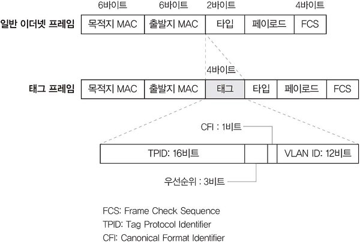

태그 포트 기능이 스위치에 생기면서 MAC 주소 테이블에도 변화가 생긴다. 다른 VLAN끼리 통신하지 못하도록 MAC 테이블에 VLAN을 지정하는 필드가 추가된 것이다. 즉 VLAN별로 MAC 주소 테이블이 존재하는 것처럼 동작한다.

정리하자면, 스위치는 같은 VLAN끼리 통신하는 언태그 포트 (또는 액세스 포트)와 여러 VALN이 한꺼번에 통신하는 태그 포트(또는 트렁크 포트)로 구성된다. 언태그 포트로 패킷이 들어올 경우 같은 VLAN으로만 패킷을 전송하고, 태그 포트로 패킷이 들어올 경우 태그를 벗겨내면서 태그된 VLAN 쪽으로 패킷을 전송한다.

## 3. STP

### SPoF(Single Point of Failure, 단일 장애점)

SPoF란 하나의 시스템이나 구성 요소에서 고장이 발생했을 때 전체 시스템의 작동이 멈추는 요소를 말한다.

네트워크에서도 하나의 장비 고장으로 전체 네트워크가 마비되는 것을 막기 위해 이중화, 다중화된 네트워크를 디자인하고 구성한다.

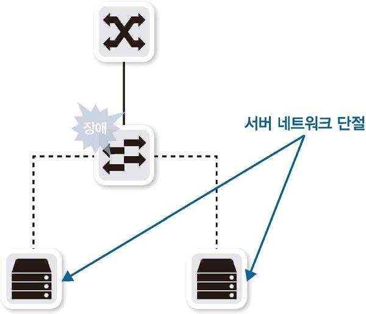

이런 SPoF를 피하기 위해 스위치 두 대로 네트워크를 디자인하지만, 두 대 이상의 스위치로 디자인하면 패킷이 네트워크를 따라 계속 전송되는 **네트워크 루프**가 발생할 수 있다.

### 루프(Loop)

네트워크에 연결된 모양이 고리처럼 되돌아 오는 형태로 구성된 상황을 말한다. 루프 상황이 발생하면 네트워크가 마비되고 통신이 안 되는 상황이 발생한다. 루프 상황에서 발생하는 문제는 여러가지가 있다.

**브로드캐스트 스톰**

루프 구조 상태에서 브로드캐스트를 발생시키면 패킷이 계속 돌아가는데, 이를 브로드캐스트 스톰이라고 한다. 3계층 헤더에는 TTL(Time to Live)이라는 패킷 수명을 갖고 있지만 2계층 헤더에는 이런 매커니즘이 없어, 루프가 발생하면 패킷이 계속 살아남아 패킷 하나가 전체 네트워크 대역폭을 차지할 수 있다. 루프로 인한 문제 중 가장 흔한 경우이다.

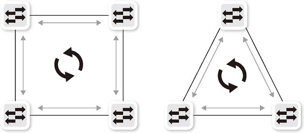

**스위치 MAC 러닝 중복 문제**

루프 구조 상태에서는 브로드캐스트뿐만 아니라 유니캐스트도 문제를 일으킨다. 스위치가 출발지 MAC 주소를 학습할 때, 직접 전달되는 패킷의 포트 번호와 루프를 돌아 다시 들어간 패킷의 포트 번호는 다르지만 MAC 주소가 가 같은 문제가 발생한다. 스위치 MAC 주소 테이블은 하나의 MAC 주소에 대해 하나의 포트만 학습할 수 있는데, 동일한 MAC 주소가 여러 포트에서 학습되면 MAC 테이블이 반복 갱신되어 정상적으로 동작하지 않는다. 이를 **MAC 어드레스 플래핑**이라고 부른다.

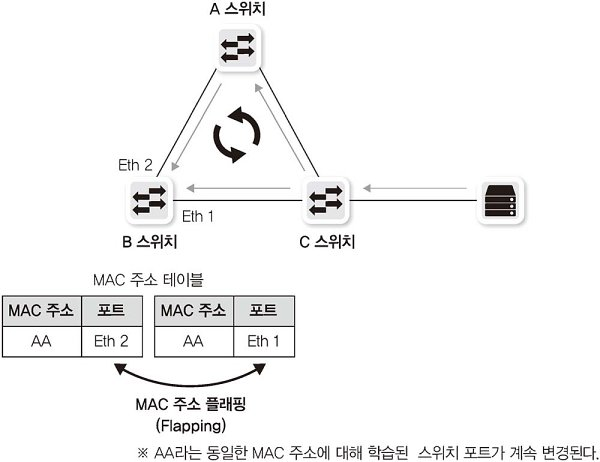

### STP(Spanning Tree Protocol)

네트워크에 루프가 발생할 경우 수동으로 루프를 찾아 포트 하나를 차단하면 문제를 해결할 수 있다. 하지만 이같은 방법은 장애가 발생할 때마다 SPoF를 해결하기 위해 수동으로 적절히 포트 차단을 조절해야 하는 번거로움이 있다. 이런 이유로 루프를 자동 감지해 포트를 차단하고, 우회로가 없을 때 차단된 포트를 스위치 스스로 풀어주는 **STP**가 개발되었다.

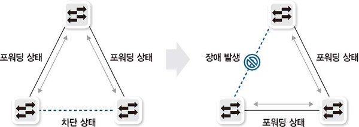

스패닝 트리 프로토콜은 루프를 확인하고 적절히 포트를 사욯하지 못하게 만들어 루프를 예방하는 메커니즘이다.

스패닝 트리 프로토콜을 이용하려면 전체 스위치가 어떻게 연결되는지 알아야하므로, 전체적인 연결 상황을 파악하기 위해 **BPDU(Bridge Protocol Data Unit)라는 프로토콜**을 통해 스위치 간에 정보를 전달한다.

**STP 선정 과정**

스위치는 BPDU에 담긴 여러 정보 중 `Root Bridge ID`, `Path Cost`, `Port ID` 등을 이용해 루트 스위치(root bridge)와 루트 포트(root port), 지정 포트(designated port), 대체 포트(alternated port)를 정한다.

먼저, 스위치끼리 bridge ID를 이용해 서열을 정한다. 자신보다 우선순위가 더 높은 bridge ID를 전달받으면 BPDU 프레임에 자신이 받은 가장 높은 우선순위의 bridge ID를 `Root Bridge ID`에 담아 전달한다.(이때 ID 값이 더 작을수록 높은 우선순위를 갖는다.)

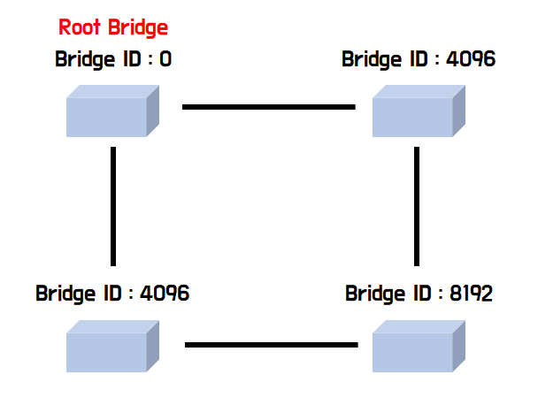

스위치의 서열이 정해지면, 각 스위치들의 포트의 서열이 매겨진다(다른 스위치와 경합하는 것이 아닌, 스위치 내에서만 적용). 이때는 다음 조건에 따라 루트 포트를 결정한다.
  1. `path cost`가 가장 낮은 포트
  2. 연결된 상대방의 `bridge ID`가 가장 낮은 포트
  3. 연결된 상대방의 `port ID`가 가장 낮은 포트

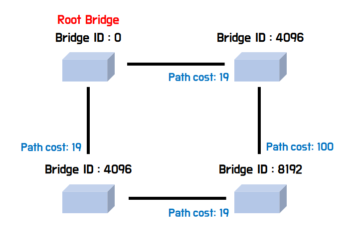

위 그림에서 루트 포트는 `path cost`만을 이용해 결정할 수 있다. 그 다음 지정 포트를 결정해야 하는데, 두 스위치 간의 연결(세그먼트)에는 반드시 하나의 지정 포트가 있어야 한다. 따라서 루트 포트에 연결된 반대편 스위치의 포트가 지정 포트가 된다. 이제 데이터 통신을 하지 않는 포트인 대체 포트를 결정해야한다. 루트 포트도 지정 포트도 아닌 남은 포트 중 스위치의 자체의 `path cost`가 낮은 스위치 쪽 포트를 지정포트로 하고, 반대편에 연결된 포트를 대체 포트로 한다.

**스위치 포트의 상태 및 변경 과정**

포트의 상태는 네 가지로 구분할 수 있다.

- Blocking
  
  - BPDU 수신을 제외한 MAC 주소 학습과 데이터 전송이 불가능한 상태를 의미한다.
  
  - 총 20초인 Max Age 기간 동안 상대방 스위치의 BPDU를 받지 못했거나 후순위 BPDU를 받았을 경우 Listening 상태로 변경된다.

- Listening
  
  - 다른 스위치와의 협상에서 해당 포트의 역할이 루트 포트 혹은 지정 포트로 결정되면 Listening 상태를 유지한다.
  
  - 15초 뒤 Learning 상태로 변경된다.

- Learning
  
  - MAC 주소 학습이 이루어지는 단계이다.
  
  - 15초간 유지하면 Forwarding 상태로 변경된다.

- Forwarding
  
  - MAC 주소 학습을 끝내고 데이터 전송이 가능한 상태를 뜻한다.
  
  - 루트/지정 포트로서 역할을 다 할 수 있는 상태이다.

이렇게 스위치에 신규 장비가 연결되었을때 정상적으로 통신되기까지 **약 50여 초가 소요**된다. 하지만 다운된 링크가 자신의 인터페이스인 경우, 토폴로지가 변했음을 직접 감지할 수 있어 Max Age를 거치지 않고 Listening부터 STP 상태 변화가 직접 이루어지므로 **30초** 만에 절체된다.

> 토폴로지(topology)란 컴퓨터 네트워크 간의 요소들을 물리적으로 연결해 놓은 것, 또는 그 연결 방식을 말한다.

****

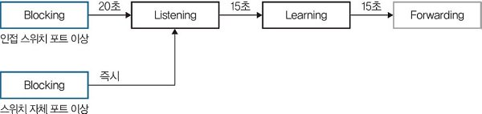

**향상된 STP**

STP는 새로운 스위치가 Forwarding 상태가 될 때까지 30-50초가 소요된다. TCP 기반 애플리케이션에서는 네트워크가 끊겼을 때 30초를 기다리지 못해 STP 장애가 생기면서 통신이 끊길 수 있다. 이러한 문제를 개선하기 위해 향상된 STP가 개발되었다.

- RSTP(Rapid STP)
  
  BPDU의 포맷 중 flags 필드는 8비트인데, 기존 STP는 토폴로지 변경과 관련된 두 가지 메세지(TCN, TCA BPDU)만 있지만 RSTP는 8비트 전부를 활용해 다양한 정보를 주고받는다. 따라서 보고와 알림이 개별적으로 이루어졌던 기존 STP와 달리, 스위치 자신이 모든 네트워크에 토폴로지 변경을 직접 전파할 수 있다.
  
  일반적인 STP
  
  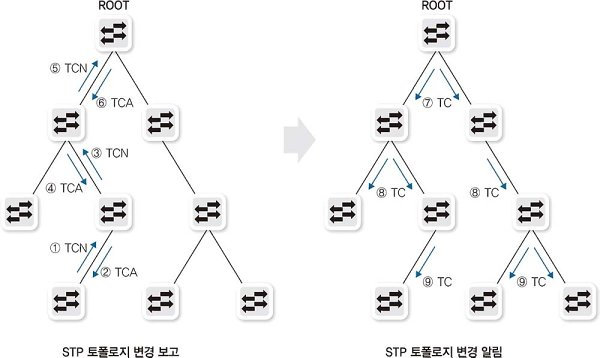
  
  RSTP
  
  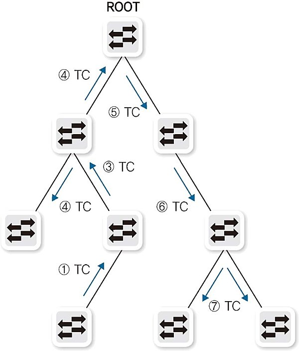

  

- MSTP(Multiple STP)
  
  VLAN을 MST 그룹으로 조성하여, MST 그룹당 STP를 제공하는 서비스 여러 개의 VLAN을 묶어서 그룹별로 스패닝 트리를 동작시키는 방식이다.
  
  VLAN 개수의 증가로 인한 스위치 부하 발생이 적다는 장점이 있지만 모든 스위치에서 동일한 MST 관련 설정을 해야하므로 까다롭다는 단점이 있다.
