# 라우터/L3스위치: 3계층 장비

라우터는 들어오는 패킷의 목적지 IP 주소를 확인하고 자신이 가진 경로 정보를 이용해 패킷을 최적의 경로로 포워딩한다. 라우터는 원격지 네트워크와 연결할 때 사용되는 필수적인 네트워크 장비이다.

> 참고: 라우터 vs L3 스위치
> 
> 스위치 중에는 라우터처럼 3계층에서 동작하는 L3 스위치라고 불리는 장비가 있다. 기존과 달리 최근에는 기술의 발달로 라우터와 L3 스위치를 구분하기가 어려워졌다. 다음 내용은 라우터로 설명하지만 L3 스위치로도 모두 동일하게 적용된다.

## 1. 라우터의 동작 방식과 역할

라우터는 다음 세 가지 동작 방식을 갖는다.

### 경로 지정

다양한 경로 정보를 수집해 최적의 경로를 **라우팅 테이블**에 저장한 후 패킷이 라우터로 들어오면 도착지 IP 주소와 라우팅 테이블을 비교해 최선의 경로로 패킷을 보낸다. 

경로 지정을 위해서는 경로를 학습해야 하는데 그 방법은 다음과 같다.

- IP 주소를 입력하면서 자연스럽게 인접 네트워크 정보를 얻는 방법(다이렉트 커넥티드)

- 관리자가 직접 경로 정보를 입력하는 방법(스태틱 라우팅)

- 라우터끼리 서로 경로 정보를 자동으로 교환하는 방법(다이나믹 라우팅)

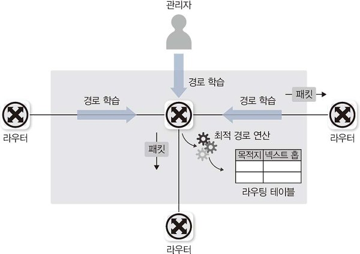

### 브로드캐스트 컨트롤

라우터는 스위치와 다르게 분명만 도착지 정보가 있을 때만 통신을 허락한다.

라우터는 바로 연결되어 있는 네트워크 정보를 제외하고 경로 습득 설정을 하지 않으면 패킷을 포워딩할 수 없다. 따라서 멀티캐스트 정보를 습득하지 않으며 브로드캐스트 패킷을 전달하지 않는다. 이 기능을 이용해 브로드캐스트가 다른 네트워크로 전파되는 것을 막을 수 있다.

### 프로토콜 변환

라우터는 서로 다른 프로토콜로 구성된 네트워크를 연결하는 기능을 한다.

라우터에 패킷이 들어오면 2계층까지의 헤더 정보를 벗겨내고 3계층 주소를 확인한 후 2계층 헤더 정보를 새로 만들어 외부로 내보낸다.

현대 네트워크는 이더넷으로 수렴되므로 이 역할이 많이 줄었지만, 과거에는 LAN 기술이 WAN 기술로 변환되어야만 원격지 네트워크 통신이 가능했고 이 역할을 라우터가 담당했다.


## 2. 경로 지정 - 라우팅/스위칭

### 라우팅 동작과 라우팅 테이블

현대 인터넷에서는 단말부터 목적지까지의 경로를 모두 책임지지 않고 인접한 라우터까지만 경로를 지정하면 인접 라우터에서 최적의 경로를 다시 파악한 후 라우터로 패킷을 포워딩한다. 이를 **홉-바이-홉**라우팅이라고 부르고 인접한 라우터를 **넥스트 홉**이라고 부른다.

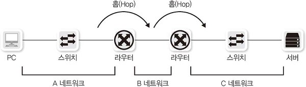

넥스트 홉을 지정할 때는 일반적으로 세 가지 방법을 이용할 수 있다.

- 다음 라우터의 IP를 지정하는 방법(일반적인 방법)

- 라우터의 나가는 인터페이스를 지정하는 방법
  
  - 상대방 넥스트 홉 라우터의 IP를 모르더라도 MAC 주소 정보를 알아낼 수 있을 때만 사용

- 라우터의 나가는 인터페이스와 다음 라우터의 IP를 동시에 지정하는 방법
  
  - IP주소와 인터페이스를 동시에 사용할 땐 VLAN 인터페이스와 같은 논리적인 인터페이스를 사용할 수 있다.

라우터가 경로를 선택할 때는 출발지를 고려하지 않는다. 라우팅 테이블에 저장하는 데이터는 **목적지 주소**와 **넥스트 홉 IP 주소(or 나가는 로컬 인터페이스)** 이다.

라우터에서 패킷의 출발지 주소를 이용해 라우팅하도록 PBR(Policy-Based Routing)기능을 사용할 수 있지만, 라우터에 일반적이지 않은 별도 동작이 필요하다. 실무에서는 소스 라우팅 혹은 폴리시 라우팅이라고 부르기도 하지만, 소스 라우팅의 원래 의미는 '출발지에서 경로를 지정하는 것'이므로 두 가지 용어의 의미를 정확히 아는 것이 중요하다.

> 참고 **TTL(Time To Live)**
> 
> 3계층의 IP 헤더에는 TTL이라는 필드가 있다. TTL은 패킷이 네트워크에 살아 있을 수 있는 시간(홉)을 제한한다.
> 
> TTL을 통해 장비 간에 동일한 패킷이 핑퐁되거나 인터넷에 사라지지 않는 유령 패킷이 생기는 문제를 해결할 수 있다.

### 라우팅(라우터가 경로 정보를 얻는 방법)

**다이렉트 커넥티드**

IP 주소를 입력할 때 사용된 IP 주소와 서브넷 마스크로 해당 IP 주소가 속한 네트워크 주소 정보를 알 수 있다. 라우터나 PC에서는 이 정보로 해당 네트워크에 대한 라우팅 테이블을 자동으로 만드는데, 이 경로 정보를 다이렉트 커넥티드라고 부른다.

해당 경로 정보는 인터페이스에 IP를 설정하면 자동으로 생성되는 정보이며, 해당 네트워크 설정을 삭제하거나 해당 네트워크 인터페이스가 비활성되지 않는 이상 정보를 강제로 지울 수 없다.

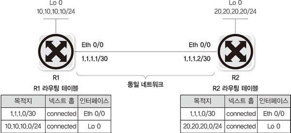

**스태틱 라우팅**

관리자가 목적지 네트워크와 넥스트 홉을 라우터에 직접 지정하는 것을 스태틱 라우팅이라고 한다.

라우팅 정보를 매우 직관적으로 설정, 관리할 수 있으며, 다이렉트 커넥티드처럼 연결된 인터페이스 정보가 삭제되거나 비활성화되면 연관된 스태틱 라우팅 정보가 자동 삭제된다.

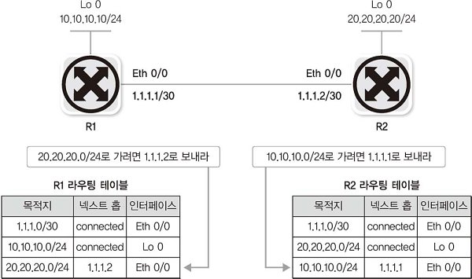

**다이나믹 라우팅**

스태틱 라우팅은 라우터 너머의 다른 라우터의 상태 정보를 파악할 수 없어 장애 발생 시 상황을 파악할 수 없다. 또한 관리해야 할 네트워크 수가 많아지면 관리자가 직접 추가하거나 삭제하는 데 한계가 생긴다.

다이나믹 라우팅은 이러한 단점을 보완해, 라우터끼리 자신이 알고 있는 경로 정보나 링크 상태 정보를 교환해 전체 네트워크 정보를 학습한다.

주기적으로 또는 상태 정보가 변경될 때 라우터끼리 경로 정보가 교환되므로, 관리자의 개입 없이 장애를 인지하고 대체 경로로 패킷을 포워딩할 수 있다. 따라서 대부분의 네트워크에서 다이나믹 라우팅이 사용된다.

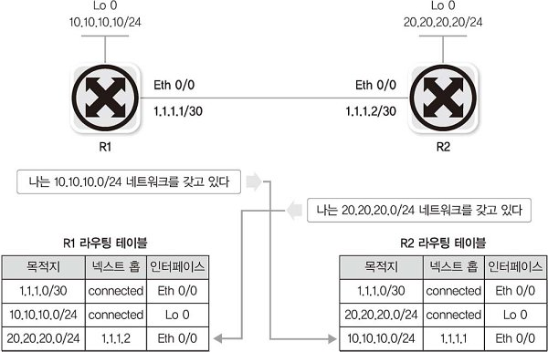

### 스위칭(라우터가 경로를 지정하는 방법)

라우터에 패킷이 들어와 라우팅 테이블을 참조하고 최적의 경로를 찾아 라우터 외부로 포워딩하는 작업을 **스위칭**이라고 한다.

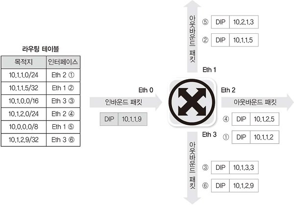

위 그림처럼 라우터로 들어온 패킷이 라우팅 테이블에 있는 정보와 일치하지 않을 경우, **롱기스트 프리픽스 매치(Longest Prefix Match)** 기법을 이용해 갖고 있는 경로 정보 중 가장 가까운 경로를 선택한다.

라우팅 테이블 중 가장 매치되는 정보가 많은 `10.1.1.0/24`를 최선의 정보로 인식해, Eth 2 인터페이스 쪽으로 패킷을 보내게 된다.

사실 라우터에서 이그잭트 매치(Exact Match)가 아닌 위와 같은 작업은 더 많은 리소스를 소호만다. 라우터에서 패킷이 들어올 때마다 이 작업을 수행하면 많은 리소스를 소모하게 되므로, 이런 반복작업을 줄여주는 기술이 채용되고 있다.

그 방법은 한 번 스위칭 작업을 수행한 정보는 캐시를 저장하고 뒤에 들어오는 패킷은 테이블을 확인하는 것이 아니라 캐시를 먼저 확인하는 것이다. 이런 기술은 패킷 네트워크에서 데이터를 보내기 위해 동일한 출발지 IP, 동일한 목적지 IP, 포트 번호로 여러 개의 패킷이 연속적으로 보내지기 때문에 유용하다.

### 라우팅, 스위칭 우선순위

목적지 네트워크 정보가 동일한 서브넷을 사용하는 경우, 스위칭 우선순위는 다음과 같은 순서로 정해진다.

1. 다이렉트 커넥티드

2. 스태틱 라우팅

3. 다이나믹 라우팅

기본적인 우선순위는 미리 정해져 있지만 필요에 따라 관리자가 우선순위를 조정해 라우팅 경로를 조정할 수 있다. 이런 우선순위를 AD(Administrative Distance, 관리 거리)라고 부르며 라우터 생산업체마다 조금씩 다르다.

## 3. 라우팅 설정 방법

### 다이렉트 커넥티드

라우터나 PC에 IP 주소, 서브넷 마스크를 입력하면 다이렉트 커넥티드 라우팅 테이블이 생성된다. 라우팅 테이블을 확인해 목적지가 다이렉트 커넥티드라면 라우터는 앞 장에서 배웠던 L2 통신(ARP 요청을 직접 보내는)으로 목적지에 도달한다. 

목적지가 외부 네트워크인데 다이렉트 커넥티드 라우팅 테이블 정보만 있으면 통신이 불가능하고, 반드시 스태틱 라우팅이나 다이나믹 라우팅에서 얻은 원격지 네트워크에 대한 라우팅 정보가 있어야 한다.

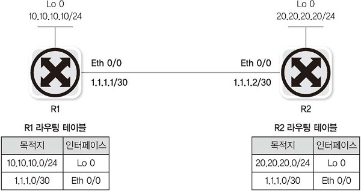


### 스태틱 라우팅

원격지 네트워크와 통신하려면 라우터에 직접 연결되지 않은 네트워크 정보를 입력해야 하는데, 이를 쉽게 추가하고 경로를 직접 제어할 수 있는 가장 강력한 방법이 스태틱 라우팅이다.

스태틱 라우팅은 네트워크 관리자뿐만 아니라 서버 담당자도 경로 관리에 사용하는 경우가 많으므로 서버 관리자도 스태틱 라우팅을 잘 알아두면 좋다.

라우팅 설정 문법은 다음과 같다.

```
ip route 목적지 서브넷마스크 넥스트홉
```

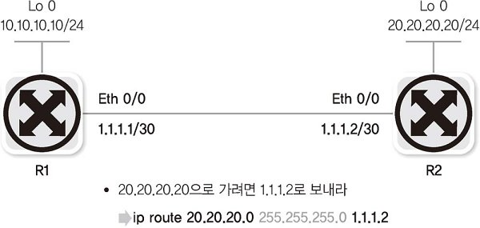

하지만 네트워크 규모가 커지게 되면 라우팅을 처리하는 데 한계가 생긴다.이때 모든 인터넷 정보를 보유한 ISP 라우터 쪽으로 패킷을 보내면 문제를 해결할 수 있다. 

따라서 만약 ISP의 주소가 `1.1.1.1`이라고 한다면, 다음과 같이 스태틱 라우팅을 설정해 모든 패킷을 ISP로 보낼 수 있다.

```
ip route 0.0.0.0 255.0.0.0 1.1.1.1
ip route 1.0.0.0 255.0.0.0 1.1.1.1
ip route 2.0.0.0 255.0.0.0 1.1.1.1
...
ip route 255.0.0.0 255.0.0.0 1.1.1.1
```

위를 한 줄로 줄이면 아래와 같이 바꿀 수 있다.

```
ip route 0.0.0.0 0.0.0.0 1.1.1.1
```

위와 같이 목적지 주소의 서브넷 마스크가 모두 0인 스태틱 라우팅을 **디폴트 라우팅**이라고 한다.

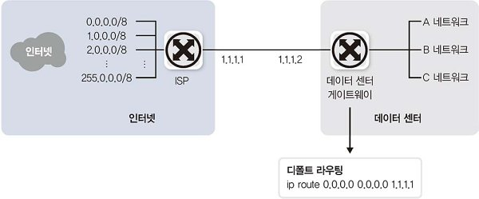

디폴트 라우팅은 인터넷으로 향하는 경로나 자신에게 경로 정보가 없는 경우, 마지막 대체 경로로 사용된다. 디폴트 라우팅과 디폴트 게이트웨이는 같은 의미로, 서버에서 디폴트 게이트웨이를 설정하면 서버의 라우팅 테이블에 디폴트 라우팅이 생긴다.

### 다이나믹 라우팅

간단한 네트워크 구조에서는 스태틱 라우팅으로 망을 유지하는 것이 가능하지만, 일반적으로 IT 환경을 구축할 때는 SPoF를 없애기 위해 대체 경로에 대한 고민이 필요하다. 이는 스태틱 라우팅만으로 구성하면 네트워크 상태의 변경에 따라 신속히 대응하기가 어려우므로 다이나믹 라우팅을 사용하는 것이 좋다.

다이나믹 라우팅 프로토콜을 사용하면 관리자의 직접적인 개입 없이 라우터끼리 정보를 교환해 경로 정보를 최신으로 유지할 수 있다. 주기적으로나 특별한 변화가 있으면 경로 정보를 교환하므로 중간 경로에 문제가 발생하더라도 대체 경로를 찾는 작업이 자동으로 수행된다.

주변 기술의 변화에 맞춰 다양한 프로토콜이 사용되어 왔고, 최근에는 OSPF와 BGP 프로토콜이 주로 사용된다.

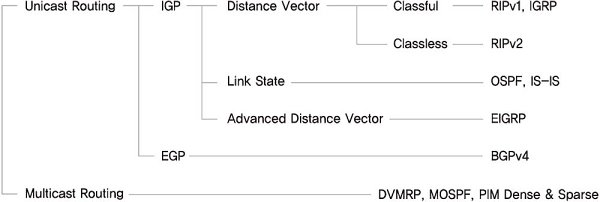

**역할에 따른 분류**

일반적으로 라우팅 프로토콜은 유니캐스트 라우팅 프로토콜을 말한다.

유니캐스트 라우팅 프로토콜은 **AS(Autonomous System)** 이라는 자율 시스템의 내부인지 외부인지에 따라 달라진다. 인터넷 사업자는 한 개 이상의 AS를 운영한다.

- IGP(Interior Gateway Protocol)
  
  - AS 내에서 사용하는 라우팅 프로토콜
  
  - 자체적으로 규칙을 세워 운영하므로 효율성이 중요한 요인이다.

- EGP(Exterior Gateway Protocol)
  
  - AS 간 통신에 사용하는 라우팅 프로토콜
  
  - 조직 간 정책이 중요한 요인이다.

AS 간의 통신은 직접 연결된 AS를 거쳐서 이동해야 하므로, 인터넷 사업자 간의 이해관계에 따라 통신이 빠르거나 느린 차이가 발생할 수 있다.

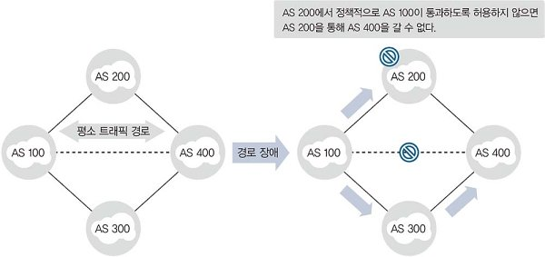

**동작 원리에 따른 분류**

IGP 라우팅 프로토콜은 동작 원리에 따라 **Distance Vector**와 **Link-State**로 나뉜다. 두 원리의 장단점을 적절히 배합해 기능을 향상시킨 **Advanced Distance Vector**가 있지만, 특정 회사가 만든 라우팅 프로토콜로 최근에는 많이 사용되지 않는다.

- Distance Vector
  
  - 인접한 라우터에서 경로 정보를 습득하는 라우팅 프로토콜
  
  - 인접 라우터가 아닌 라우터의 정보는 인접 라우터를 통해 간접적으로 한 단계 건너 받는다.
  
  - 이미 계산된 결과물인 라우팅 테이블을 전달받기 때문에 정보 처리에 많은 리소스가 필요없다는 장점이 있다.
  
  - 멀리 떨어진 라우터의 경로 정보를 얻는 데 많은 라우터를 거쳐야 하므로 모든 라우터 정보가 동기화되는데 많은 시간이 걸린다.
    
    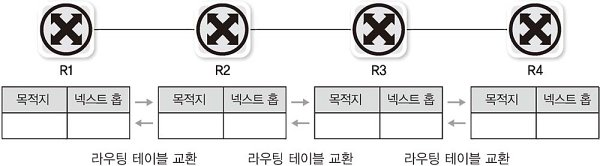

- Link-State
  
  - 라우터들에 연결된 링크 상태를 교환하는 라우팅 프로토콜
  
  - 이미 최적의 경로를 연산한 결과물인 라우팅 테이블 대신 직접적인 상태 정보를 받는다.
  
  - 링크 상태를 교환해 토폴로지 데이터베이스를 만들고 이 정보를 다시 SPF(Shortest Path First) 알고리즘을 이용해 최단 경로 트리를 만든다.
  
  - 전체 네트워크의 링크 상태 정보를 받아 각자 처리하므로 경로 변화를 파악하는 데 유리하다.
  
  - 네트워크 규모가 커지면 네트워크 경로를 파악하는 데 CPU와 메모리 자원을 많이 소모한다. 따라서 네트워크 변화를 더 빨리 감지하고 리소스를 최적화하기 위해 네트워크를 AREA 단위로 분리하고, 분리된 AREA 내에서만 링크 상태 정보를 교환한다.(AREA 외부에서는 가공된 라우팅 테이블 형태로 정보를 전달)
    
    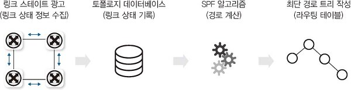


