# 로드 밸런서/방화벽: 4계층 장비(세션 장비)

## 1. 4계층 장비의 특징

4계층 장비는 TCP와 같은 4계층 헤더에 있는 정보를 이해하고 이 정보들을 기반으로 동작한다. 

4계층 이상에서 동작하는 로드 밸런서, 방화벽과 같은 장비를 **세션 장비**라고 부르기도 한다.

세션 장비에서 최우선적으로 고려해야 하는 요소

- 세션 테이블
  
  세션 장비는 세션 정보를 저장, 확인하는 작업 전반에 대한 이해가 필요하다.
  
  세션 정보는 세션 테이블에 남아 있는 라이프타임이 존재한다.

- Symmetric(대칭) 경로 요구
  
  Inbound와 Outbound 경로가 일치해야 한다.

- 정보 변경(로드 밸런서의 경우)
  
  IP 주소가 변경되며 확장된 L7 로드 밸런서(ADC)는 애플리케이션 프로토콜 정보도 변경된다.

## 2. 로드 밸런서

서버나 장비의 부하를 분산하기 위해 사용하는 장비이다. 가장 많이 쓰이는 분야는 웹 서버의 부하 분산이며 FWLB(FireWall Load Balancing, 방화벽 로드 밸런싱), VPNLB(VPN Load Balancing, VPN 로드 밸런싱)와 같이 다양한 서비스를 위해 사용된다.

내부 부품을 이중화하거나 용량이 더 큰 부품을 사용하면 가격이 크게 올라가므로 작은 장비 여러 대를 묶어 사용하는 방법을 선호한다. 이런 시스템 확장 방법을 **스케일 아웃**이라고 한다. 작은 시스템 여러 대가 하나의 서비스로 보이기 위해 로드 밸런서는 대표 IP 주소를 갖고 각 시스템의 실제 IP로 요청을 보낸다.

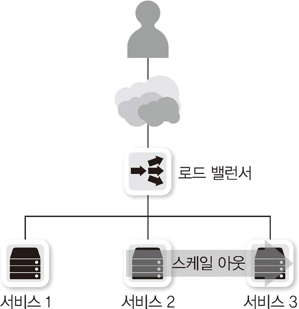

로드 밸런서는 동작하는 계층에 따라 보통 4계층과 7계층으로 나뉜다.

- L4 로드 밸런싱
  
  일반적인 로드 밸런서가 동작하는 방식이다. TCP, UDP 정보(특히 포트 번호)를 기반으로 로드 밸런싱을 수행한다. 최근 로드 밸런서는 L4, L7의 기능을 모두 지원하지만, 장비에서 L7 지원 여부와 상관없이 4계층에 대한 정보로만 분산 처리하는 경우를 L4 로드 밸런싱이라고 한다.

- L7 로드 밸런싱
  
  HTTP, FTP, SMTP와 같은 애플리케이션 프로토콜 정보를 기반으로 로드 밸런싱을 수행한다. HTTP 헤더 정보나 URI와 같은 정보를 기반으로 프로토콜을 이해한 후 부하를 분산할 수 있다. 일반적으로 이런 장비를 ADC(Application Delivery Controller)라고 부르며 프록시 역할을 수행한다.

> 참고
> 
> 데이터 센터에서 사용하는 로드 밸런서 장비는 L4, L7을 모두 지원하며 어떻게 설정했는지에 따라 L4 로드 밸런싱과 L7 로드 밸런싱으로 나뉜다.
> 
> 반면, 클라우드에서는 L4와 L7을 지원하는 컴포넌트를 계층별로 구분해 전용으로 사용된다. 그 예로 AWS의 NLB(Netword Load Balancer)가 L4 로드 밸런싱, ALB(Application Load Balancer)가 L7 로드 밸런싱 전용 컴포넌트이다.

### L4 스위치

 4계층에서 동작하면서 로드 밸런서 기능이 있는 스위치를 L4 스위치라고 한다. 여러 개의 포트를 가지고 있으며 TCP, UDP 정보를 기반으로 한 부하 분산, 성능 최적화, 리다이렉션 기능을 제공한다.

L4 스위치가 동작하려면 가상 서버, 가상 IP, 리얼 서버, 리얼 IP를 설정해야 한다. 가상 서버는 사용자가 보는 실제 서비스이고 가상 IP는 사용자가 접근해야 하는 서비스 IP 주소이다. 여기서 L4 스위치는 가상 IP를 리얼 IP로 변경해주는 역할을 한다.

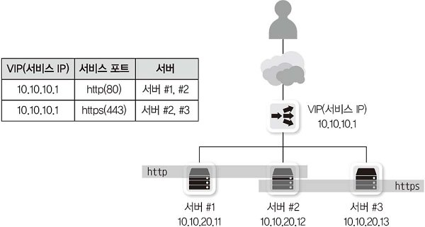

### ADC

ADC는 애플리케이션 계층에서 동작하는 로드 밸런서이다. L4 스위치와 달리 애플리케이션 프로토콜 헤더와 내용을 이해하고 동작하므로 다양한 부하 분산, 정보 수정, 정보 필터링이 가능하다. ADC는 이런 상세한 동작을 위해 프록시로 동작한다.

대부분의 ADC는 L4 스위치의 기능을 포함하며 페일오버나 리다이렉션 기능도 함께 수행한다. 이외에도 캐싱, 압축, 인코딩 변환 등이 가능하며 애플리케이션 프로토콜 최적화 기능도 제공한다. 웹서버에도 콘텐츠 압축 기능이 있지만 ADC에서 이 역할을 수행해 웹 서버의 부하를 줄일 수 있다.

최근 SSL 프로토콜을 이용해 웹 보안을 강화하고 있다. ADC는 클라이언트에서 ADC까지의 구간을 SSL로 처리해주고 ADC와 웹 서버 사이를 일반 HTTP를 이용해 통신한다.

> 참고: 스케일 업과 스케일 아웃
> 
> |     | 스케일 업(Scale-Up)                                    | 스케일 아웃(Scale-Out)                                                            |
> | --- | -------------------------------------------------- | ---------------------------------------------------------------------------- |
> | 설명  | 하드웨어 성능 자체를 업그레이드하거나 더 높은 성능의 시스템으로 마이그레이션하는 방법    | 여러 대의 서버로 로드를 분산하는 방법                                                        |
> | 장점  | 부품을 쉽게 추가할 수 있으면 시스템 설계 변경 없이 서비스 사용량을 쉽게 늘릴 수 있다. | 상대적으로 적은 비용으로 시스템 확장이 가능하다. 시스템에 장애가 발생하더라도 서비스에 미치는 영향이 없도록 결함허용을 구현할 수 있다. |
> | 단점  | 부품 추가가 어렵고 시스템이 커질수록 비용이 기하급수적으로 증가한다.             | 별도의 복잡한 아키텍처를 이해하고 운영해야만 할 수 있다. 프로세스나 네트워크 장비가 추가로 필요할 수 있다.                |
> 
> 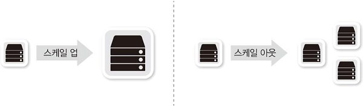
> 
> 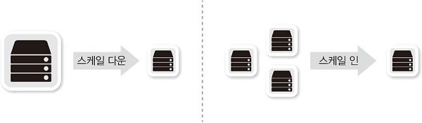

## 3. 방화벽

네트워크 중간에서 장비를 통과하는 트래픽을 사전에 주어진 정책 조건에 맞추어 허용하거나 차단하는 장비를 말한다. 일반적으로 3, 4계층에서 동작하고 세션을 인지, 관리하는 SPI(Stateful Packet Inspection) 엔진을 기반으로 동작하는 장비를 방화벽이라고 부른다.

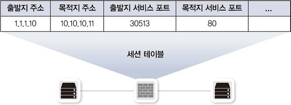

방화벽은 NAT(Network Address Translation) 동작 방식과 유사하게 세션 정보를 세션 내부에 저장한다. 패킷이 외부로 나갈 때 세션 정보를 저장하고, 그 정보를 이용해 패킷이 외부에서 처음 시작된 것인지 내부 사용자가 외부로 요청한 응답인지 가려낸다.

세션 테이블을 이용하면 패킷의 인과 관계를 파악할 수 있어 정책을 간단히 유지할 수 있다. 만약 세션 테이블이 없어 세션의 방향성을 파악하지 못한다면, 양방향 정책을 함께 설정해야 하는 등 복잡한 관리가 필요할 것이다.

> 참고: 상태 테이블? 세션 테이블?
> 
> 패킷의 상태 정보를 인지하는 stateful로 동작하는 장비의 경우, 상태 정보를 갖고 있어 상태 테이블이라고도 하고 해당 상태에 대한 세션 값을 유지하므로 세션 테이블이라고도 부른다.

## 4. 4계층 장비를 통과할 때의 유의점 (세션 관리)

애플리케이션과 세션 장비 간 세션 정보를 동일하게 유지해주거나 애플리케이션을 제작할 때 네트워크 중간에 있는 세션 장비를 고려해 여러 가지 기능을 추가하면, 세션 장비가 중간에 있을 때 생기는 여러 문제를 해결할 수 있다.

### 세션 테이블 유지, 세션 정보 동기화

세션 장비는 통신을 시작하면 해당 세션 상태를 테이블에 기록하며, 통신이 없더라도 통신이 정상적으로 종료되지 않았다면 일정 시간 동안 세션 테이블을 유지한다. 하지만 세션 테이블을 메모리에 저장되므로 메모리 사용률을 적절히 유지하기 위해 일정 시간(세션 타임아웃)만 세션 정보를 저장한다. 여러가지 애플리케이션과 통신해야하므로 일반적인 애플리케이션에 맞추어 적당한 세션 타임아웃값을 유지한다.

하지만 만약 세션 타임아웃값이 애플리케이션의 세션 타임아웃값보다 짧으면 중간 세션 장비의 세션 정보는 사라졌지만 양쪽 단말은 세션이 유지되는 문제가 발생한다. 세션 장비의 세션 정보가 없는 상황에서 SYN이 아닌 ACK로 표시된 패킷이 들어오면 세션 장비는 해당 패킷을 차단할 것이다.

이러한 문제를 해결하기 위해 세션 장비와 애플리케이션(혹은 시스템)에서 각각 적용할 수 있는 설정이 있다. 이 중 하나만 적용되어도 서비스는 정상적으로 동작한다.

- 세션 장비 운영자 입장
  
  - 세션 만료 시간 증가
    
    세션 장비 운영자는 애플리케이션 고유의 세션 유지 시간을 파악해, 해당 애플리케이션에 맞게 세션 만료 시간을 늘린다.
  
  - 세션 시간을 둔 채로 중간 패킷을 수용할 수 있도록 방화벽 설정
    
    세션 테이블에 정보가 없는 ACK 패킷이 들어오더라도 새션을 새로 만들어 통과시킨다. 이는 전체적인 보안이 취약해질 수 있으므로 가능하면 적용하지 않는 것이 좋다.
  
  - 세션 장비에서 세션 타임아웃 시 양 단말에 세션 종료 통보
    
    세션 장비에서 세션 타임아웃 시 양 종단 장비에 세션 정보 만료(RST)를 통보한다(TCP의 RST 플래그를 1로 세팅). 양 종단 장비는 해당 세션을 끊는다.

- 개발자 입장
  
  - 애플리케이션에서 주기적인 패킷 발생 기능 추가(가장 좋은 방법)
    
    애플리케이션 개발 시 중간에 통신이 없더라도 일정 시간마다 양 단말 애플리케이션의 세션 상태 정보를 체크하는 더미 패킷(or Health Check Packet)을 보내는 기능을 추가한다. 패킷이 주기적으로 발생해 중간 세션 장비에서 세션 타임아웃이 발생하기 전에 세션을 유지할 수 있다.

### 비대칭 경로 문제

네트워크의 안정성을 높이기 위해 네트워크 회선과 장비를 이중화하는데, 이때 패킷이 지나가는 경로가 2개 이상이므로 인바운드 패킷과 아웃파운드 패킷의 경로가 같거나 다를 수 있다. 인바운드 패킷과 아웃바운드 패킷이 같은 장비를 통과하는 것을 **대칭 경로**(Symmetric Path)라고 하고 다른 장비를 통과하는 것을 **비대칭 경로**(Asymmetric Path)라고 한다.

**대칭 경로**: 인바운드 패킷과 아웃바운드 패킷이 한 장비를 통과해 통신에 문제가 없다.

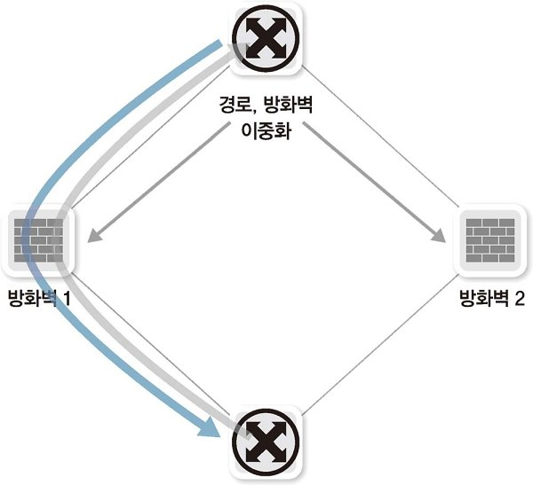

**비대칭 경로**: 인바운드 패킷과 아웃바운드 패킷이 한 장비를 통과하지 않아 세션 정보가 없어 패킷이 드롭된다.

**비대칭 경로를 방화벽에서 처리할 수 있는 방법**

- 세션 테이블 동기화
  
  두 장비가 하나의 장비처럼 동작하도록 세션 테이블을 동기화한다.
  
  이는 패킷 경로를 바꾸지 않고도 동작한다는 장점이 있지만, 세션을 동기화하는 시간보다 패킷 응답이 빠르면 정상적으로 동작하지 않을 수 있다는 단점이 있다.
  
  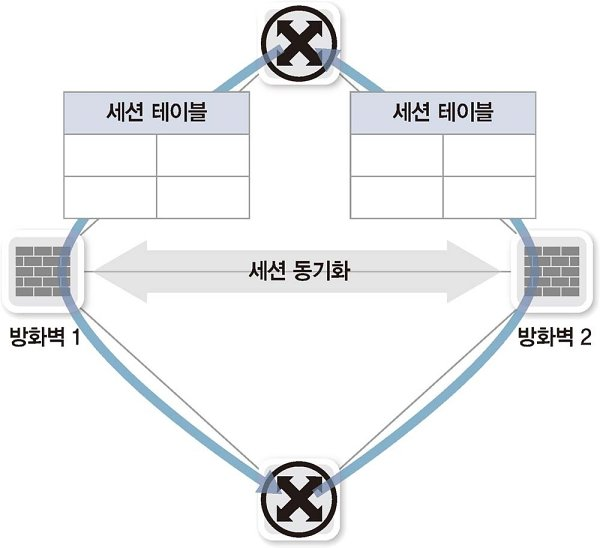

- 경로 보정
  
  한 세션 장비에 인바운드 패킷이 통과하지 않았는데 아웃바운드 패킷이 들어온 경우, 인바운드 패킷이 통과한 다른 세션 장비 쪽으로 패킷을 보내 경로를 보정한다.
  
  방화벽 간 통신용 링크가 필요하고 MAC 주소를 변경하는 MAC rewriting이나 기존 패킷에 MAC 주소를 한 번 더 인캡슐레이션하는 Tunneling 기법으로 경로를 보정한다.
  
  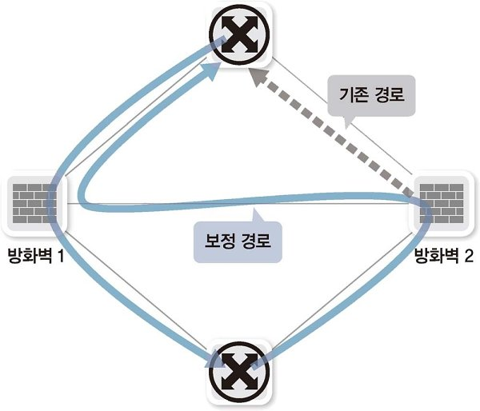

### 하나의 통신에 두 개 이상의 세션이 사용될 때의 고려사항

현대 프로토콜은 하나의 통신을 위해 한 개의 세션만 사용하는 경우가 대부분이지만 특별한 목적이 있거나 오래된 프로토콜은 두 개 이상의 세션을 만드는 경우가 있다.

대표적으로 FTP(File Transfer Protocol)이 있는데, FTP는 컨트롤 프로토콜과 데이터 프로토콜이 완전히 분리되어 있고 통신 방법이 다른 두 가지 모드를 가지고 있다.

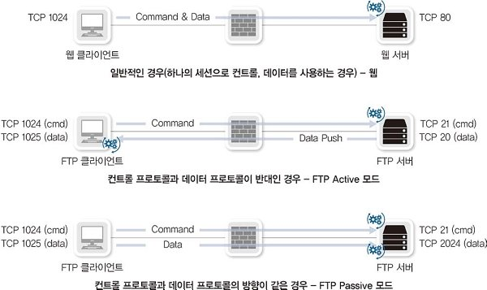

- Active 모드
  
  FTP의 기본적인 구동 방식이다.
  
  명령어를 전달하는 컨트롤 프로토콜과 데이터를 전달하는 데이터 프로토콜이 반대로 동작한다. 
  
  세션 장비는 active 모드의 동작 방식에 맞추어 방화벽의 반대 방향도 열어주어야 한다. 특히 NAT 환경인 경우 FTP가 동작하는 프로토콜을 모두 이해할 수 있는 기능인 ALG(Application Layer Gateway)를 동작시켜야 한다. ALG는 FTP 명령어를 이해하고 반대 방향으로 시작하는 데이터 세션을 인지해 방화벽과 NAT를 자동으로 동작시킨다.
  
  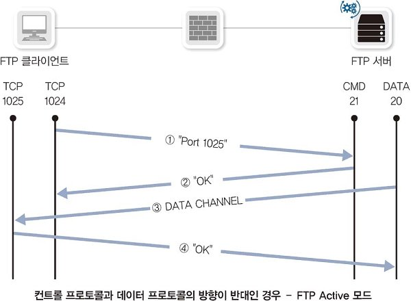

- Passive 모드
  
  Active 모드의 단점을 보완하기 위해 만들어졌다.
  
  컨트롤, 데이터 프로토콜이 모두 클라이언트에서 서버쪽으로 데이터를 요청해 다운받도록 동작한다.
  
  클라이언트 쪽에 방화벽이나 세션 장비가 있을 경우 특별한 작업 없이 동작할 수 있다는 장점이 있지만, 서버 쪽에 방화벽이 있으면 데이터 다운로드를 위한 추가 포트를 열어주어야 한다.
  
  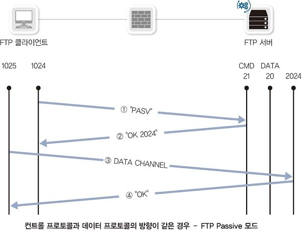
