# 통신을 도와주는 네트워크 주요 기술

## 1. NAT/PAT

**NAT**(Netword Address Translation)은 네트워크 주소를 변환하는 기술이다. 기본적으로 하나의 네트워크 주소에 다른 하나의 네트워크 주소로 변환하는 1:1 변환이 기본이다. 1:1 변환이 아닌 여러 개의 IP를 하나의 IP로 변환하는 기술도 NAT의 기술 중 하나인데, 공식 용어는 **NAPT**(Network Address Port Translation)이다. NAPT는 실무에서 **PAT**(Port Address Translation)라는 용어로 더 많이 사용된다.

### NAT/PAT의 필요성

- IPv4 주소 고갈문제의 솔루션
  
  IP 주소 요구를 극복하기 위해 단기, 중기, 장기전략을 수립했는데, NAT가 중기 전략에 해당된다.
  
  - 단기: 서브네팅
  
  - 중기: NAT와 사설 IP 체계(서비스는 공인 IP 사용 / 일반 사용자 PC나 기타 종단 장비는 IP 사용)
  
  - 장기: IPv6 전환

- 보안 강화
  
  외부와 통신할 때 내부 IP를 다른 IP로 변환해 사내 IP 주소 체계를 숨길 수 있다.

- IP 주소 체계가 같은 두 네트워크 간 통신을 가능하게 한다.
  
  사설 IP를 이용해 다른 회사와 직접 연결해야 하거나 회사 간 합병으로 서로 통신해야 한다면 사설 IP 주소가 충돌할 수 있다. 특히 대외계라고 부르는 회사 간 통신에서 이런 상황이 주로 발생하는데, 이는 출발지와 도착지를 한꺼번에 변환하는 **Double NAT**기술을 사용해 해결할 수 있다.

- 불필요한 설정 변경을 줄일 수 있다.
  
  IDC 쪽에서 IP를 할당받아 사용하는 경우, 회선 사업자를 바꾸거나 IDC를 이전하면 그동안 빌려 써왔던 공인 IP를 변경해야 하는 일이 생긴다. 이는 NAT/PAT를 이용해 내부 네트워크를 구성하고 있었다면 서버와 PC의 IP 주소 변경 없이 회선과 IDC 사업자 이전이 가능하다.

> 참고: NAT의 단점
> 
> 네트워크 운영자 입장: IP가 변환되면 장애가 발생했을 때 문제 해결이 힘들다.
> 
> 애플리케이션 개발자 입장: 애플리케이션을 개발할 때 더 많은 고려사항이 생긴다.
> 
> NAT로 인해 단말 간 직접적인 연결성이 무너졌는데, 이를 극복하기 위해 NAT 밑에 있는 단말도 직접 연결하게 도와주는 **홀 펀칭** 기술이 나왔지만 이 기술을 이용하기 위해 애플리케이션이 더 복합해지는 악순환이 계속되었다.

### NAT 동작 방식

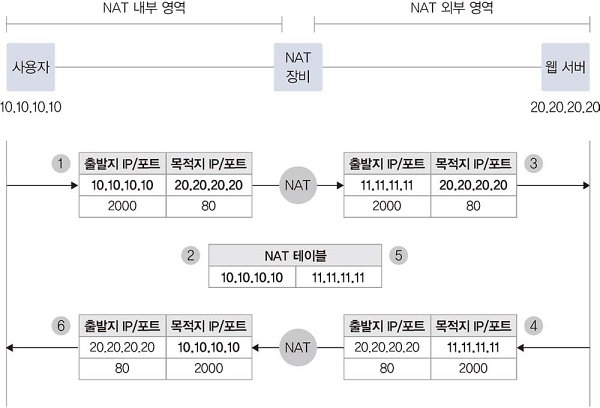

1. 사용자가 웹 서버에 접근하기 위해 출발지 IP/포트에서 목적지 IP/포트로 패킷을 전송한다.

2. NAT 장비는 외부 네트워크과 통신이 가능한 공인 IP로 변경해, 변경 전후 IP 주소를 NAT 테이블에 저장한다.

3. 출발지 주소를 공인 IP 주소로 변경해 목적지로 전송한다.

4. 패킷을 수신한 웹 서버는 자신의 IP를 출발지로 하고 변환된 공인 IP로 응답을 보낸다.

5. 응답 패킷을 수신한 NAT 장비는 테이블에서 목적지 IP에 대응하는 원래 출발지 IP를 확인한다.

6. 원래 패킷 출발지 IP로 변경해 패킷을 전송하고, 사용자는 최종적으로 패킷을 수신한다.

### PAT 동작 방식

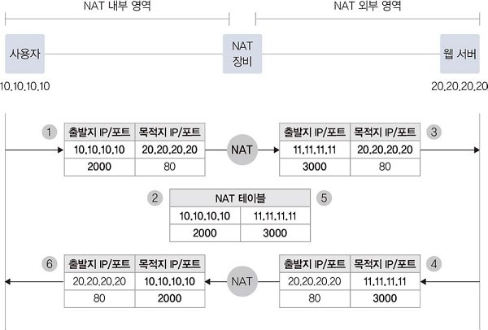

1. 사용자가 웹 서버에 접근하기 위해 출발지 IP/포트에서 목적지 IP/포트로 패킷을 전송한다.

2. NAT 장비는 외부 네트워크과 통신이 가능한 공인 IP로 변경하는데, 다수의 사용자가 동일한 공인 IP로 변환되어야 하므로 출발지 포트도 변경한다. 변경 전후 IP 주소 및 포트 번호를 NAT 테이블에 저장한다.

3. 출발지를 공인 IP 주소 및 새로운 포트 번호로 재작성해 목적지로 전송한다.

4. 패킷을 수신한 웹 서버는 자신의 IP를 출발지로 하고 변환된 공인 IP 및 포트 번호로 응답을 보낸다.

5. 응답 패킷을 수신한 NAT 장비는 테이블에서 목적지 IP와 포트 번호에 대응하는 원래 출발지 IP 및 포트 번호를 확인한다.

6. 원래 패킷 출발지 IP 및 포트 번호로 변경해 패킷을 전송하고, 사용자는 최종적으로 패킷을 수신한다.

PAT는 출발지에서 목적지로 갈 때 생성되는 NAT 테이블을 이용해 응답에 대해 NAT 테이블을 참조할 수 있지만, PAT IP가 목적지일 때는 해당 IP가 어느 IP에 바인딩되는지 확인할 수 있는 NAT 테이블이 없으므로 사용할 수 없다. 즉, PAT는 SNAT와 DNAT 중 SNAT에 대해서만 적용된다.

### SNAT와 DNAT

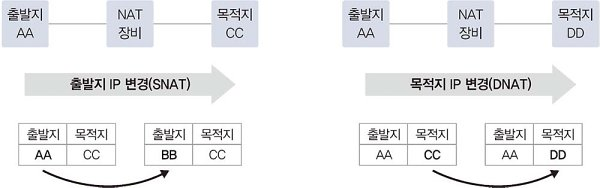

**SNAT(Source NAT)**

출발지 주소를 변경하는 NAT

- 사설에서 공인으로 통신하는 경우

- 내부 IP 주소를 숨겨야 하는 경우

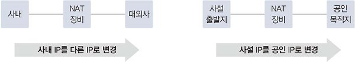

**DNAT(Destination NAT)**

도착지 주소를 변경하는 NAT

- 로드 밸런서에 설정된 서비스 IP로 서비스를 요청하면 로드 밸런서는 서버의 실제 IP로 내보낸다.

- 대외망과의 연동에서 IP 중복이나 대외사와의 연동마다 라우팅을 개별 설정해야 하는 문제가 발생할 수 있다. 이는 새외사의 IP를 특정 IP 대역으로 NAT한 뒤, 어떤 대외사든 대외망 전용 NAT 대역으로 라우팅을 처리해 문제를 해결할 수 있다.

### 동적 NAT와 정적 NAT

**동적 NAT**

출발지와 목적지가 모두 정의된 것이 아니라 다수의 IP 풀에서 정해지므로 최소한 출발지나 목적지 중 한 곳이 다수의 IP로 구성되 IP 풀이나 레인지로 설정되어 있다. NAT가 필요할 때 IP 풀에서 어떤 IP로 매핑될 것인지 판단해 NAT를 수행하는 시점에 NAT 테이블을 만들어 관리한다.

**정적 NAT**

출발지와 목적지 매핑 관계가 특정 IP로 사전에 정의되어 있다. 실제 IP와 NAT IP가 고정되어 있어 방향성 없이 서비스 흐름을 고려하지 않고 NAT를 설정할 수 있다. 외부에서 내부로 통신을 시작하면 DNAT가 적용되고 내부에서 외부로 통신을 시작하면 SNAT가 적용된다.

|              | 동적 NAT                      | 정적 NAT   |
| ------------ | --------------------------- | -------- |
| NAT 설정       | 1:N, N:1, N:M               | 1:1      |
| NAT 테이블      | NAT 수행 시 생성                 | 사전 생성    |
| NAT 테이블 타임아웃 | 동작                          | 없음       |
| NAT 수행 정보    | 실시간으로만 확인하거나 별도 변경 로그 저장 필요 | 별도 필요 없음 |

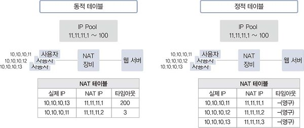

## 2. DNS

DNS는 도메인 주소를 IP 주소로 변환하는 역할을 수행한다.

- 도메인 주소: `www.naver.com`

- IP 주소: `202.179.177.21`

IP 주소보다 도메인 주소를 사용하는 것이 일반 사용자에게 더 익숙하고 서버 IP 변경에 쉽게 대처할 수 있다. 또한 도메인 주소를 이용하면 하나의 IP 주소로 여러 개의 웹 서비스를 운영할 수 있기 때문에 네트워크 통신에서 DNS의 역할이 매우 중요하다.

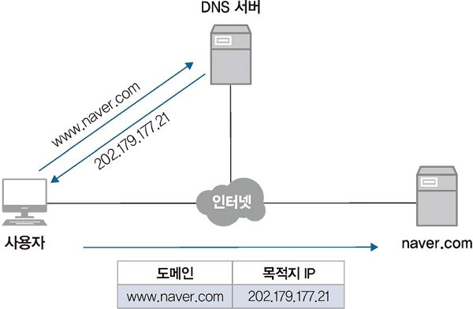

### DNS 구조와 명명 규칙

도메인은 **계층 구조**여서 수많은 인터넷 주소 중 원하는 주소를 효율적으로 찾아갈 수 있다. 역트리 구조로 최상위 루트부터 Top, Second, Third Level 순으로 원하는 주소를 단계적으로 찾아간다. 각 계층의 경계는 `.`으로 표시한다.

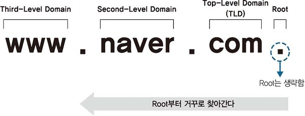

- 루트 도메인
  
  도메인을 구성하는 최상위 영역으로, DNS 서버는 사용자가 쿼리한 도메인에 대한 값을 직접 갖고 있거나 캐시에 저장된 정보를 이용해 응답한다.
  
  만약 DNS 서버에 해당 도메인의 정보가 없으면 루트 도메인을 관리하는 루트 DNS에 쿼리하게 된다.
  
  루트 DNS는 전 세계에 13개가 있다.

- Top-Level Domain(TLD)
  
  TLD는 IANA(Internet Assigned Numbers Authority)에서 구분한 6가지 유형으로 구분할 수 있다.
  
  유형: Generic(gTLD), country-code(ccTLD), sponsored(sTLD),  infrastructure, generic-restricted(grTLD), test(tTLD)

### DNS 동작 방식

**클라이언트 관점**

도메인을 IP 주소로 변환하려면 DNS 서버에 도메인 쿼리하는 과정을 거쳐야 한다. 하지만 DNS 서버 없이 로컬에 도메인과 IP 주소를 직접 설정해 사용할 수도 있다. 로컬에서 도메인과 IP 주소를 관리하는 파일을 **hosts**파일이라고 하고, hosts 파일에 도메인과 IP 주소를 설정해두면 해당 도메인 리스트는 항상 **DNS 캐시**에 저장된다.

도메인을 쿼리하면 DNS 서버에 쿼리를 하기 전 로컬에 있는 DNS 캐시 정보를 먼저 확인한다. DNS 캐시 정보에 필요한 도메인 정보가 없으면 DNS 서버로 쿼리를 수행한다.

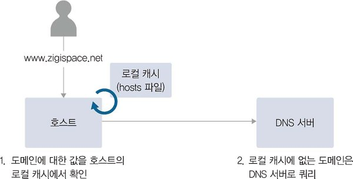

**DNS 시스템 관점**

전 세계 도메인 정보를 DNS 서버 하나에 저장할 수는 없기 떄문에, DNS는 분산된 데이터베이스로 서로 도와주도록 설계되었다.

DNS 서버는 클라이언트의 쿼리가 자신에게 없는 정보라면 루트 DNS에 쿼리한다. 루트 DNS에서는 쿼리한 도메인의 TLD 값을 확인해 해당 TLD 값을 관리하는 DNS가 어디인지 응답하고, 응답받은 정보를 통해 TLD를 관리하는 DNS에 응답하는 식으로 차례대로 결과를 얻어낸다.

즉, 클라이언트는 한 번의 쿼리를 보내지만 이 요청을 받은 DNS 서버는 여러 단계로 쿼리를 상위 DNS 서버에 보내 정보를 획득한다. 호스트가 DNS 서버에 질의했던 방식을 **재귀적 쿼리**라고 하고, DNS 서버가 루트 NS, TLS NS 등에 질의한 방식을 **반복적 쿼리**라고 한다.

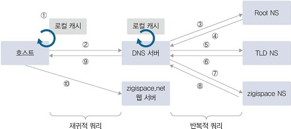

### 마스터와 슬레이브

DNS 서버는 **마스터(Master, Primary)** 서버와 **슬레이브(Slave, Secondary)** 서버로 나눌 수 있다. 마스터 서버가 우선순위가 더 높지 않고 두 서버 모두 도메인 쿼리에 응답한다.

마스터와 슬레이브는 도메인에 대한 존(Zone) 파일을 직접 관리하는지 여부로 구분한다. 마스터 서버는 존 파일을 직접 생성해 도메인 관련 정보를 관리하고 슬레이브 서버는 마스터에 만들어진 존 파일을 복제한다. 이 과정을 **영역 전송**(Zone Transfer)라고 하고, 슬레이브 서버는 정기적으로 도메인이 가진 레코드값을 복제한다. 마스터 서버는 임의의 DNS 서버가 자신의 도메인 정보를 복제해가지 못하도록 슬레이브 서버를 지정해 복제를 제한할 수 있다.

DNS 마스터 서버와 슬레이브 서버는 이중화에서 일반적으로 사용하는 것처럼 액티브-스탠바이나 액티브-액티브 형태로 구성하지 않는다. 즉, 마스터 서버에 문제가 발생하고 일정 시간이 지나면 슬레이브 서버도 도메인에 대한 질의에 정상적으로 응답할 수 없다. 이 시간을 **만료 시간**(Expiry Time)이라고 하고 SOA 레코드에 설정된다. 따라서 만료 시간 안에 마스터 서버를 복구하거나 슬레이브 서버를 마스터로 전환해야만 서비스 장애를 막을 수 있다.

### DNS 주요 레코드

| 레코드 종류         | 내용                               |
| -------------- | -------------------------------- |
| A(IPv4 호스트)    | 도메인 주소를 IP 주소(IPv4)로 매핑          |
| AAAA(IPv6 호스트) | 도메인 주소를 IP 주소(IPv6)로 매핑          |
| CNAME(별칭)      | 도메인 주소에 대한 별칭                    |
| SOA(권한 시작)     | 본 영역 데이터에 대한 권한                  |
| NS(도메인의 네임 서버) | 본 영역에 대한 네임 서버                   |
| MX(메일 교환기)     | 도메인에 대한 메일 서버 정보(Mail eXchanger) |
| PTR(포인터)       | IP 주소를 도메인에 매핑(역방향)              |
| TXT(레코드)       | 도메인에 대한 일반 텍스트                   |

- A(IPv4) 레코드
  
  도메인 주소를 IP 주소로 변환하는 기본 레코드이다.
  
  하나의 A 레코드에는 한 개의 도메인 주소와 한 개의 IP 주소가 1:1로 매핑되는데, A 레코드를 여러 개 만들어 하나의 도메인 주소(또는 IP 주소)에 여러 IP 주소(또는 도메인 주소)를 매핑할 수 있다.

- CNAME(Canonical Name) 레코드
  
  **별칭 이름을 사용**하게 해주는 레코드이다.
  
  레코드 값에 IP 주소를 매핑하는 A 레코드와 달리 도메인 주소를 매핑한다. 네임 서버가 CNAME 레코드에 대한 질의를 받으면 CNAME 레코드에 설정된 도메인 정보를 확인하고 그 도메인 정보를 내부적으로 다시 질의한 결과값을 응답한다.
  
  대표적인 예로 'www'가 있다. 아래 그림을 보면 CNAME에 대한 결과값으로 A 레코드 도메인을 응답하고, IP 변경시에도 A 레코드만 변경해도 된다는 것을 확인할 수 있다.
  
  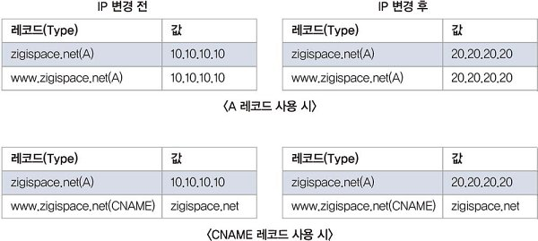

- SOA(Start Of Authority) 레코드
  
  도메인 영역에 대한 권한을 나타내는 레코드로, 도메인 영역 선언 시 SOA 레코드는 **필수적으로 만들어야 한다.**
  
  도메인 동기화에 필요한 타이머 값이나 TTL 값과 함께 도메인의 네임 서버나 관리자 정보도 SOA 레코드에서 설정한다.

- NS(Name Server) 레코드
  
  도메인에 대한 권한이 있는 네임 서버 정보를 설정하는 레코드이다.
  
  또한 하위 도메인에 대한 권한을 다른 네임 서버로 위임하는 역할로도 사용된다.

- PTR(Pointer) 레코드
  
  A 레코드와 반대로 IP 주소에 대한 질의를 도메인 주소로 응답하는 레코드이다.(역방향 조회용 레코드)
  
  A 레코드와 달리 하나의 IP 주소에 대해 하나의 도메인 주소만 가질 수 있다.

> 참고: **도메인 위임(DNS Delegation)**
> 
> 도메인 내의 모든 레코드를 그 네임 서버가 직접 관리하지 않고 일부 영역에 대해 다른 곳에서 관리하도록 위임하기도 한다.
> 
> CDN을 이용하거나 GSLB를 사용하는 것이 대표적인 경우이다.
> 
> 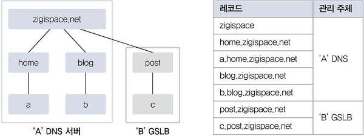

> 참고: **TTL(Time To Live)**
> 
> DNS에 질의해 응답받은 결과값을 캐시에서 유지하는 시간을 뜻한다.
> 
> DNS 서버에서 TTL 값을 늘려 캐시를 많이 이용하면 DNS 재귀적 쿼리로 인한 응답 시간을 많이 줄일 수 있다. 하지만 해당 도메인 관련 정보가 변경되었을 때 새로 변경된 값으로 DNS 정보 갱신이 그만큼 지연되는 문제가 있다.
> 
> 반대로 TTL 값이 너무 작으면 DNS의 정보 갱신이 빨라지므로 DNS 쿼리량이 늘어나 DNS 서버 부하가 증가할 수 있다.
> 
> 따라서 변경이 빈번하지 않다면 TTL 값을 늘려 DNS 부하를 줄이는 것이 좋고, IDC 이전이나 공인 IP, 서비스 변경이 예정되어 있다면 DNS의 TTL 값을 미리 줄여 변경을 신속히 적용하는 것이 좋다.

## 3. GSLB

DNS에서 동일한 레코드 이름으로 서로 다른 IP 주소를 동시에 설정할 수 있다. 이렇게 설정하면 도메인 질의에 따라 응답받는 IP 주소를 나누어 로드밸런싱할 수 있는데, 이를 **DNS 로드밸런싱**이라고 한다.

하지만 DNS는 설정된 서비스 상태의 정상 여부를 확인하지 않고 질의에 대해 설정된 값을 무조건 응답하기 때문에, 서버에 문제가 있는 경우에도 이를 감지하지 못한다. (일반적으로 DNS는 두 개 이상의 항목이 있는 경우 라운드 로빈(순서대로 순환하는) 방식으로 응답한다.)

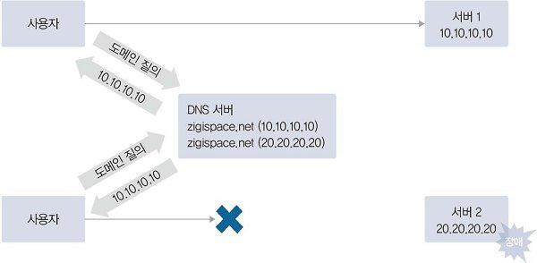

**GSLB**(Global Server/Service Load Balancing)은 이런 문제점을 해결해 도메인을 이용한 로드밸런싱 구현을 도와준다. DNS와 동일하게 도메인 질의에 응답해주는 역할과 동시에 로드 밸런서처럼 등록된 도메인에 연결된 서비스가 정상적인지 헬스 체크를 수행한다.

따라서 GSLB를 '인텔리전스 DNS'라고도 부른다.

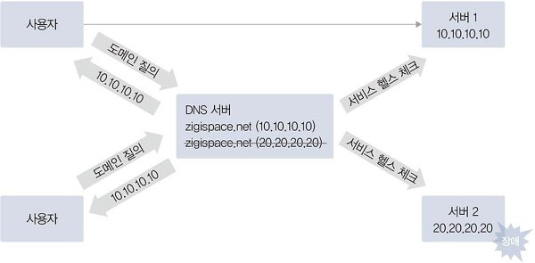

### GSLB 동작 방식

GSLB는 FQDN에 대한 IP 주소 정보를 단순히 갖고 있다가 응답하지 않고, 헬스 체크를 통해 해당 IP가 정상적인 서비스가 가능한 상태인지 확인한다. 만약 정상적인 서비스가 가능한 서버가 여러 개라면 사전에 정의된 알고리즘을 통해 어느 IP 주소로 응답할지 결정한다.

즉, DNS와의 가장 큰 차이점은 **서비스 IP 정보에 대한 헬스 체크**와 **부하 분산**이라고 할 수 있다.

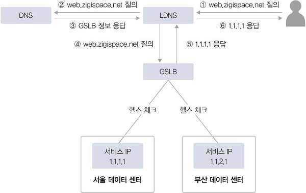

> 참고: **FQDN(Fully Qualified Domain Name)**
> 
> 호스트 이름과 도메인 이름으로 구성된 것
> 
> `www.csstudy.com`: FQDN
> 
> `www`: 호스트 이름
> 
> `csstudy.com`: 도메인 이름

### GSLB 구성 방식

- 도메인 자체를 GSLB로 사용
  
  해당 도메인에 속하는 모든 레코드 설정을 GSLB 장비에서 관리한다.
  
  GSLB 자체가 도메인의 네임 서버 역할을 한다.

- 도메인 내의 특정 레코드만 GSLB를 사용
  
  도메인 자체를 GSLB로 할 경우 모든 레코드에 대한 질의가 GSLB를 통해 이루어지므로 GSLB에 부하를 주게 된다. 또한 회사 대표 도메인에 속한 레코드 중 GSLB 적용이 불필요한 경우도 많다.
  
  따라서 도메인 내의 특정 레코드에 대해서만 GSLB로 처리하도록 설정할 수도 있다.
  
  - 별칭(Alias) 사용 (CNAME 레코드 사용)
    
    일반적으로 외부 CDN을 사용하거나 회사 내부에 GSLB를 사용해야 할 도메인이 많은 경우 한꺼번에 사용하기 위해 사용
    
    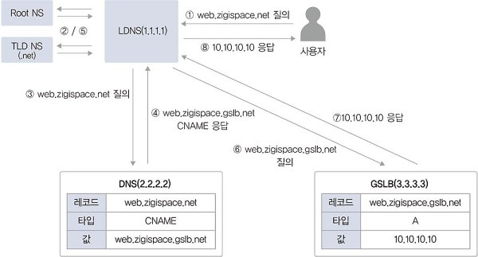
    
    1. 사용자가 LDNS(Local DNS)로 `A 주소`를 질의
    
    2. LDNS는 `A 주소`를 관리하는 DNS 서버를 찾기 위해 root부터 순차적으로 질의
    
    3. DNS 서버의 IP 주소를 받은 뒤, DNS 서버로 `A 주소`를 질의
    
    4. DNS 서버는 LDNS에게 `CNAME`을 응답
    
    5. LDNS는 `응답받은 CNAME`의 IP 주소를 찾기 위해 다시 root부터 순차적으로 질의
    
    6. 응답받은 IP 주소(GSLB)로 `응답받은 CNAME`을 질의
    
    7. GSLB는 LDNS에 사용자가 원하는 IP 주소를 응답
    
    8. LDNS는 사용자에게 결괏값을 최종 응답
  
  - 위임(Delegation) 사용 (NS 레코드 사용)
    
    실제 도메인과 동일한 도메인 레코드를 사용하며 도메인 전체를 위임할 때 사용
    
    
    
    1. 사용자가 LDNS(Local DNS)로 `A 주소`를 질의
    
    2. LDNS는 `A 주소`를 관리하는 DNS 서버를 찾기 위해 root부터 순차적으로 질의
    
    3. DNS 서버의 IP 주소를 받은 뒤, DNS 서버로 `A 주소`를 질의
    
    4. DNS 서버는 LDNS에게 `GSLB 주소`를 응답
    
    5. LDNS는 `응답받은 GSLB 주소`에 `A 주소`에 대해서 질의
    
    6. GSLB는 LDNS에 사용자가 원하는 IP 주소를 응답
    
    7. LDNS는 사용자에게 결괏값을 최종 응답
    
    하나의 FQDN을 위임 처리하면 해당 FQDN의 하위 도메인은 별도의 위임 처리없이 이미 상위 계층에서 위임 처리되므로, 특정 도메인 내에서 GSLB를 사용한 하부 도메인을 계층화해 사용하면 DNS 서버 설정을 최소화해 GSLB로 다수의 FQDN을 위임 처리할 수 있다.
    
    

### GSLB 분산

GSLB를 이용해 서비스를 분산하면 다음과 같은 주요 목적 달성할 수 있다.

- 서비스 제공의 가능 여부를 체크해 트래픽 분산

- 지리적으로 멀리 떨어진 다른 데이터 센터에 트래픽 분산

- 지역적으로 가까운 서비스에 접속해 더 빠른 서비스 제공이 가능하도록 분산

GLSB는 로드 밸런서의 분산 방식과 동일하게 라운드 로빈(Round Robin), 최소 접속(Least Connection), 해싱(Hashing) 방식 등의 분산 방식을 제공한다. (분산 방식은 GSLB 장비를 생산하는 벤더와 모델에 따라 조금씩 다름)

대부분의 GSLB는 다음 두 가지 헬스 체크 모니터링 요소를 제공한다.

- 서비스 응답 시간/지연(RTT/Latency): 서비스 요청에 따라 응답이 얼마나 빠른지 확인

- IP에 대한 지리(Geography) 정보: 가까운 사이트로 서비스 분산을 처리

## 4. DHCP

**정적 할당**: IP와 네트워크 정보를 직접 설정하는 것

**동적 할당**: IP와 네트워크 정보를 자동으로 설정하는 것

**DHCP**(Dynamic Host Configuration Protocol)은 IP를 동적으로 할당하는 데 사용되는 프로토콜이다.

DHCP를 사용하면 IP 주소, 서브넷 마스크, 게이트웨이, DNS 정보를 자동으로 할당받아 사용할 수 있다.

### DHCP 프로토콜

DHCP는 BOOTP(Bootstrap Protocol)라는 프로토콜을 기반으로 한다.

두 프로토콜은 비슷하게 동작하지만 DHCP는 BOOTP에서 지원되지 않는 몇 가지 기능이 추가된 확장 프로토콜이다.

둘 사이에는 호환성이 있어 서로 서비스 포트가 같고, BOOTP 클라이언트가 DHCP서버를 사용하거나 DHCP 클라이언트가  BOOTP 서버를 사용하는 것이 가능하다.

DHCP 클라이언트 서비스 포트: 68(bootpc)

DHCP 서버 서비스 포트: 67(bootps)

### DHCP 동작 방식

DHCP 서버는 신규 IP를 할당할 때 DHCP IP Pool에서 클라이언트에 정해진 시간 동안 IP를 사용할 수 있도록 한다. 이를 **임대 과정**이라고 하며, 그 과정은 다음과 같다.

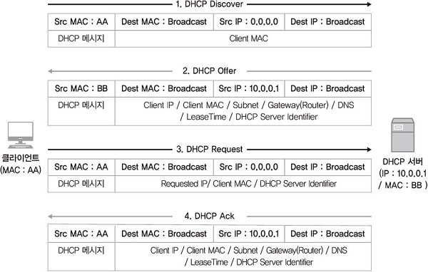

1. DHCP Discover
   
   DHCP 클라이언트는 DHCP 서버를 찾기 위해 DHCP Discover 메시지를 브로드캐스트로 전송한다.
   
   IP는 아직 없으므로 출발지는 Zero IP 주소(0.0.0.0), 목적지는 브로드캐스트 주소(255.255.255.255)로 설정된다. 서비스 포트는 출발지가 UDP 68번, 목적지는 UDP 67번을 사용한다. IP를 할당받는 과정이므로 패킷을 정상적으로 주고받을 수 없어 TCP가 아닌 UDP를 사용한다.

2. DHCP Offer
   
   DHCP 서버는 클라이언트에 할당할 정보를 포함한 메시지를 클라이언트에 제안한다.
   
   클라이언트에 할당할 수 있는 IP 리스트인 DHCP IP Pool 중에서 할당할 IP를 선택한다. 별도의 설정이 없으면 임의로 할당하지만, 특정 클라이언트의 MAC주소와 IP 주소를 사전에 정의해두면 설정된 IP를 할당하므로 고정된 IP를 할당할 수 있다.

3. DHCP Request
   
   클라이언트가 DHCP 서버로부터 제안받은 IP 주소와 DHCP 서버 정보를 포함한 DHCP 요청 메시지를 브로드캐스트로 전송한다.(전송받은 IP로 설정한 뒤 유니캐스트로 패킷을 전달해도 되지만, DHCP 서버가 여러 대인 환경을 고려)
   
   서버는 자신이 보낸 DHCP Offer 메시지에 대한 응답인지 확인하고 그 패킷에 대해서만 응답한다.

4. DHCP Acknowledgement
   
   서버가 클라이언트에 최종 확인을 위한 응답 메시지 패킷을 보낸다.

임대시간이 만료되면 클라이언트에 할당한 IP를 다시 IP Pool로 회수하며, 클라이언트는 DHCP Discover부터 다시 IP를 재할당받아야 한다. 하지만 **갱신 과정**을 거치면 IP 주소를 IP Pool에 반환하지 않고 계속 사용할 수 있다.

**DHCP 갱신 과정**

DHCP에서 IP를 할당받은 후 임대 시간의 50%가 지나면 DHCP 갱신을 수행한다.

갱신하는 경우는 Discover와 Offer 과정을 생략하고 Request, Ack만 보내며 갱신한다.

또한 브로드캐스트가 아닌 유니캐스트로 진행하므로 불필요한 브로드캐스트가 발생하지 않는다.

임대 시간이 50%가 지난 시점에서 갱신이 실패하면 75%가 지난 시점에서 다시 시도하고, 또 실패하면 임대 시간이 모두 지난 후에 IP를 반납하게 된다.

IP 임대 시간은 DHCP를 사용하는 환경에 맞추어 알맞게 설정할 수 있다.

> 참고: DHCP Starvation 공격
> 
> DHCP 서버가 관리하는 IP 풀의 모든 IP를 소진한 상태에서 새로운 클라이언트가 Discover 메시지를 보내면, DHCP 서버는 IP를 할당할 수 없다.
> 
> 이런 점을 악용해 DHCP 서버에서 가용한 모든 IP를 가짜로 할당받아 실제 클라이언트가 IP 주소를 할당받지 못하게 하는 공격 방식을 'DHCP Starvation(기아 상태) 공격'이라고 한다.

### DHCP 릴레이

DHCP 서버에서 IP 주소를 할당받기 위해 브로드캐스트를 사용하는데, 브로드캐스트는 동일 네트워크에서만 전송되므로 DHCP를 사용하려면 각 네트워크마다 DHCP 서버가 있어야 한다.

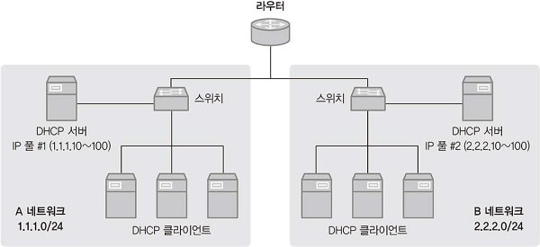

하지만 여러 네트워크를 가진 환경에서도 **DHCP 릴레이 에이전트** 기능을 사용하면 DHCP 서버 한 대로 여러 네트워크 대역에서 IP 풀을 관리할 수 있다.

DHCP 릴레이 에이전트는 DHCP 클라이언트와 DHCP 서버가 서로 다른 대역에 있을 경우, DHCP 패킷을 중간에서 중계(Relay)하는 역할을 수행한다.

DHCP 릴레이 에이전트가 동일 네트워크 대역의 패킷을 브로드캐스트로 전달받으면 DHCP 서버로 갈 수 있도록 유니캐스트로 변환해준다.

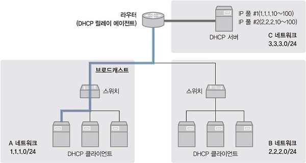