# 보안

## 1. 보안의 개념과 정의

### 정보 보안의 정의

"우리가 생산하거나 유지해야 할 정보에 위험이 발생하거나 사고가 날 염려 없이 편안하고 온전한 상태를 유지하는 일련의 활동"

보안의 필수 요소

- 기밀성(Confidentiality)
  
  인가되지 않은 사용자가 정보를 보지 못하게 하는 모든 작업
  
  ex) 암호화 작업

- 무결성(Integrity)
  
  정확하고 완전한 정보 유지에 필요한 모든 작업
  
  ex) 해시 함수를 이용해 변경 여부를 파악

- 가용성(Availability)
  
  정보가 필요할 때 접근을 허락하는 일련의 작업

즉, 정보 보안은 **인가된 사용자만(기밀성) 정확하고 완전한 정보로(무결성) 필요할 때 접근할 수 있도록(가용성) 하는 일련의 작업**이다.

### 네트워크의 정보 보안

네트워크 입장에서의 정보 보안은 수집된 정보를 침해하는 행동을 기술적으로 방어하거나 정보의 송수신 과정에 생기는 사고를 막는 작업이다.

- 1차 목표: 정보 시스템에 대한 공격을 적절히 막는 것

- 2차 목표: 복제 및 이동되는 정보의 유출을 막는 것

### 네트워크 보안의 주요 개념

네트워크 보안의 목표는 외부 네트워크로부터 내부 네트워크를 보호하는 것이다. 이때 외부로부터 보호받아야 할 네트워크를 **Trust 네트워크**, 신뢰할 수 없는 외부 네트워크를 **Untrust 네트워크**로 구분한다.

한 단계 나아가 우리가 운영하는 내부 네트워크이지만 신뢰할 수 없는 외부 사용자에게 개방해야 하는 서비스 네트워크인 경우, **DMZ(DeMilitarized Zone)** 네트워크라고 부르며 일반적으로 인터넷에 공개되는 서비스를 이 네트워크에 배치한다.

네트워크 보안 분야는 트래픽의 방향과 용도에 따라 두 가지로 나눌 수 있다.

- Internet Secure Gateway
  
  트러스트(또는 DMZ) 네트워크에서 언트러스트 네트워크로의 통신을 통제
  
  SWG(Secure Web Gateway), 웹 필터, 애플리케이션 컨트롤, 샌드박스 등이 해당된다.

- Data Center Secure Gateway
  
  언트러스트 네트워크에서 트러스트(또는 DMZ)로의 통신을 통제
  
  방화벽, IPS, DCSG(DataCenter Secure GateWay, WAF(Web Application Firewall), Anti-DDoS(Distribute Denial of Service) 등의 장비가 해당된다.

**네트워크 보안 정책 수립에 따른 분류**

네트워크 보안 정책 수립에 따라 네트워크 보안은 두 가지로 나뉜다.

- 화이트리스트
  
  방어에 문제가 없다고 명확히 판단되는 통신만 허용하는 방식
  
  인터넷 전체에 대한 화이트리스트를 만들기 어려우므로 일반적으로 IP와 통신 정보에 대해 명확히 아는 경우에 많이 사용된다.

- 블랙리스트
  
  공격이라고 명확히 판단되거나 문제가 있었던 IP리스트나 패킷 리스트를 기반으로 데이터베이스를 만들고 그 정보를 이용해 방어하는 방식
  
  각종 패턴으로 공격을 방어하는 네트워크 장비(IPS, 안티바이러스 ,WAF)들은 일반적으로 블랙리스트 기반의 방어 기법을 제공한다.
  
  공격을 당할 때 이를 분석해 공격 기법을 판단해 탐지하도록 간단히 적어 데이터베이스로 만드는데, 이 데이터베이스를 공격 패턴(Signature)이라고 한다.

대부분의 장비는 화이트리스트 기법과 블랙리스트 기법을 모두 사용할 수 있다.

> 참고: **정탐, 오탐, 미탐(탐지 에러 타입)**
> 
> IPS나 안티바이러스와 같은 네트워크 장비는 공격 데이터베이스에 따라 방어한다.
> 
> 하지만 이 데이터베이스를 아무리 정교하게 만들더라도 공격을 탐지하지 못하거나 공격이 아닌데도 공격으로 감지해 패킷을 드롭시킬 때가 있다.
> 
> 이렇게 예상했던 상황과 탐지 결과에 따라 4가지 경우가 나타날 수 있다.
> 
> 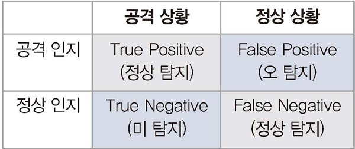

## 2. 보안 솔루션의 종류

보안을 위한 다양한 솔루션은 방어 가능한 범위가 다르다.

보안 장비의 위치와 역할에 따라 다양한 네트워크 보안 장비가 있다.

데이터 센터에서 보안 장비를 디자인할 때 DDos - 방화벽 - IPS - WAF 형태와 같이 여러 단계로 공격을 막도록 인라인 상에 여러 장비를 배치해 단계적으로 방어한다.

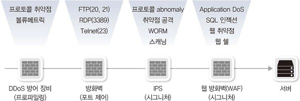

### DDoS 방어 장비

**DoS(Denial of Service)** 공격은 다양한 방법으로 공격 목표에 서비스 부하를 가해 정상적인 서비스를 방해하는 공격 기법이다.

Dos 공격은 적이 공격 출발지에서 공격하는 것이 일반적이었으므로 비교적 탐지가 쉽고 IP 주소 기반으로 충분히 방어할 수 있었다.

이런 탐지를 회피하고 더 짧은 시간 안에 공격 성과를 내기 위해 다수의 봇을 이용해 분산 공격을 수행하는 **DDoS(Distribute Denial of Service)** 공격 기법이 등장했다. 

DDoS 장비는 데이터 센터 네트워크 내부와 외부의 경계에서 볼류메트릭 공격(Volumetric Attack)을 우선적으로 막는다.

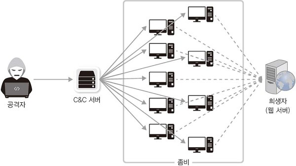

### 방화벽

4계층에서 동작하는 패킷 필터링 장비이다.

3, 4계층 정보를 기반으로 정책을 세울 수 있고 해당 정책과 매치되는 패킷이 방화벽을 통과하면 그 패킷을 허용하거나 거부할 수 있다.

### IDS, IPS

IDS(Intrusion Detection System: 침입 탐지 시스템)와 IPS(Intrusion Prevention System: 침입 방지 시스템)는 방화벽에서 방어할 수 없는 다양한 애플리케이션 공격을 방어하는 장비이다. 기존에는 둘을 구분했지만 최근에는 애플리케이션 공격을 방어하는 장비를 IPS로 통칭한다.

사전에 공격 데이터베이스(Signature)를 제조사나 위협 인텔리전스 서비스 업체로부터 받아 블랙리스트 기반의 방어 방식으로 동작한다.

최근에는 프로파일링 기반의 방어 기법이 IPS 장비에 적용되고 애플리케이션 컨트롤 기능이 추가되면서 화이트리스트 기반의 방어 기법도 IPS 장비에 적용할 수 있게 되었다.

### WAF

WAF(Web Application Firewall)는 웹 서버를 보호하는 전용 보안 장비로 HTTP, HTTPS처럼 웹 서버에서 동작하는 웹 프로토콜의 공격을 방어한다. 

IDS/IPS 장비보다 범용성이 떨어지지만 웹 프로토콜에 대해서는 더 세밀히 방어할 수 있다.

WAF는 다음과 같은 다양한 형태의 장비나 소프트웨어로 제공된다.

- 전용 네트워크 장비

- 웹 서버의 플러그인

- ADC 플러그인

- 프록시 장비 플러그인

WAF는 IPS에서 방어할 수 없는 IPS 회피 공격(Evasion Attack)을 방어할 수 있다. IPS는 데이터를 조합하지 않고 처리하지만 WAF는 프록시 서버와 같이 패킷을 데이터 형태로 조합해 처리한다. 따라서 데이터의 일부를 수정, 추가하는 기능을 수행할 수 있다.

### 샌드박스

직접적인 공격을 원하는 서버에 접근하지 않고 악성 코드를 관리자 PC에 우회적으로 심은 뒤, 이 악성 코드를 이용해 관리자 PC를 컨트롤하는 방식의 공격이 개발되었다. 악성 코드에 감염된 PC는 C&C(Command & Control) 서버에 연결되어 외부에서 컨트롤된다. 이때 기존 방화벽에서는 내부 사용자가 외부 서버로 통신을 정삭적으로 시도한 것으로 보이므로 이 공격을 검출하거나 방어할 수 없다. 이 공격들이 발전해 현재 APT(Advanced Persistent Threat: 지능형 지속 공격)와 ATA(Advanced Target Attack: 지능형 표적 공격)가 되었다.

샌드박스는 APT의 공격을 방어하는 대표적인 장비로 악성 코드를 샌드박스 시스템 안에서 직접 실행시킨다. 가상 운영체제 안에서 각종 파일을 직접 실행시키고 그 행동을 모니터링해 그 파일들의 악성 코드 여부를 판별하는 방법을 이용한다.

### NAC

NAC(Network Access Control)은 네트워크에 접속하는 장치들을 제어하기 위해 개발되었다. 네트워크에 접속할 때 인가된 사용자만 내부망에 접속할 수 있도록 제어하는 기술이다.

외부 PC가 내부망에 접속해 보안사고를 일으키거나 악성 코드를 전파하는 문제를 해결하기 위해 개발되었다.

### IP 제어

NAC 솔루션과 공통적인 기술을 이용하거나 기능이 비슷한 경우도 많지만, 다른 목적으로 개발되었다.

보안사고 추적이 쉽도록 고정 IP 사용 권고 지침이 금융권에 내려오면서, 정확히 의도된 IP 할당이 아니면 정상적으로 네트워크를 사용하지 못하게 하는 기능이 필요했다. 이를 구현하기 시작한 것이 IP 제어 솔루션이다.

### 접근 통제

운영자가 서버, 데이터베이스 ,네트워크 장비에 직접 접근해 관리하면 각 시스템에서 사용자에 대한 권한을 관리해야 하는데, 문제가 발생했을 때 관리자가 작업 내용을 추적하기 어렵다. 이 문제를 해결하기 위해 서버나 데이터베이스에 대한 직접적인 접근을 막고 작업 추적 및 감사를 할 수 있는 접근 통제 솔루션이 개발되었다. 가장 기본적인 접근 통제 방식은 **배스천 호스트**이다.

**배스천 호스트**

서버 접근을 위한 모든 통신은 배스천 호스트를 통해서만 가능하고, 서버 호스트의 방화벽은 배스천 호스트에서 출발한 통신만 허용한다. 배스천 호스트의 보안, 감사를 높이면 보안을 강화할 수 있다.

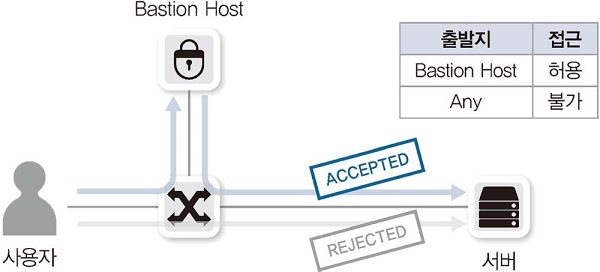

### VPN

사용자 기반의 VPN 서비스를 제공해주는 장비를 VPN 장비라고 한다. 기존에는 별도의 VPN 서비스를 제공하는 하드웨어가 있었지만 현재는 대부분 방화벽이나 라우터 장비에 VPN 기능이 포함되어 있다.

## 3. 방화벽

### 방화벽의 정의

방화벽은 네트워크 중간에 위치해 해당 장비를 통과하는 트래픽을 사전에 주어진 정책 조건에 맞추어 허용하거나 차단하는 장비이다.

일반적으로 방화벽은 3, 4계층에서 동작하며 세션을 인지하는 상태 기반 엔진(Stateful Packet Inspection, SPI)으로 동작한다.

### 초기 방화벽

초기에는 패킷의 세션 정보나 방향성과 상관없이 순수하게 방화벽에 설정된 정책에 따라 동작하는 **Stateless 방화벽**(= 패킷 필터 방화벽)이 존재했다. 5-튜플(Source IP, Destination IP, Protocol No, Source Port, Destination Port)을 참고해 방화벽에 일치된 정책이 있으면 해당 정책에 따라 패킷을 허용하거나 차단한다.

하지만 이런한 방식은 인터넷 통신과 같이 불특정 다수 기반의 정책을 정의할 때는 룰셋이 복잡해지고 보안이 악화되는 문제가 있다. 또한, 패킷 단위의 필터링이므로 5-튜플 외의 3, 4계층 헤더를 변조해 공격하면 적절한 방어가 불가능하다.

### 현대 방화벽

기존 Stateless 방화벽의 한계를 극복하기 위해 개발된 것이 **상태 기반 방화벽**(Stateful Inspection Firewall)이다. 현재 우리가 '방화벽'이라고 부르는 모든 장비는 세션 기반으로 동작하는 **상태 기반(SPI) 엔진**을 탑재하고 있다.

SPI 엔진은 패킷의 인과 관계와 방향성을 인지해 정책을 적용할 수 있어 내부 네트워크에서 인터넷으로 통신할 때 유용하게 사용된다. 내부에서 외부 인터넷으로 통신을 시도해 받은 응답과 외부에서 내부로 직접 들어오려는 패킷을 구분할 수 있다.

패킷 필터링 방화벽과 SPI 방화벽 비교

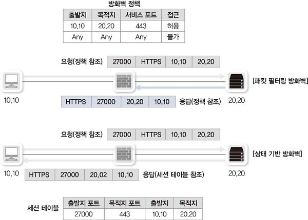

### 방화벽 동작 방식

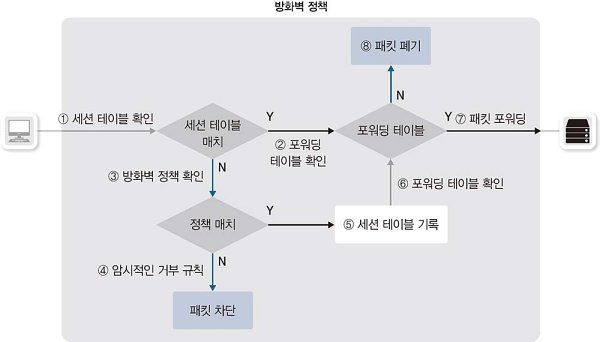

1. 장비에 패킷이 들어오면 먼저 **세션 상태 테이블을 확인**한다.

2. 조건에 맞는 세션 정보가 세션 테이블에 있으면 포워딩 테이블을 확인한다. (라우팅, ARP 포함)

3. 조건에 맞는 세션 정보가 세션 테이블에 없으면 방화벽 정책을 확인한다.

4. 방화벽 정책은 맨 위의 정책부터 확인해 최종 정책까지 확인한 후 없으면 암시적인 거부 규칙을 참고해 차단된다.

5. 허용 규칙이 있으면 내용을 세션 테이블에 적어 넣는다.

6. 포워딩 테이블을 확인한다. (라우팅, ARP 포함)

7. 조건에 맞는 정보가 포워딩 테이블에 있으면 적절한 인터페이스로 패킷을 포워딩한다.

8. 조건에 맞는 정보가 포워딩 테이블에 없으면 패킷을 폐기한다.

### ALG

세션 기반으로 동작하는 방화벽은 세션의 방향성이 매우 중요한데, FTP 액티브 모드에서는 초기 접속 방향과 반대로 데이터 프로토콜이 동작하므로 방화벽을 정상적으로 통과할 수 없다. 그래서 방화벽에서 FTP 액티브 모드를 통과시키기 위해 애플리케이션 프로토콜을 확인하고 필요에 따라세션을 인지해 포트를 자동으로 열어줘야 하는데, 이 기능을 **ALG**(Application Layer Gateway)라고 한다.

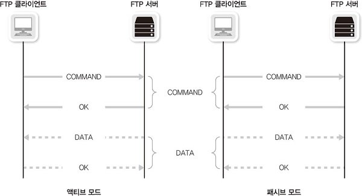

ALG 기능은 PAT(Port Address Translation) 기능이 동작하는 방화벽에서 PAT를 정상적으로 통과하지 못하는 프로토콜을 자동으로 인지해 애플리케이션 정보를 변경해주거나 세션 테이블을 만들어주는 작업을 수행한다. FTP ALG 기능이 동작하려면 패킷이 방화벽을 지나갈 때, 방화벽이나 해당 패킷이 참조되는 정책에 ALG 기능이 활성화되어 있어야 한다.

최근 대부분의 애플리케이션이 이런 방화벽이나 NAT를 고려해 개발되고 있고 STUN(Session Traversal Utilities for NAT)와 같은 홀 펀칭 기술들도 많이 발전해, 오래된 프로토콜을 제외하면 **ALG 기능을 사용하지 않는 추세**이다.

## 4. IPS, IDS

3, 4계층 방어만 가능한 방화벽은 애플리케이션 계층에서 이루어지는 공격을 방어할 수 없다. 애플리케이션 계층에서 이루어지는 이런 다양항 공격을 탐지, 방어하기 위해 IDS와 IPS가 개발되었다.

### IPS, IDS의 정의

- IDS(Intrusion Detection System): 침입 탐지 시스템
  
  방어보다 탐지에 초점을 맞춰 개발됨

- IPS(Intrusion Prevention System): 침입 방지 시스템
  
  탐지뿐만 아니라 방어도 함께 수행
  
  - 호스트 기반 IPS
  
  - 네트워크 기반 IPS(일반적으로 IPS라고 부르는 시스템)

### IPS, IDS의 동작 방식

**패턴 매칭 방식**

기존 공격 방식에 대한 데이터베이스를 습득하고 그 최신 내용을 유지하다가 공격을 파악하는 기술을 **패턴 방식, 시그니처 방식, 데이터베이스 방식 방어**라고 한다. IPS는 많은 공격 데이터베이스를 보유해야 하고 최신 공격 방식을 공격 데이터베이스에 최대한 신속히 반영하는 것이 중요하다.

**어노말리 기법**

패턴 기반의 방어는 극미한 변화만 생겨도 적절한 대응이 어렵고 빠르게 전파되는 공격을 적절한 타이밍에 막아내기 어렵다. 따라서 블랙리스트 기반의 방어 방식인 패턴 기반 방어의 한계를 극복하기 위해 화이트리스트 기반의 방어 기법이 개발되었는데, 이 기법이 바로 **어노말리 기법**이다. 어노말리 기법은 분명한 공격으로 파악되지 않더라도 특정 기준 이상의  행위를 이상하다고 판단하고 방어한다.

- 프로파일 어노말리
  
  평소 관리자가 정해놓은 기준 혹은 IPS 장비가 모니터링해 정해진 기준과 다른 행위가 일어나면 공격으로 판단한다. 프린트 서버에 FTP 패킷이 전송되는 경우 평소 1MB 이하의 트래픽이 발생하던 시스템에서 갑자기 수십 MB 이상의 트래픽이 발생한 경우처럼 평소와 다른 행위에 초점을 맞춘다.

- 프로토콜 어노말리
  
  잘 알려진 포트(Well-Known Port)와 실제로 통신하는 프로토콜이 다를 때 이를 파악해 적절히 제어하는 기법이다. 좀비 PC가 외부와 공격을 위한 통신을 할 때 잘 알려진 서비스 포트를 사용하지만 실제 해당 서비스 포트에서 동작하는 프로토콜이 아닌 다른 프로토콜을 사용하는 경우 유용하게 사용될 수 있다.

### IPS, IDS의 한계와 극복(NGIPS)

패턴 매칭 방식은 알려지지 않은 공격에 취약하고 어노말리 기법은 오탐율이 높다는 단점이 있다. 이러한 IPS의 기능을 향상시켜 문제를 해결한 **NGIPS(Next Generation IPS)** 개념의 장비가 출시되고 있다.

애플리케이션을 인지하거나 다양한 시스템과 연동할 수 있고 특히 APT 공격을 방어하기 위한 일부 기능이 탑재되어 있거나 다양한 외부 시스템과 연동할 수 있는 NGIPS 장비들이 많이 소개되고 있다.

> 참고: **IPS가 공격 데이터베이스를 얻는 방법**
> 
> 새로운 공격을 탐지하기 위해 인터넷에 **허니팟(Honeypost) 시스템**을 구축한다. 허니팟은 공격에 대한 방어가 없고 취약점이 많아 공격 대상이 되기 쉽다. 허니팟은 이런 공격을 모두 로깅하고 공격 기법을 분석해 공격 데이터베이스로 바꾸는 작업을 도와준다.

## 5. DDoS 방어

### DDoS 방어 장비 동작 방식

DDoS는 워낙 대규모 공격이므로 탐지 장비와 방어 장비를 구분하는 경우가 많다. DDoS 공격을 탐지해 공격을 수행하는 IP 리스트를 넘겨주면 방어 장비가 ISP 내부에서 이 IP를 버리는 것이 가장 흔한 DDoS  방어 기법이다.

탐지 및 방어를 하나의 장비에서 하는 기법을 **인라인 방식**이라고 하고 각각 다른 장비에서 수행하는 기법을 **아웃 오브 패스**라고 한다.

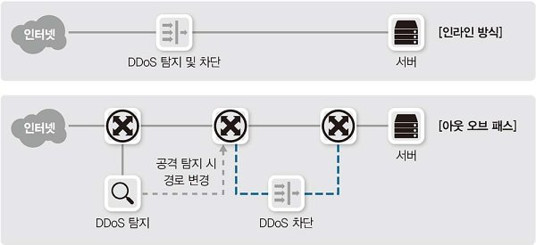

**DDoS 여부를 판별하는 방식**

- 프로파일링 기법: 평소 데이터 흐름을 습득해 일반적인 대역폭, 세션량 등과 일치하지 않는 과도한 트래픽이 인입되면 알려주고 차단한다.

- 보안 데이터베이스 기반 방어: IP 평판 데이터베이스를 공유해 DDoS 공격으로 사용된 IP 기반으로 방어 여부를 결정하거나 특정 공격 패턴을 방어하는 방법이다.

### DDoS 공격 타입

**볼류메트릭 공격**

회선 사용량이나 그 이상의 트래픽을 과도하게 발생시켜 회선을 사용하지 못하도록 방해하는 공격이다. 좀비 PC를 활용한 공격과 증폭 공격 등이 있다.

좀비 PC를 활용한 공격

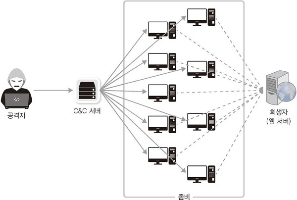

증폭 공격

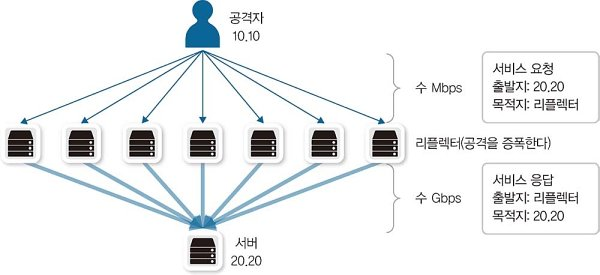

볼류메트릭 공격을 방어하기 위해서는 회선을 공급해주는 ISP 내부나 사용자 네트워크 최상단에 방어 장비를 위치시켜 이 공격을 완화해야 한다. 또한 클라우드 기반의 DDoS 방어 서비스도 고려해볼 수 있다. 클라우드 기반 서비스는 DDoS, WAF와 같은 별도의 보안 장비 없이도 다양한 DDoS 공격을 방어할 수 있다는 장점이 있다.

ISP에서 제공하는 DDoS 방어 서비스

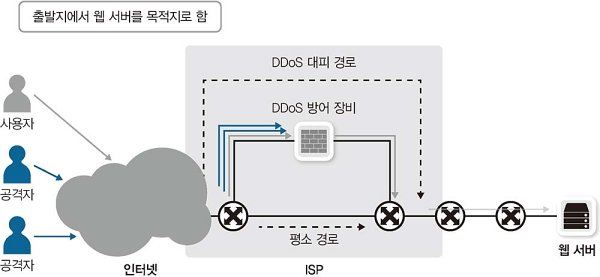

클라우드 기반의 DDoS 방어 서비스

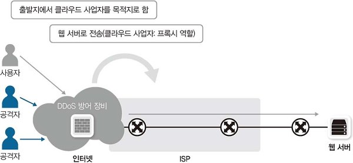