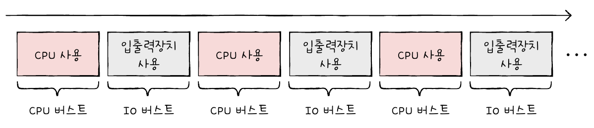
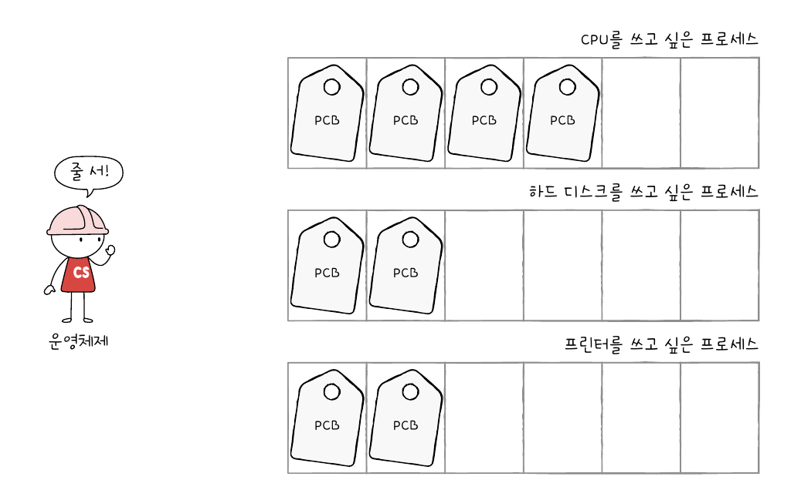
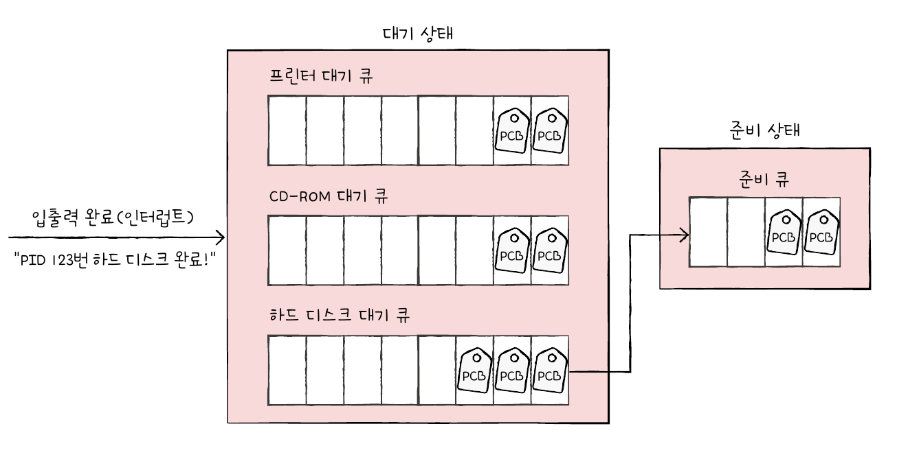
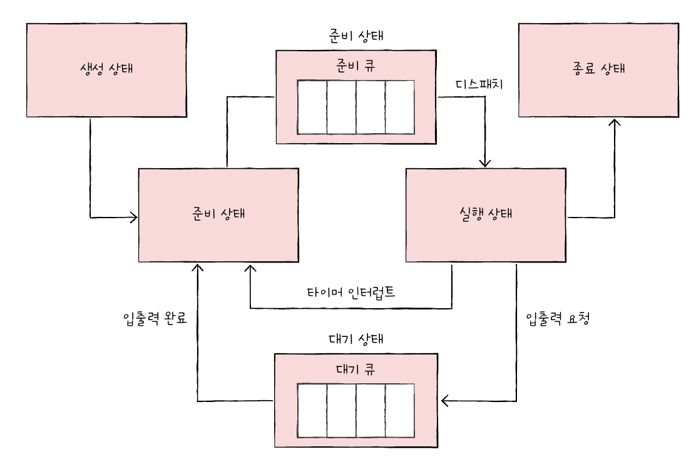
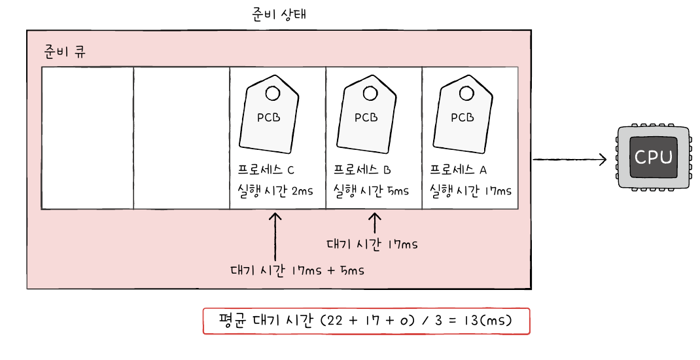
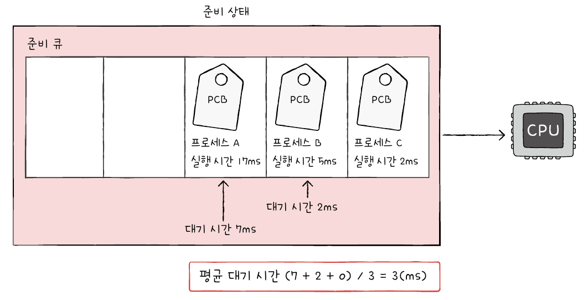
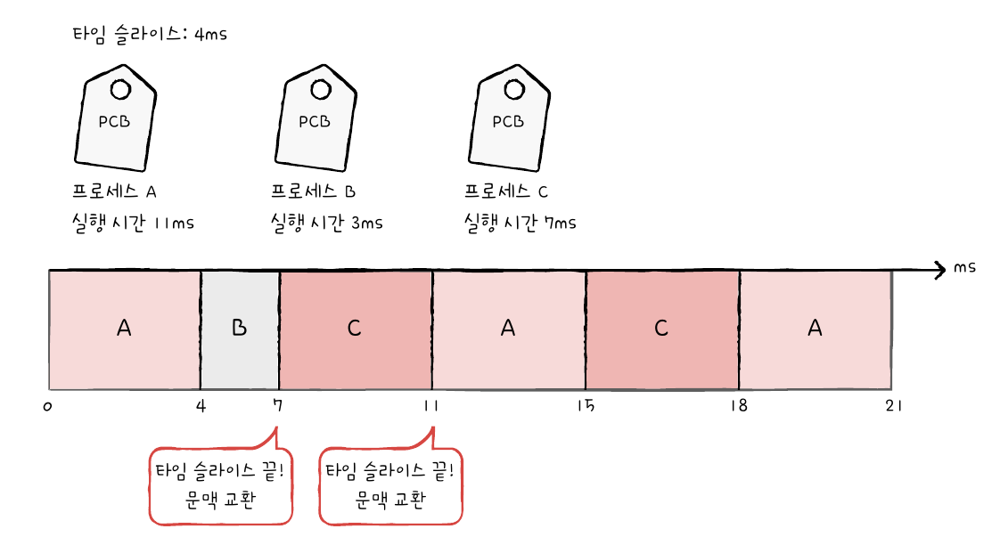
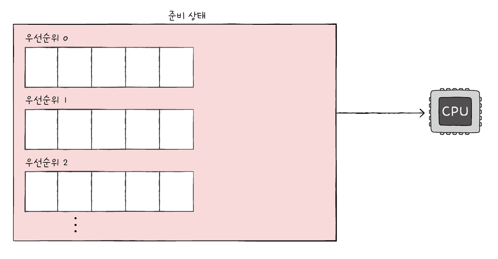
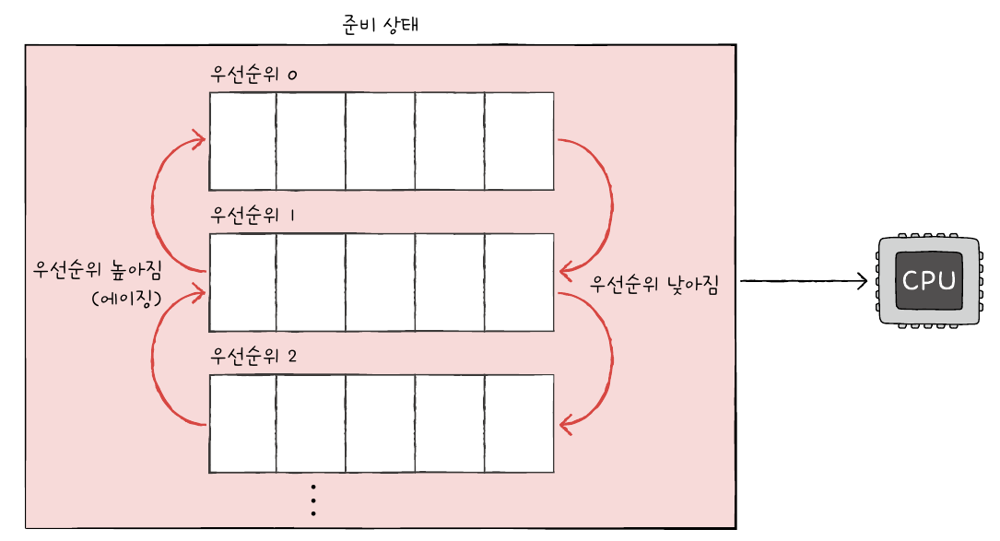

# CPU 스케줄링

## 1. CPU 스케줄링 개요

### 프로세스 우선순위

프로세스는 **입출력장치를 이용하는 시간**과 **CPU를 이용하는 시간**의 양에 따라 두 가지로 나눌 수 있다.

- **입출력 집중 프로세스**(I/O bound process)
  
  비디오 재생이나 디스크 백업 작업 등 입출력 작업이 많은 프로세스
  
  실행상태보다 입출력을 위한 **대기 상태에 더 많이 머무른다.**

- **CPU 집중 프로세스**(CPU bound process)
  
  연산, 컴파일, 그래픽 처리 작업 등 CPU 작업이 많은 프로세스
  
  대기 상태보다 **실행 상태에 더 많이 머무른다.**

**만약 입출력 집중 프로세스와 CPU 집중 프로세스가 동시에 CPU 자원을 요구한다면?**

CPU는 입출력 집중 프로세스를 빨리 실행시켜 입출력장치를 끊임없이 작동시키고, CPU 집중 프로세스에 집중적으로 CPU를 할당하는 것이 효율적일 것이다.

∴ 이처럼 상황과 프로세스의 중요도에 맞게 운영체제는 각 프로세스의 **PCB**에 **우선순위**를 명시하고, 우선순위를 기준으로 먼저 처리할 프로세스를 결정한다.

> **참고: CPU 버스트와 입출력 버스트**
> 
> 프로세스는 일반적으로 CPU 버스트와 입출력 버스트를 반복하며 실행된다.
> 
> - **CPU 버스트**
>   
>   CPU를 이용하는 작업
>   
>   CPU 집중 프로세스는 CPU 버스트가 많은 프로세스이다.
> 
> - **입출력 버스트** 
>   
>   입출력장치를 기다리는 작업
>   
>   입출력 집중 프로세스는 입출력 버스트가 많은 프로세스이다.
> 
> 

### 스케줄링 큐

운영체제가 모든 PCB를 일일이 확인해 우선순위를 결정하는 것은 비효율적이다.

따라서 운영체제는 CPU, 메모리 등 각 자원을 이용할 프로세스를 **스케줄링 큐**로 구현해 관리한다.

(일반적인 큐와 달리 스케줄링 큐는 반드시 선입선출 방식일 필요는 없음)

운영체제가 관리하는 큐에는 **준비 큐**와 **대기 큐**가 있다.

- 준비 큐
  
  CPU를 이용하고 싶은 프로세스들을 위한 큐
  
  운영체제는 PCB들이 큐에 삽입된 순서대로 프로세스를 실행한다.
  
  이때 **우선순위가 높은 프로세스를 먼저 실행**한다.

- 대기 큐
  
  입출력장치를 이용하기 위해 대기 상태에 접어든 프로세스를 위한 큐
  
  작업이 완료되어 인터럽트가 발생하면 운영체제는 작업이 완료된 PCB를 찾아 준비 큐로 이동시킨다.
  
  

**프로세스 상태 다이어그램**

### 선점형과 비선점형 스케줄링

프로세스가 자원을 사용하고 있는 도중 다른 프로세스에게 요청이 들어오면 운영체제는 두 가지 선택권을 갖는다.

- **선점형 스케줄링**
  
  프로세스가 **현재 사용중인 자원을 다른 프로세스에 강제로 할당**하는 방식
  
  프로세스가 정해진 시간만큼 자원을 사용해 타이머 인터럽트가 발생하면, 해당 자원을 다음 프로세스에 할당해 자원 사용의 독점을 막는다.
  
  현재 대부분의 운영체제가 차용한 방식이다.
  
  - 장점: 자원 독점을 막아 자원을 골고루 배분할 수 있음
  
  - 단점: 문맥 교환 과정에서 오버헤드가 발생할 수 있음 (오버헤드: 문맥 교환 과정에 걸리는 시간)

- **비선점형 스케줄링**
  
  **하나의 프로세스가 자원 사용을 독점**할 수 있는 방식
  
  프로세스가 종료되거나 스스로 대기 상태에 접어들 때까지 다른 프로세스는 해당 자원을 사용할 수 없다.
  
  - 장점: 문맥 교환에서 오버헤드의 발생 빈도가 적음
  
  - 단점: 모든 프로세스가 골고루 자원을 사용할 수 없음

## 2. CPU 스케줄링 알고리즘

### 선입 선처리 스케줄링

**FCFS(First Come First Served Scheduling) 스케줄링**이라고도 한다.

**큐에 삽입된 순서대로 프로세스들을 처리하는 비선점형 스케줄링 방식**이다.

앞선 프로세스의 실행시간이 너무 길면 실행시간이 짧은 프로세스들이 실행되지 못하는 **호위 효과**(Convoy Effect)가 발생한다.

### 최단 작업 우선 스케줄링

**SJF(Shortest Job First Scheduling) 스케줄링**이라고도 한다.

**CPU 이용 시간의 길이가 가장 짧은 프로세스부터 실행하는 스케줄링 방식**이다.

기본적으로 **비선점형 스케줄링** 알고리즘으로 분류되지만, 선점형으로 구현되면 최소 잔여 시간 우선 스케줄링 방식이 된다.

### 라운드 로빈 스케줄링

**선입 선처리 스케줄링에 타임 슬라이스라는 개념이 더해진 스케줄링 방식**이다.

**타임 슬라이스**란 각 프로세스가 CPU를 사용할 수 있는 정해진 시간을 의미한다.

즉, 정해진 타임 슬라이스만큼의 시간 동안 돌아가며 CPU를 이용하는 **선점형 스케줄링** 방식이다.

타임 슬라이스 크기가 매우 중요한 요인이다.

- 타임 슬라이스 크기가 너무 클 경우: 호위 효과 발생 가능

- 타임 슬라이스 크기가 너무 작을 경우: 문맥 교환에 발생하는 비용 증가

### 최소 잔여 시간 우선 스케줄링

**SRT(Shortest Remaining Time) 스케줄링**이라고도 한다.

**최단 작업 우선 스케줄링 알고리즘과 라운드 로빈 알고리즘을 합친 스케줄링 방식**이다.

프로세스는 정해진 타임 슬라이스만큼 CPU를 사용하되, 그 우선권은 남아있는 작업 시간이 가장 적은 프로세스가 갖는다.

### 우선순위 스케줄링

프로세스들에 우선순위를 부여하고 **가장 높은 우선순위를 가진 프로세스부터 실행**하는 스케줄링 알고리즘이다.

이 방식은 우선순위가 높은 프로세스에 의해 우선순위가 낮은 프로세스의 실행이 계속해서 연기될 수 있다는 문제가 있는데, 이를 **기아 현상**이라고 한다.

이를 방지하기 위한 대표적인 기법으로 **에이징**이 있다. 이는 오랫동안 대기한 프로세스의 우선순위를 점차 높이는 방식으로, 우선순위가 낮았던 프로세스도 언젠가 우선순위가 높은 프로세스가 될 수 있다.

### 다단계 큐 스케줄링

**우선순위별로 준비 큐를 여러 개 사용하는 스케줄링 방식**이다.

우선순위가 높은 큐에 있는 프로세스를 먼저 처리하고, 해당 큐가 비어있으면 그다음 우선순위 큐에 있는 프로세스를 처리한다.

프로세스 유형별로 우선순위를 구분하여 실행하는 것이 편리해진다.

큐 별로 타임 슬라이스를 여러 개 지정하거나 다른 스케줄링 알고리즘을 사용할 수 있다.

### 다단계 피드백 큐 스케줄링

다단계 큐 스케줄링은 우선순위 스케줄링과 마찬가지로 우선순위가 낮은 프로세스가 계속해서 연기되는 기아 현상이 발생할 수 있는데, 이를 보완한 방식이 다단계 피드백 큐 스케줄링이다.

**프로세스가 큐 사이를 이동**할 수 있어, 한 큐에서 오랜 시간 동안 머무르는 프로세스가 있다면 다른 큐로 보내 우선순위를 변경할 수 있다.

즉, 어떤 프로세스가 CPU 이용 시간이 너무 길면 낮은 우선순위 큐로 이동시키고, 낮은 우선순위 큐에서 너무 오래 기다린다면 높은 우선순위 큐로 이동시킬 수 있다.

**가장 일반적인 CPU 스케줄링 알고리즘**이다.

