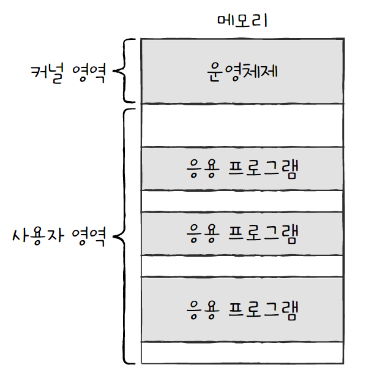
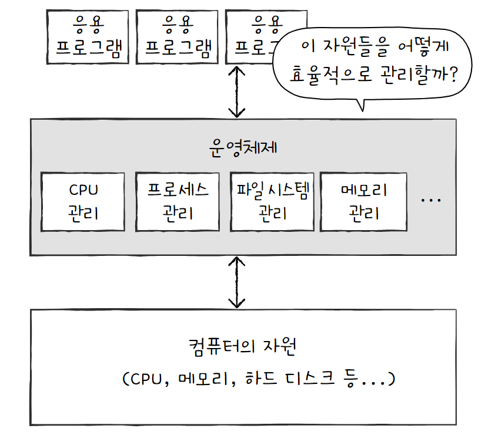
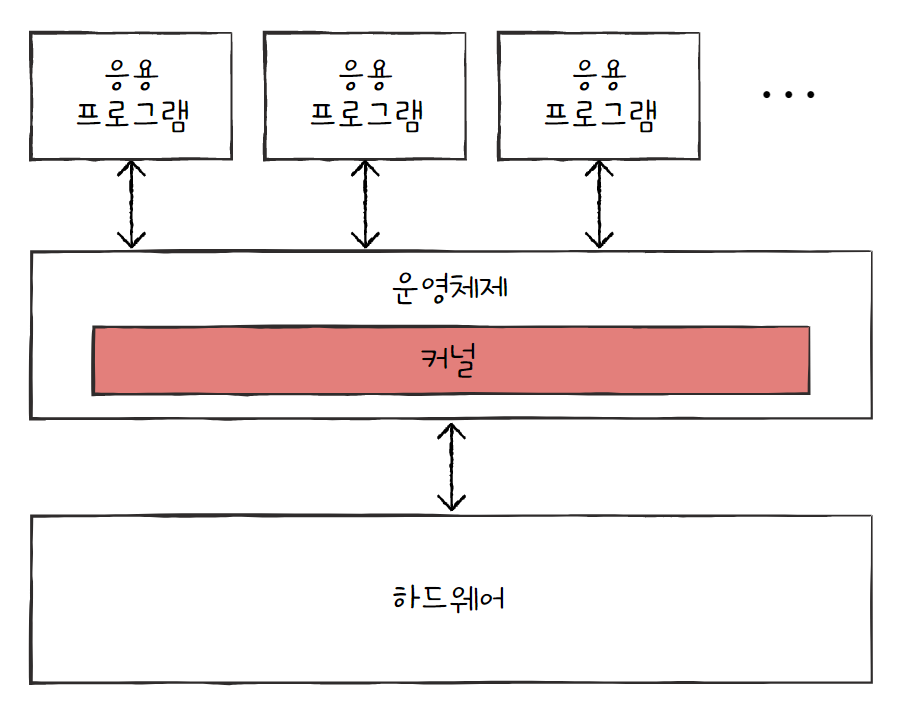
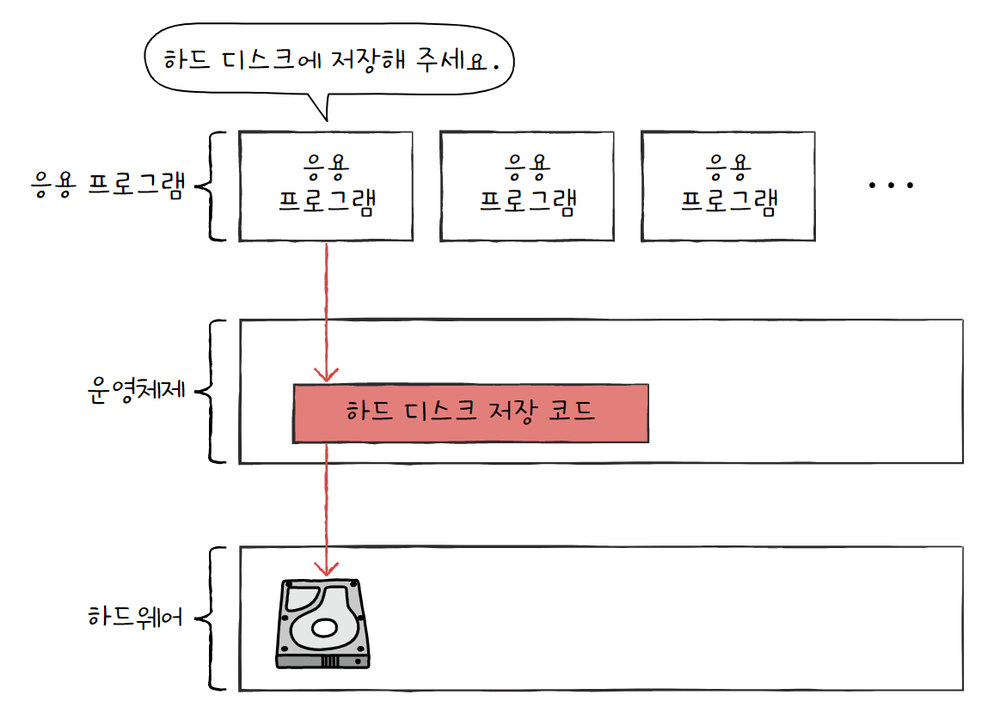
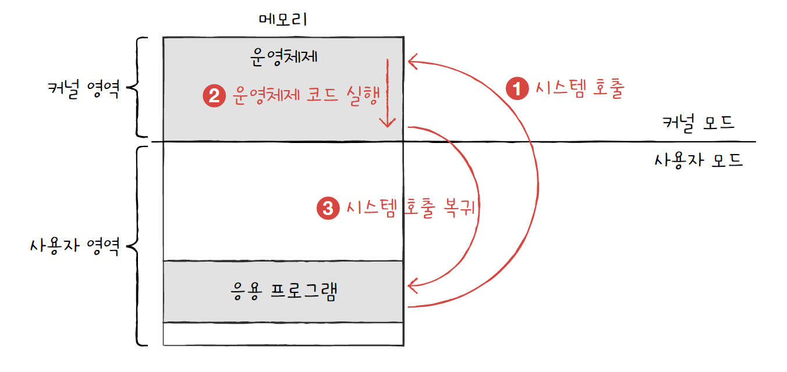
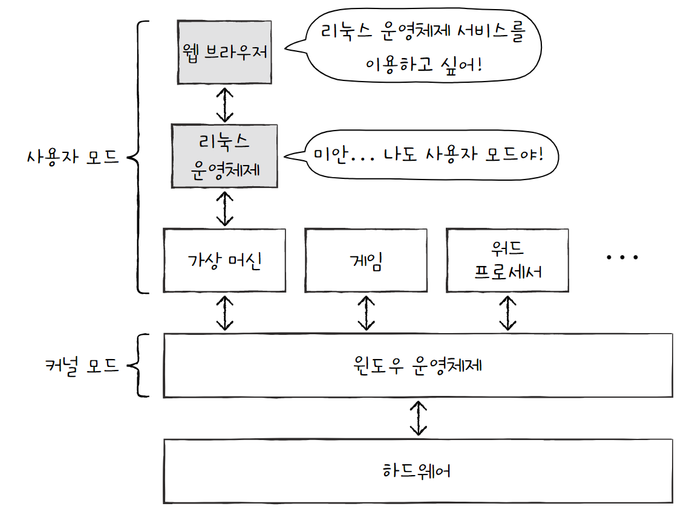
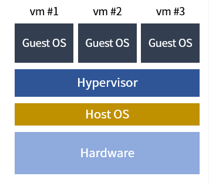

# 운영체제 시작하기

## 1. 운영체제란

CPU, 메모리와 같은 컴퓨터 부품을 포함해 프로그램 실행에 필요한 요소들을 **시스템 자원**, 혹은 **자원**이라고 한다. 실행할 프로그램에 필요한 자원을 할당하고, 프로그램이 올바르게 실행되도록 돕는 특별한 프로그램을 바로 **운영체제**라고 한다.

메모리는 **커널 영역**과 **사용자 영역**으로 나눌 수 있다. 운영체제 또한 프로그램이기 때문에 메모리에 적재되어야 하며, 그중에서도 커널 영역에 적재된다. 그 외 사용자가 이용하는 응용 프로그램이 적재되는 영역이 사용자 영역인데, **운영체제는 커널 영역에서 사용자 영역에 적재된 프로그램들에 자원을 할당**한다.

>  **응용 프로그램**이란 사용자가 특정 목적을 위해 사용하는 일반적인 프로그램을 의미한다. 워드 프로세서, 인터넷 브라우저, 메모장 등과 같은 프로그램이 모두 응용 프로그램에 해당한다.

운영체제는 메모리에 주소가 겹치지 않도록 적당한 공간에 프로그램을 적재하고 실행되지 않는 프로그램의 삭제하는 등, **지속적으로 메모리 자원을 관리**한다.

또한 **여러 프로그램에 CPU 자원을 적절히 할당**해 CPU에 접근할 수 있도록 하는 역할도 수행한다.

이렇게 여러 역할을 수행하기 위해 운영체제는 자원별로 기능이 나누어져 있다.

### 운영체제를 알아야 하는 이유

운영체제는 다양한 하드웨어를 조작하고 관리하는 기능을 제공한다.

그 덕에 개발자는 하드웨어를 조작하는 코드를 직접 작성할 필요 없이 운영체제의 도움을 받아 간편하게 개발할 수 있다.

따라서 하드웨어의 상태 및 하드웨어 상의 문제를 파악하기 위해서는 운영체제의 깊은 이해가 필요하다.

즉, 운영체제를 깊이 이해하면 운영체제에 적절한 명령을 할 수 있고, 하드웨어와 프로그램을 더 깊이 이해하게 될 것이다.

## 2. 운영체제의 큰 그림

### 커널

운영체제가 제공하는 서비스에는 자원 접근 및 조작 기능, 프로그램이 올바르고 안전하게 실행되게 하는 기능 등이 있는데, 이 핵심 기능을 담당하는 부분을 **커널**이라고 한다.

운영체제가 설치된 모든 기기에는 커널이 있으며, 어떤 커널을 사용하는지에 따라 프로그램이 하드웨어를 이용하는 양상이 달라지고 컴퓨터 전체의 성능도 달라질 수 있다.

운영체제가 제공하는 서비스 중 커널에 포함되지 않는 서비스도 있는데, 대표적으로 **사용자 인터페이스**가 있다.

> **사용자 인터페이스**
> 
> 사용자 인터페이스에는 **그래픽 유저 인터페이스**(**GUI**)와 커맨드 라인 인터페이스(**CLI**)가 있다.
> 
> GUI는 그래픽을 기판으로 컴퓨터와 상호작용할 수 있는 인터페이스이고, CLI는 명령어를 기반으로 컴퓨터와 상호작용할 수 있는 인터페이스이다.
> 
> 두 가지 모두 운영체제가 제공하는 서비스이지만, 단지 컴퓨터와 상호작용하기 위한 통로일 뿐 커널에 속한 기능은 아니다.

### 이중 모드와 시스템 호출

**운영체제는 응용 프로그램이 하드웨어 자원에 직접 접근하는 것을 방지하여 자원을 보호한다.** 따라서 응용 프로그램은 자원에 접근하기 위해 운영체제에 요청해야 하며, 이는 즉 운영체제 코드를 실행하려는 것과 같다. 요청을 받은 운영체제는 응용 프로그램 대신 자원에 접근하여 요청한 작업을 수행한다.

이러한 일종의 문지기 역할은 **이중 모드**로써 구현된다. 이중 모드란 CPU가 명령어를 실행하는 모드를 크게 **사용자 모드와 커널 모드로 구분**하는 방식이다. CPU는 명령어를 두가지 모드로써 각각 실행할 수 있다.

**사용자 모드**는 운영체제 서비스를 제공받을 수 없는, 즉 커널 영역의 코드를 실행할 수 없는 실행 모드이다. 일반적인 응용 프로그램은 기본적으로 사용자 모드로 실행되며, 자원에 접근하는 명령어를 실행할 수 없다.

**커널 모드**는 운영체제 서비스를 제공받을 수 있는, 즉 커널 영역의 코드를 실행할 수 있는 실행 모드이다. CPU가 커널 모드로 명령어를 실행하면 자원에 접근하는 명령어를 실행할 수 있다.

(CPU가 어떤 모드로 실행 중인지는 플래그 레지스터 속 **슈퍼바이저 플래그**를 통해 알 수 있다.)

따라서 사용자 모드로 실행되는 프로그램이 자원에 접근하는 운영체제 서비스를 제공받으려면 운영체제에 요청을 보내 커널 모드로 전환되어야 한다. 이때 운영체제 서비스를 제공받기 위한 요청을 **시스템 호출**(=**시스템 콜**)이라고 한다.

입출력장치에 의한 인터럽트를 하드웨어 인터럽트라고 했다면, 시스템 호출과 같이 CPU 내부에서 특정 명령어에 의해 발생하는 인터럽트를 **소프트웨어 인터럽트**라고 한다.

정리하면 응용 프로그램은 자원에 접근하기 위해 시스템 호출을 통해 커널 모드로 전환한 뒤, 운영체제 내 자원에 접근하는 코드를 실행하고, 자원 접근이 끝났다면 다시 사용자 모드로 복귀한다. 일반적으로 응용 프로그램은 실행 과정에서 운영체제 서비스를 매우 자주 사용하기 때문에, 빈번하게 시스템 호출을 발생시킨다.

### 운영체제의 핵심 서비스

운영체제의 핵심 서비스에는 프로세스 관리, 자원 접근 및 할당, 파일 시스템 관리가 있다.

- **프로세스 관리**
  
  **프로세스**는 **실행 중인 프로그램**을 뜻한다.
  
  일반적으로 CPU는 한 번에 하나의 프로세스만 실행할 수 있어, 다양한 프로세스를 조금씩 번갈아 가며 실행한다.
  
  이때 각 프로세스는 상태와 사용하고자 하는 자원이 다양한데, 이는 운영체제에 의해 일목요연하게 관리된다.
  
  여러 프로세스가 동시에 실행되는 환경에서는 **프로세스 동기화**가 필수적이며, 프로세스가 꼼짝도 못하고 더 이상 실행되지 못하는 상황인 **교착 상태**를 해결해야 한다.

- **자원 접근 및 할당**
  
  - CPU
    
    일반적으로 CPU는 한 번에 하나의 프로세스만 실행할 수 있다.
    
    그래서 프로세스마다 CPU 이용 우선순위와 이용 시간 등을 결정해야 하는데, 이를 **CPU 스케줄링**이라고 한다.
  
  - 메모리
    
    각 프로세스마다 적절한 메모리 주소를 할당하며, 메모리 부족 문제를 해결하기도 한다.
  
  - 입출력장치
    
    **인터럽트 서비스 루틴** 기능은 운영체제가 제공하는 기능으로 커널 영역에 있다. 
    
    따라서 하드웨어 인터럽트 요청 신호를 받으면 인터럽트를 적절히 처리할 수 있다.

- 파일 시스템 관리
  
  운영체제는 **파일 시스템**을 통해 보조기억장치 속 데이터를 파일 및 디렉토리로 관리하는 기능을 제공한다.

> **참고: 가상 머신과 이중모드의 발전**
> 
> 이중 모드는 커널 모드와 사용자 모드, 두 가지 모드를 지원하는 실행 모드이지만, 가상 머신을 통한 가상화를 지원하는 현대 CPU는 두 가지 모드 이상을 지원한다.
> 
> **가상 머신**이란 소프트웨어적으로 만들어낸 가상 컴퓨터로, 새로운 운영체제와 응용 프로그램을 설치하고 실행할 수 있다.
> 
> 가상 머신 또한 응용 프로그램이기 때문에 사용자 모드로 작동하고, 가상 머신상에 설치된 운영체제 또한 사용자 모드로 작동한다. 따라서 가상 머신에 설치된 응용 프로그램이 운영체제 서비스를 제공받기 위해서는 커널 모드로 전환되어야 하는데, 가상 머신에 설치된 운영체제도 사용자 모드로 작동하기 때문에 운영체제 서비스를 제공받기가 어렵다.
> 
> 
> 
> 그래서 가상화를 지원하는 CPU는 가상 머신을 위한 모드인 **하이퍼바이저 모드**를 따로 둔다. 이로써 가상 머신 상에서 작동하는 응용 프로그램들은 하이퍼바이저 모드로써 가상 머신에 설치된 운영체제로부터 운영체제 서비스를 받을 수 있다.
> 
> 

