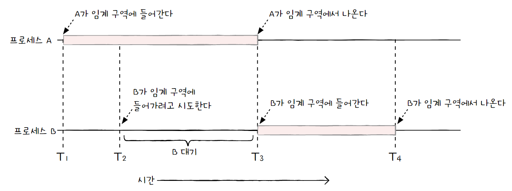
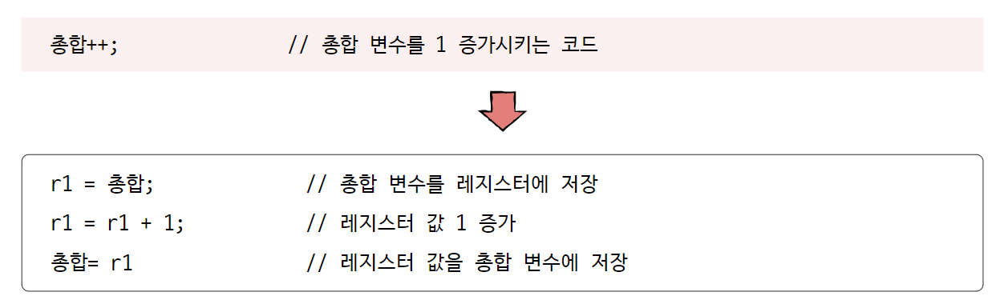
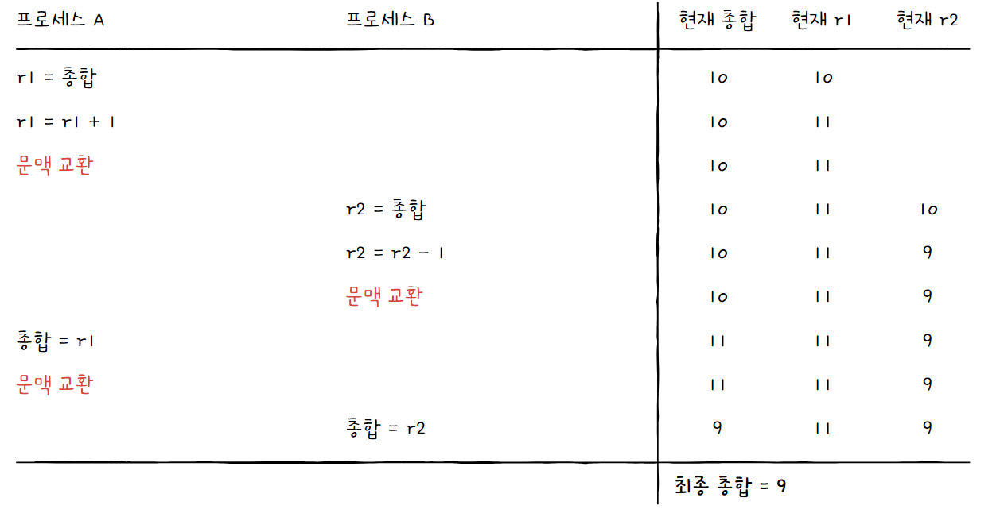

# 프로세스 동기화

## 1. 동기화란

### 동기화

프로세스 동기화란 **프로세스들 사이의 수행 시기를 맞추는 것**을 의미한다. 수행 시기를 맞춘다는 것은 다음과 같다.

- **실행 순서 제어**
  
  프로세스를 올바른 순서대로 실행하는 것
  
  ex) txt 파일에 `Reader` 프로세스와 `Writer` 프로세스가 동시에 실행되려 한다면, `Writer` 프로세스가 값을 저장한 뒤에 `Reader` 프로세스가 실행되어야 한다.

- **상호 배제**
  
  동시에 접근해서는 안 되는 자원에 하나의 프로세스만 접근하게 하기

> 실행의 흐름을 갖는 모든 것은 동기화의 대상이다. 즉, 프로세스뿐만 아니라 스레드도 동기화 대상이 된다.

### 생산자와 소비자 문제

**상호 배제**에 관련된 유명한 문제로 "생산자와 소비자 문제"가 있다.

```
총합 = 10

생산자 () {
    버퍼에 데이터 삽입
    '총합' 변수 1 증가
}

소비자 () {
    버퍼에서 데이터 빼내기
    '총합' 변수 1 감소
}
```

생산자 프로세스와 소비자 프로세스가 '총합'이라는 데이터를 공유한다.

이때 생산자와 소비자를 100,000번 동시에 실행하게 되면, 실행 후 총합은 초기값과 다른 값을 갖게 된다.

이는 **두 프로세스가 제대로 동기화되지 않았기 때문에 발생한 문제**이다.

한 프로세스의 작업이 끝나기 전에 다른 프로세스의 작업이 시작해 서로 다른 '총합'으로 연산한 것이다.

따라서 **동시에 접근해서는 안 되는 자원에 동시에 접근했기에 발생한 문제**라고 볼 수 있다.


### 공유 자원과 임계 구역

- **공유 자원**: 여러 프로세스가 공동으로 이용하는 변수, 메모리, 파일 등을 의미한다.

- **임계 구역**: 공유 자원에 접근하는 코드 중, 동시에 실행하면 문제가 발생하는 자원에 접근하는 코드 영역

임계 구역에서는 하나의 프로세스만 작업할 수 있으므로, 두 개 이상의 프로세스가 임계 구역에 진입하고자 하면 둘 중 하나는 대기해야 한다.



잘못된 실행으로 여러 프로세스가 동시에 임계 구역의 코드를 실행하는 경우를 **레이스 컨디션**이라고 한다.

앞의 생산자와 소비자 문제처럼 레이스 컨디션이 발생하면 **데이터의 일관성이 깨질 수 있다.**

> **참고: 레이스 컨디션의 근본적인 문제**
> 
> 고급 언어는 실행 과정에서 저급 언어로 변환된다.
> 
> 즉, 다음과 같이 한 줄의 코드도 여러 줄에 걸쳐 실행된다.
> 
> 
> 
> 이렇게 저급 언어로 변환된 고급 언어 한 줄을 실행하는 과정에서 문맥 교환이 일어날 수 있는데, 이때 레이스 컨디션이 발생한다.
> 
> 

**운영체제가 임계 구역 문제를 해결하기 위해 지키는 세 가지 원칙**

- **상호 배제**: 한 프로세스가 임계 구역에 진입했다면 다른 프로세스는 임계구역에 진입할 수 없다.

- **진행**: 임계 구역에 어떤 프로세스도 진입하지 않았다면 임계 구역에 접근하고자 하는 프로세스는 들어갈 수 있어야 한다.

- **유한 대기**: 한 프로세스가 임계 구역에 진입하고 싶다면, 그 프로세스는 언젠가는 임계 구역에 들어올 수 있어야 한다. (무한정 대기하는 일은 없다.)
