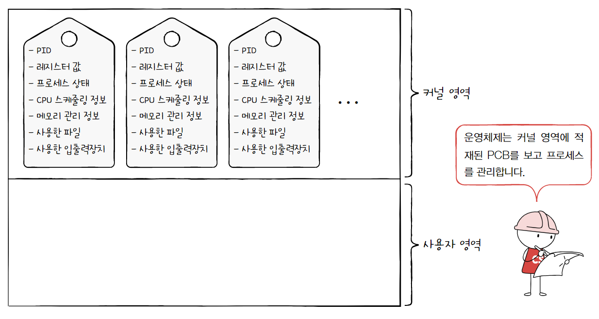
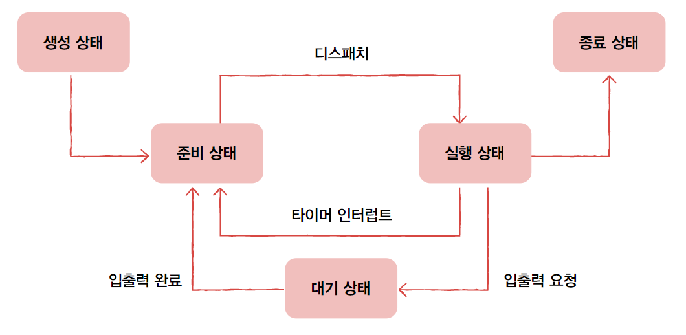
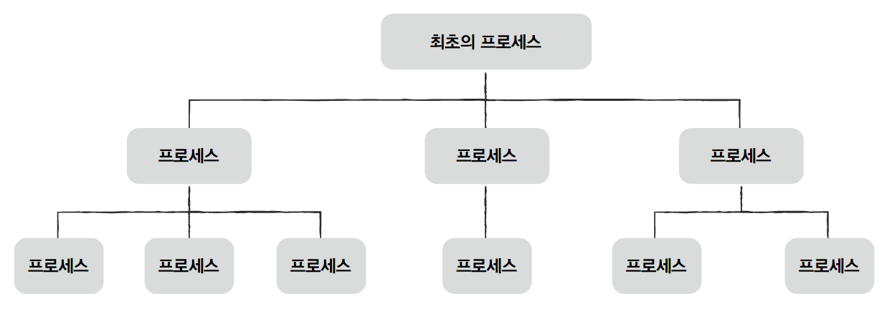
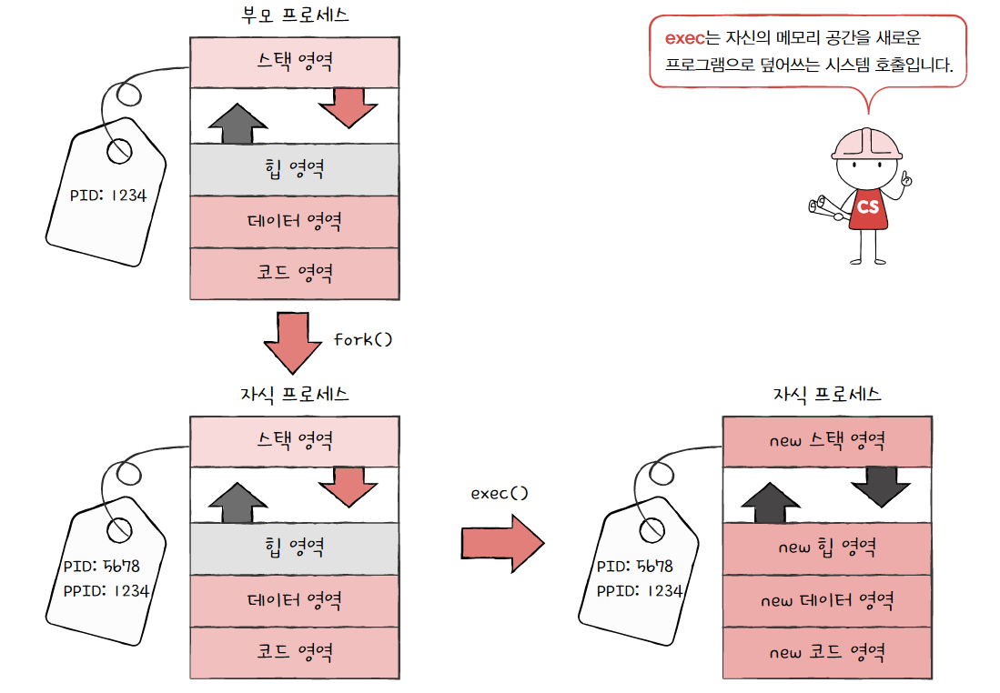
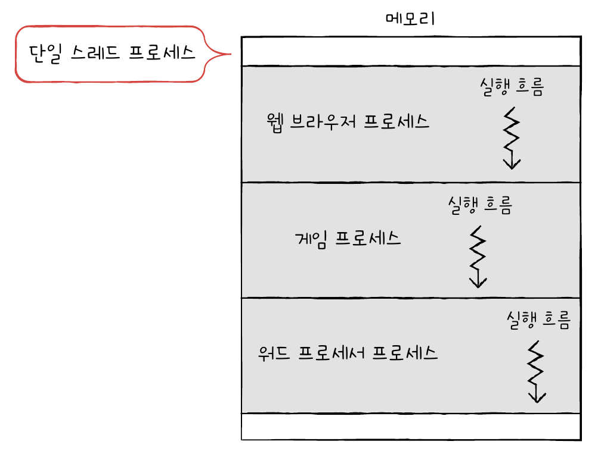
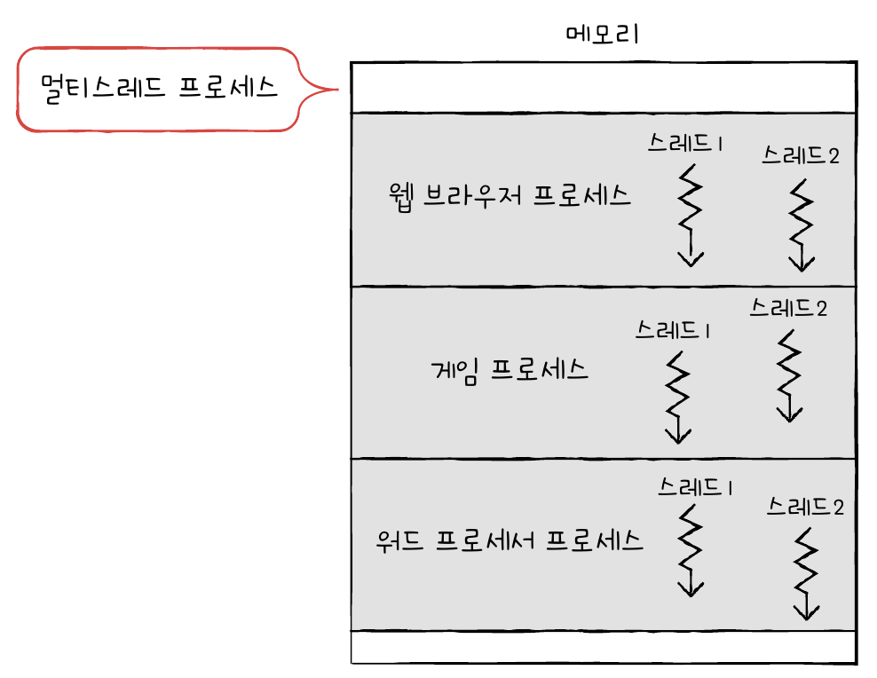
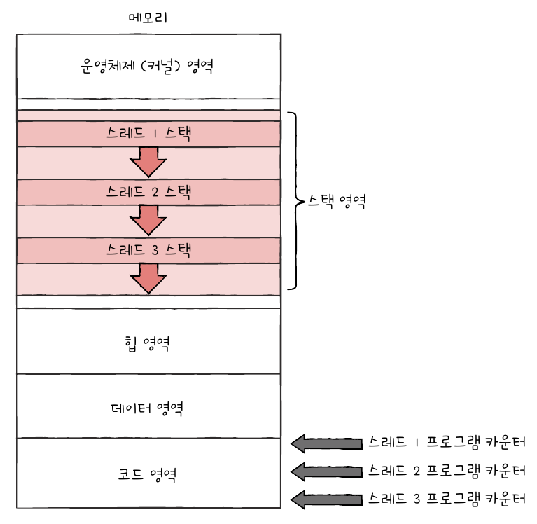
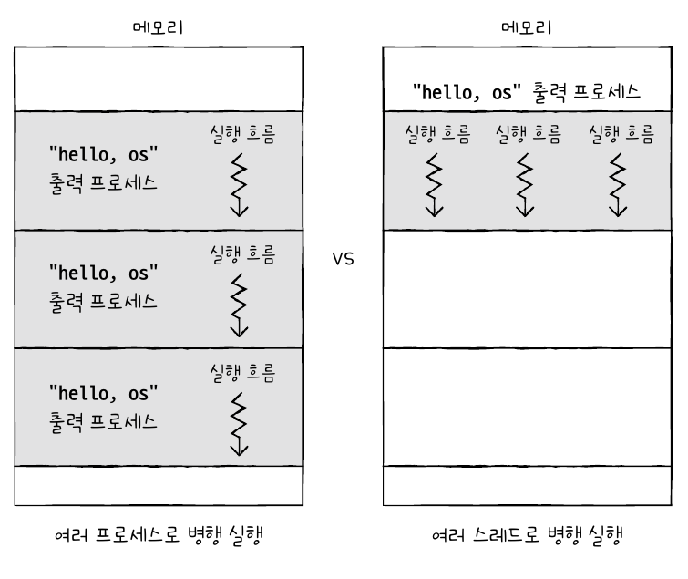
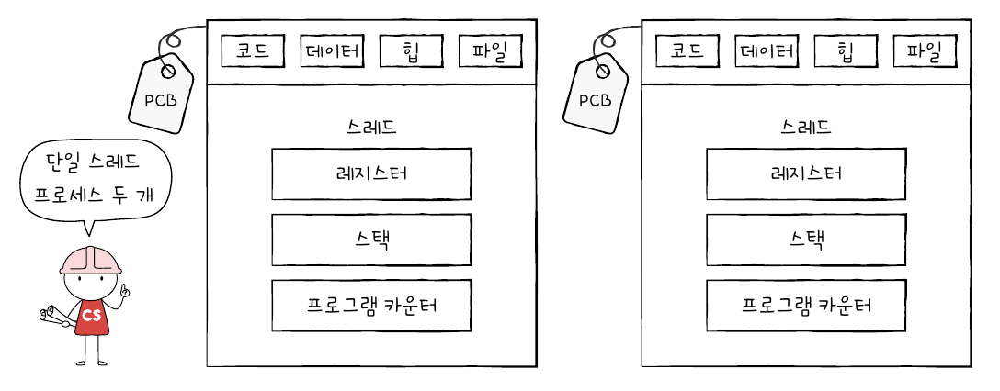
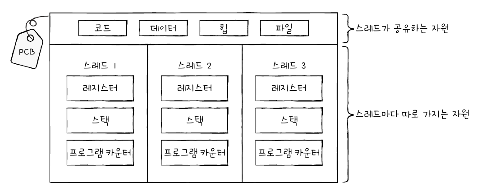

# 프로세스와 스레드

## 1. 프로세스 개요

### 프로세스

프로세스는 **실행 중인 프로그램**을 의미한다.

프로그램은 실행되기 전까지는 그저 보조기억장치에 있는 데이터 덩어리일 뿐이지만, 메모리에 적재하고 실행하는 순간 그 프로그램은 프로세스가 된다.

프로세스는 사용자가 볼 수 있는 공간에서 실행되는지에 따라 두 가지로 나눌 수 있다.

- 포그라운드 프로세스
  
  사용자가 보는 앞에서 실행되는 프로세스

- 백그라운드 프로세스
  
  사용자가 보지 못하는 뒤편에서 실행되는 프로세스
  
  사용자와 직접 상호작용할 수 있는 프로세스와 상호작용하지 않는 프로세스로 나뉜다.
  
  유닉스 체계의 운영체제에서는 **데몬**이라고 부르고, 윈도우 운영체제에서는 **서비스**라고 부른다.

### 프로세스 제어 블록

프로세스는 한정된 CPU 자원을 돌아가며 이용하기 위해 **타이머 인터럽트**(=**타임아웃 인터럽트**)가 발생하면 자신의 차례를 양보하고 다음 차례를 기다린다. 타이머 인터럽트는 클럭 신호를 발생시키는 장치에 의해 주기적으로 발생하는 하드웨어 인터럽트이다.

운영체제는 프로세스에 CPU를 비롯한 자원을 배분하는데, 이를 위해 **프로세스 제어 블록**(**PCB**: Process Control Block)을 이용한다.

PCB **프로세스와 관련된 정보를 저장**하는 자료구조로, **프로세스를 식별**하기 위한 정보들이 저장된다. PCB는 **커널 영역에 생성**되며, 운영체제는 PCB로 특정 프로세스를 식별하고 해당 프로세스를 처리하는 데 필요한 정보를 판단한다.

PCB는 프로세스 생성 시에 만들어지고 실행이 끝나면 폐기된다.

**PCB에 담기는 대표적인 정보**

- **프로세스 ID**(**PID**)
  
  특정 프로세스를 식별하기 위해 부여하는 고유한 번호

- **레지스터 값**
  
  해당 프로세스가 실행하며 사용했던 레지스터 값 (자신의 실행 차례가 돌아오면 사용했던 값을 복원해서 사용해야 함)

- **프로세스 상태**
  
  생성 / 준비 / 실행 / 대기 / 종료 상태

- **CPU 스케줄링 정보**
  
  프로세스가 언제, 어떤 순서로 CPU를 할당받을지에 대한 정보

- **메모리 관리 정보**
  
  프로세스가 어느 주소에 저장되어 있는지 알기 위해, 베이스 레지스터 값, 한계 레지스터 값, 페이지 테이블 정보가 담긴다.

- **사용한 파일과 입출력장치 목록**
  
  어떤 입출력장치가 할당되었는지, 어떤 파일들을 열었는지에 대한 정보

### 문맥 교환

프로세스 수행을 재개하기 위해 기억해야 할 정보를 **문맥**이라고 한다.

하나의 프로세스 문맥은 해당 프로세스의 PCB에 표현되어 있다.

기존 프로세스의 문맥을 PCB에 백업하고, 새로운 프로세스를 실행하기 위해 문맥을 PCB로부터 복구하여 새로운 프로세스를 실행하는 것을 **문맥 교환**이라고 한다.

### 프로세스의 메모리 영역

프로세스가 생성되면 커널 영역에는 PCB가 생성되고, 사용자 영역에는 프로세스가 **코드 영역**, **데이터 영역**, **힙 영역**, **스택 영역**으로 나뉘어 저장된다.

- 코드 영역(=텍스트 영역)
  
  CPU가 실행할 **기계어로 이루어진 명령어**가 저장된다.
  
  쓰기가 불가능한 읽기 전용 공간이다.
  
  크기가 변하지 않는 정적 할당 영역이다.

- 데이터 영역
  
  **전역 변수**와 같은 프로그램이 실행되는 동안 유지할 데이터가 저장된다.
  
  크기가 변하지 않는 정적 할당 영역이다.

- 힙 영역
  
  프로그래머가 직접 할당할 수 있는 저장 공간이다.
  
  힙 영역에 메모리 공간을 할당했다면 언젠가 해당 공간을 반환해야 한다.
  
  메모리 공간을 반환하지 않는다면 할당한 공간은 메모리에 계속 남아 메모리 공간을 낭비하는, **메모리 누수**를 초래한다.
  
  크기가 변하는 동적 할당 영역이다.

- 스택 영역
  
  **매개 변수**, **지역 변수**와 같이 일시적인 데이터가 저장되는 공간이다.
  
  크기가 변하는 동적 할당 영역이다.

> **힙 영역과 스택 영역의 할당**
> 
> 힙 영역과 스택 영역은 크기가 변하는 동적 할당 영역이다.
> 
> 일반적으로 힙 영역은 메모리의 낮은 주소에서 높은 주소로 할당되고, 스택 영역은 높은 주소에서 낮은 주소로 할당된다.
> 
> 이로 인해 힙 영역과 스택 영역의 주소가 겹치는 일을 방지할 수 있다.
> 
> 

## 2. 프로세스 상태와 계층 구조

### 프로세스 상태

운영체제는 프로세스 상태를 PCB를 통해 인식하고 관리한다.

프로세스가 가질 수 있는 대표적인 상태는 다음과 같다.

- **생성 상태**(new)
  
  프로세스가 이제 막 메모리에 적재되어 PCB를 할당 받은 상태를 말한다.
  
  생성 상태를 거쳐 실행할 준비가 완료된 프로세스는 준비 상태가 된다.

- **준비 상태**(ready)
  
  당장이라도 CPU를 할당받아 실행할 수 있지만, 아직 자신의 차례를 기다리는 상태이다.
  
  차례가 되면 CPU를 할당받아 실행 상태가 된다.
  
  준비 상태인 프로세스가 실행 상태로 전환되는 것을 **디스패치**라고 한다.

- **실행 상태**(running)
  
  CPU를 할당받아 실행 중인 상태를 의미한다.
  
  할당된 일정 시간 동안만 CPU를 사용할 수 있으며, 할당 시간이 다 되면(타이머 인터럽트가 발생하면) 다시 준비 상태가 된다.
  
  만약 실행 도중 입출력장치를 사용하여 입출력 장치의 작업을 기다리는 상태가 되면 대기 상태가 된다.
  
  (대기 상태가 되는 이유에 입출력 작업만 있는 것은 아니지만 대부분은 입출력 작업이다.)

- **대기 상태**(BLOCKED)
  
  (입출력 완료 인터럽트를 받을 때까지) 입출력장치의 작업을 기다리는 상태이다.
  
  입출력작업이 완료되면 다시 준비 상태가 된다.

- **종료 상태**(TERMINATED)
  
  프로세스가 종료된 상태이다.
  
  프로세스가 종료되면 운영체제는 PCB와 프로세스가 사용한 메모리를 정리한다.

**프로세스 상태 다이어그램**

### 프로세스 계층구조

프로세스는 실행 도중 시스템 호출을 통해 다른 프로세스를 생성할 수 있다.

새 프로세스를 생성한 프로세스를 **부모 프로세스**, 부모 프로세스에 의해 생성된 프로세스를 **자식 프로세스**라고 한다.

두 프로세스는 다른 프로세스이기에 각기 다른 PID를 가지며, 일부 운영체제에서는 자식 프로세서의 PCB에 부모 프로세스의 PID인 **PPID**(Parent PID)를 기록하기도 한다.

컴퓨터가 부팅될 때 실행되는 최초의 프로세스는 자식 프로세스들을 생성하고, 생성된 자식 프로세스들이 새로운 프로세스들을 낳는 형식으로 여러 프로세스가 동시에 실행된다. 이는 곧 트리 구조를 띄는데, 이를 **프로세스 계층 구조**라고 한다.

### 프로세스 생성 기법

프로세스의 생성은시스템 호출인 fork와 exec에 의해 수행된다.

- **fork**: 부모 프로세스가 자신의 복사본을 자식 프로세스로 생성하는 것

- **exec**: 만들어진 복사본(자식 프로세스)이 자신의 메모리 공간을 다른 프로그램으로 교체하는 것

fork에 의해 생성된 자식 프로세스는 부모 프로세스의 자원들(메모리 내의 내용, 열린 파일의 목록)을 상속받는다.(PID나 저장된 메모리 위치는 다름)

생성된 자식 프로세스는 exec 시스템 호출을 통해 자신의 메모리 공간을 새로운 프로그램으로 덮어쓴다. 즉, 코드 영역과 데이터 영역의 내용이 실행할 프로그램 내용으로 바뀌고, 나머지 영역은 초기화된다.

생성된 자식 프로세스가 exec를 호출하지 않는 경우도 있는데, 이 경우 부모와 자식 프로세스는 같은 코드를 병행하여 실행하는 프로세스가 된다.

- [프로그래밍 언어로 프로세스 다뤄보기](https://github.com/kangtegong/self-learning-cs/tree/main/process)

## 3. 스레드

### 프로세스와 스레드

스레드란 **프로세스를 구성하는 실행의 흐름 단위**이다.

하나의 프로세스는 여러 개의 스레드를 가질 수 있으며 여러 부분을 동시에 실행할 수 있다.

하나의 프로세스가 하나의 스레드를 가지면 **단일 스레드 프로세스**, 여러 스레드를 가지면 **멀티스레드 프로세스**라고 한다.

스레드는 프로세스 내에서 각기 다른 스레드 ID, 레지스터 값, 스택으로 구성되어 있어, 각기 다른 코드를 실행할 수 있다.

이때 각 스레드는 프로세스의 **자원을 공유**하기 때문에 **실행에 필요한 최소한의 정보**만을 유지한 채 실행된다.

### 멀티프로세스와 멀티스레드

- **멀티프로세스**: 여러 프로세스를 동시에 실행하는 것

- **멀티스레드**: 여러 스레드로 프로세스를 동시에 실행하는 것

둘의 가장 큰 차이점은 **프로세스끼리는 자원을 공유하지 않지만, 스레드끼리는 같은 프로세스 내의 자원을 공유**한다는 점이다.

프로세스를 fork하여 같은 작업을 하는 동일한 프로세스를 동시에 실행하면, 코드 영역, 데이터 영역, 힙 영역 등을 비롯한 모든 자원(PID, 메모리 주소 제외)이 복제되어 메모리에 적재된다. 이는 곧 **메모리의 낭비**로 이어질 수 있다.

이에 반해 스레드들은 코드 영역, 데이터 영역, 힙 영역 등 프로세스 자원을 공유하기 때문에 **메모리를 더 효율적으로 사용**할 수 있다.

또한 서로 다른 프로세스들은 기본적으로는 자원을 공유하지 않기 때문에 독립적으로 실행되는 반면, 스레드는 프로세스의 자원을 공유하기 때문에 서로 협력과 통신에 유리하다.

하지만 멀티스레드 환경에서는 프로세스 자원을 공유하기 때문에 하나의 스레드에 문제가 생기면 프로세스 전체에 문제가 생길 수도 있다.

> **참고: 프로세스 간 통신**
> 
> 프로세스끼리는 '기본적으로' 자원을 공유하지 않지만, 프로세스끼리도 자원을 공유하고 데이터를 주고받을 수 있다.
> 
> 프로세스 간의 자원을 공유하고 데이터를 주고받는 것을 **프로세스 간 통신**(**IPC**: Inter-Process Communication)이라고 한다.
> 
> 예를 들어 한 파일에 새로운 값을 쓰는 프로세스와 그 파일을 읽는 프로세스가 있다면, 두 프로세스는 같은 파일 속 데이터를 주고받으므로 프로세스 간의 통신이 이루어져야 한다. 이는 **파일을 통한 프로세스 간 통신**으로 볼 수 있다.
> 
> 또, 프로세스들은 서로 공유하는 메모리 영역인 **공유 메모리**를 두어 전역 변수와 같은 값을 공유할 수 있다.
> 
> 이 외에도 프로세스들은 소켓, 파이프 등을 통해 통신할 수도 있다.

- [프로그래밍 언어로 스레드 다뤄보기](https://github.com/kangtegong/self-learning-cs/tree/main/thread)